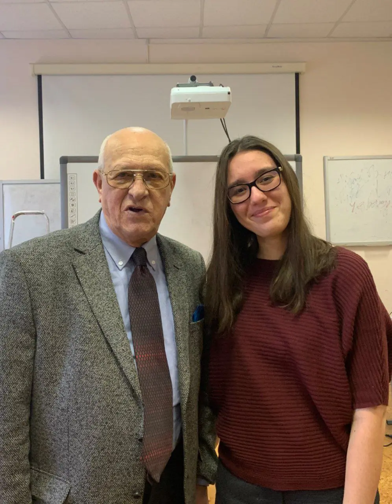

:::gallery
{width="868" height="1280" data-color="#76685c"}

{width="996" height="1280" data-color="#7a695b"}
:::

А я сегодня по-шпионски пробралась на лекцию легендарного [Давида Голощёкина](https://jazzpeople.ru/jazz-in-faces/david-goloshhekin-biografiya-karera/) по Эстетике джаза для студентов Герцена.

Послушали и обсудили несколько интересных записей! Делюсь джазовым настроением!!!
🎷🎷🎷

[Giant Steps — John Coltrane](https://t.me/gattavasis/200){.audio data-duration="287"}

[I Want To Be Happy — Lester Young, Nat King Cole, Buddy Rich](https://t.me/gattavasis/201){.audio data-duration="236"}

[When I Grow Too Old to Dream — Nat King Cole Trio, Stuff Smith](https://t.me/gattavasis/202){.audio data-duration="211"}

[John Coltrane, McCoy Tyner, Elvin Jones, Steve Davis My Favori](https://t.me/gattavasis/203){.audio}
