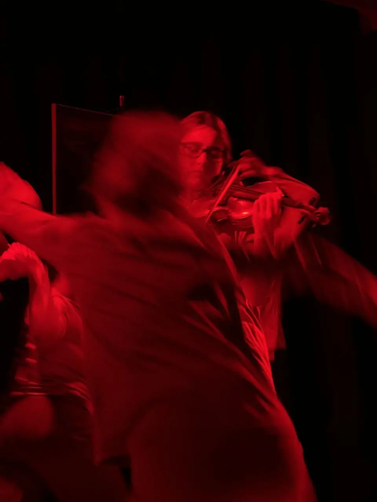
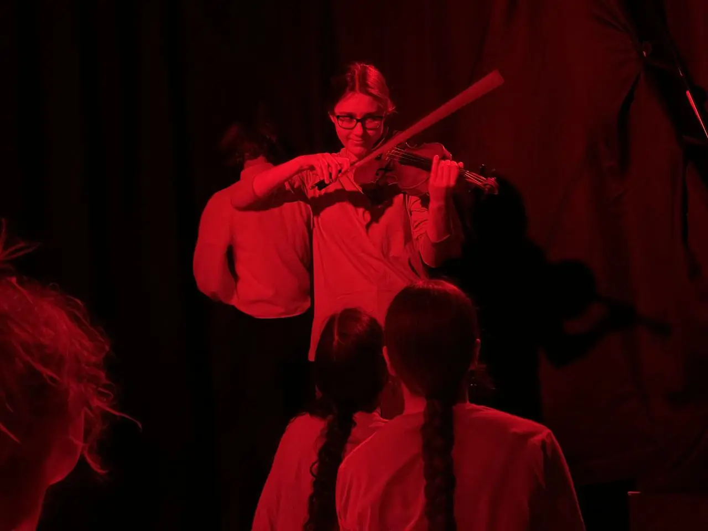
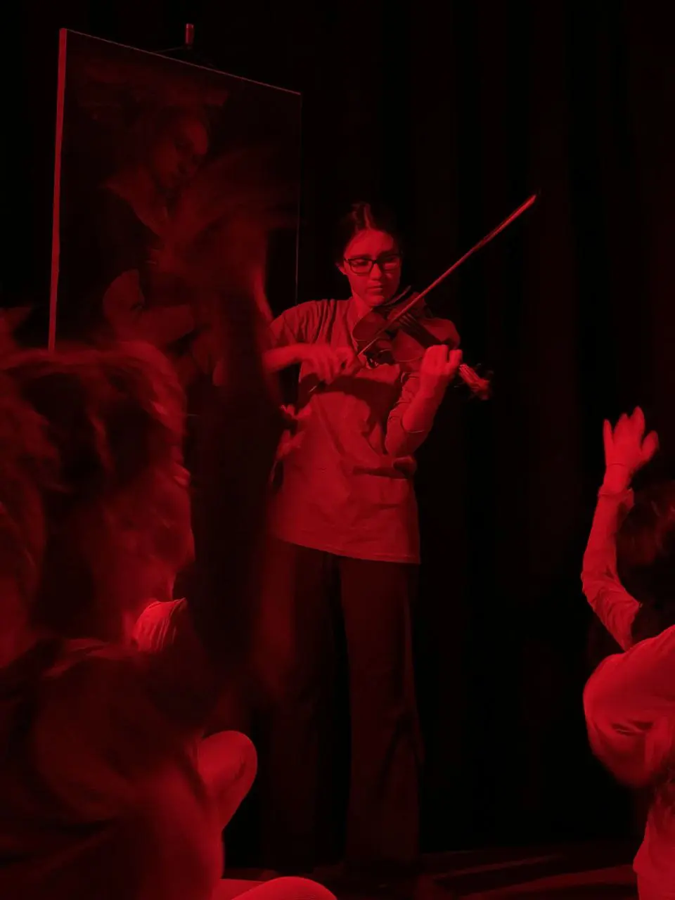

:::gallery
{width="960" height="1280" data-color="#380002"}

{width="1280" height="960" data-color="#2d0003"}

{width="960" height="1280" data-color="#250001"}
:::

И к какой серии картин отсылает этот оттенок?))

Пишите ваши версии под постом и приходите на спектакль [«](https://t.me/gattavasis/196)[О духовном в искусстве»!](https://t.me/gattavasis/196)

На сегодня и субботу билетов уже нет, но в феврале ещё планируется  показ 27-го!
Будем рады всех видеть!!

🎫 [Билеты по ссылке🔗](https://ano-prosvetitelskiy-klub.timepad.ru/event/3219966/)

📍[Нащокинский переулок, 14](https://yandex.ru/maps/org/aleksandr/86343990352?si=hkgv88xffz97ba3h76tajv9ey0)
     [Клуб «Александр»](https://yandex.ru/maps/org/aleksandr/86343990352?si=hkgv88xffz97ba3h76tajv9ey0)
     [м. Кропоткинская](https://yandex.ru/maps/org/aleksandr/86343990352?si=hkgv88xffz97ba3h76tajv9ey0)
