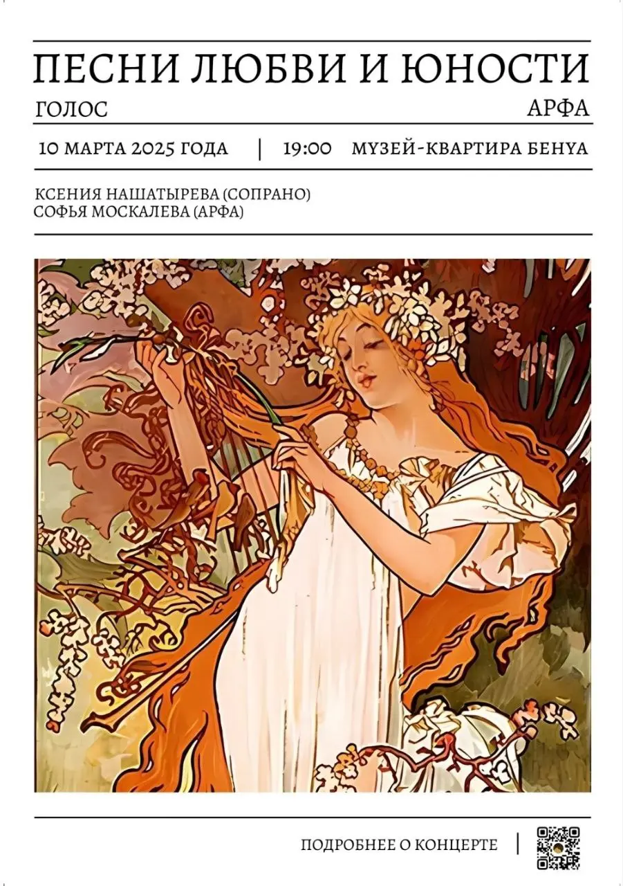

{width="901" height="1280" data-color="#bf9a83"}

10 марта мои близкие друзья устраивают [вечер французской камерной музыки](https://vk.com/harpvoiceconcert) в [Доме-музее Леонтия Бенуа](https://yandex.ru/maps/org/muzey_kvartira_l_n_benua/13898569892?si=hkgv88xffz97ba3h76tajv9ey0).

Необычен не только состав исполнителей — часто ли можно услышать **ансамбль сопрано и арфы**? В концерте прозвучат сочинения не только известных французских композиторов, таких как Дебюсси, Равель, Форе, но и гораздо более редко исполняемых — Полины Виардо, Рейнольдо Ана.

🎫[Билеты по ссылке](https://kontsert-pesni-lyub-event.timepad.ru/event/3236274)🔗
