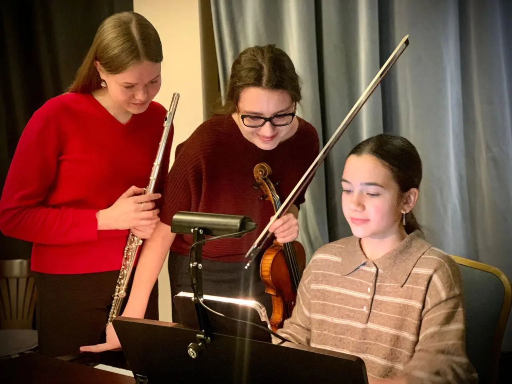

{width="1280" height="960" data-color="#724536"}

Много интересной редкой музыки, которую исполнят талантливые музыканты от мала до велика😊

Завтра в [Доме-музее Цветаевой](https://yandex.ru/maps/org/dom_muzey_mariny_tsvetayevoy/1015086117?si=hkgv88xffz97ba3h76tajv9ey0)!
Начало в 18:00.

🎫 [Билеты по ссылке](https://dommuseum.ru/kalendar-sobyitij/2025/fevral/zaklyuchitelnyij-konczert-programmyi-master-klassyi-soundout-2025)
