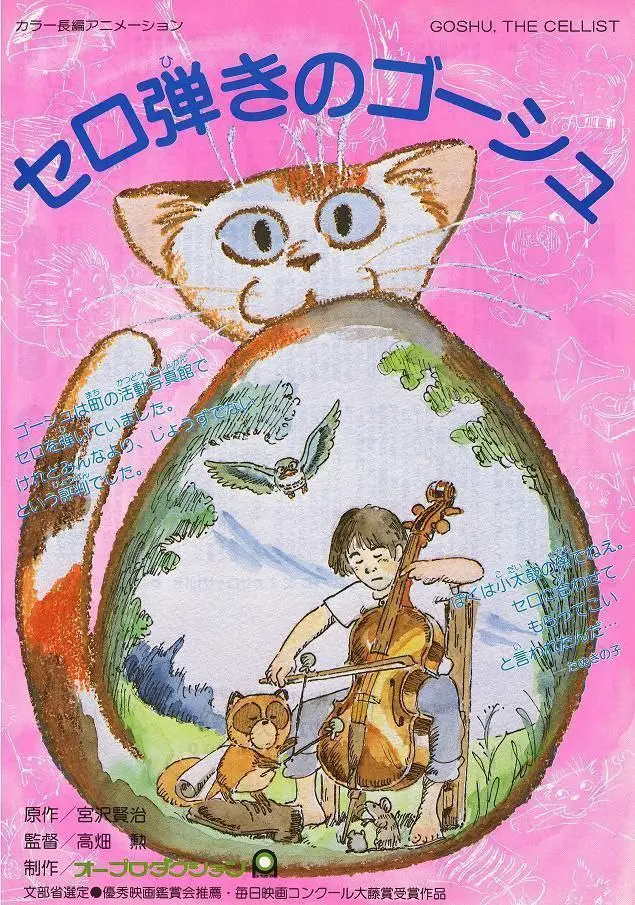
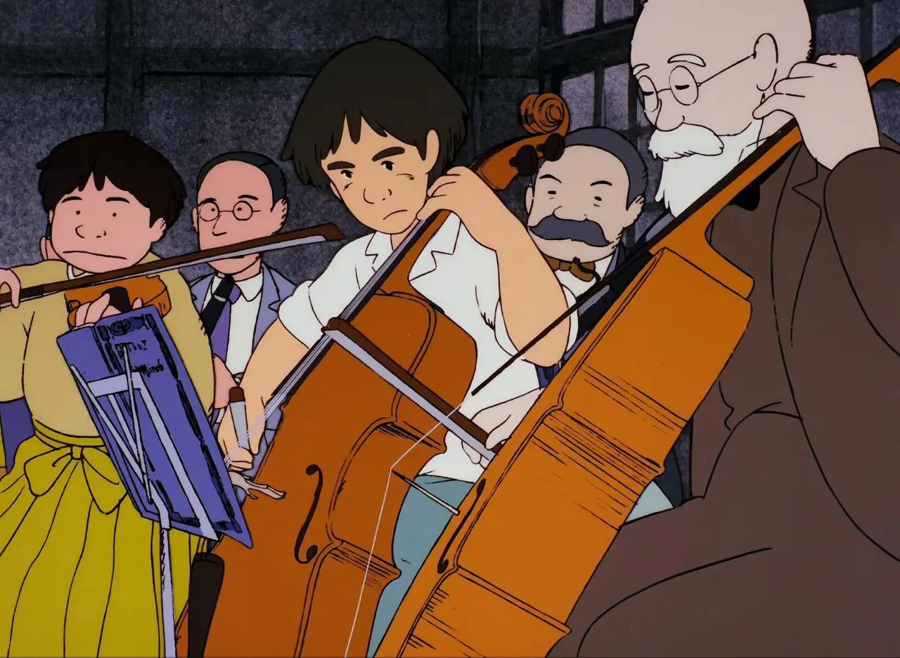
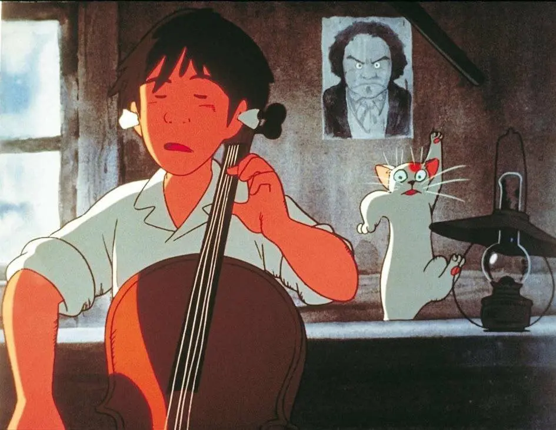
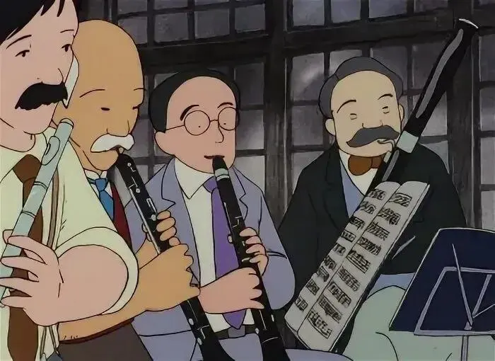
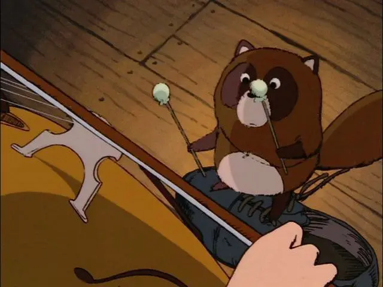
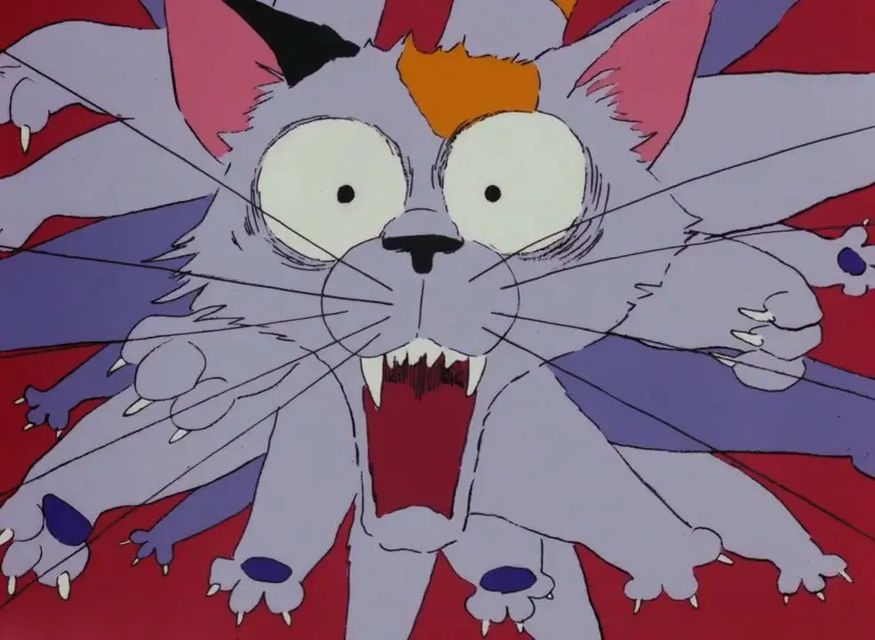
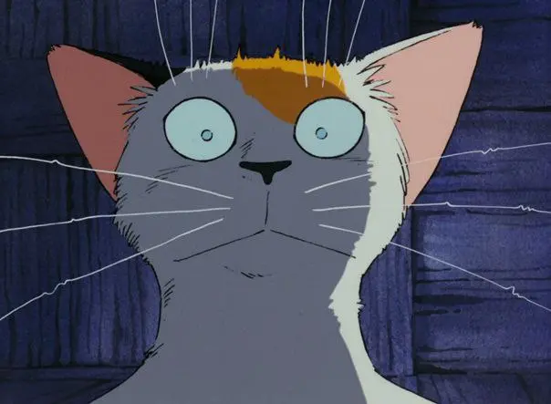
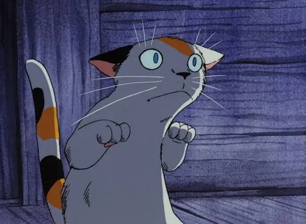

:::gallery
{width="635" height="905" data-color="#bc9ba6"}

{width="1280" height="937" data-color="#765641"}

{width="945" height="731" data-color="#7d675d"}

{width="700" height="510" data-color="#645b54"}

{width="640" height="480" data-color="#654326"}

{width="984" height="720" data-color="#816c80"}

{width="604" height="443" data-color="#4c4e60"}

{width="604" height="442" data-color="#4a4d6b"}
:::

Молодой виолончелист Госю без ума от Бетховена, но доводит до слёз своего дирижера, который очень переживает за грядущий концерт.

До него осталось всего 10 дней! Госю совершенно не готов, хотя репетирует в поте лица.

 [«Виолончелист Госю» (1982)](https://vk.com/video-184447514_456245614) — музыкальная анимационная сказка Исао Такахаты, близкого друга Хаяо Миядзаки, вместе с которым в 1985 году они положат начало анимационной студии Ghibli и проработают вместе более 30 лет.

В основе этой ранней работы режиссера— рассказ знаменитого японского детского писателя Кэндзи Миядзавы, который повествует о юном виолончелисте, который учится слушать и слышать, выражать себя в музыке. В этом ему помогает его кот, енот, кукушка и мышиное семейство.

Сюжет — суть «Рождественская песнь» Диккенса, но автор, видимо, транслировал смыслы учения буддистской Сутры Лотоса, приверженцем которой и являлся. У него вообще много интересных сказок.

[Смотреть мультфильм](https://vk.com/video-184447514_456245614) 🎬

Там в процессе кот заработал нервное потрясение из-за того, что неудачливый виолончелист срывал свою злость в музыке, но делаем скидку на то, что сказка написана аж в 1949 году.
