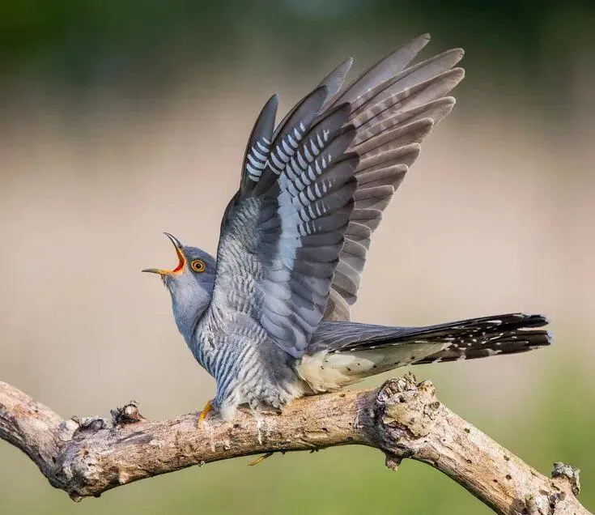

{width="735" height="636" data-color="#9a8f83"}

Самый птичий композитор в мире, Оливье Мессиан, называл их противоположностью времени, нашим желанием света, звёзд и радуги. Первыми музыкантами на Земле.
*«Птицы — мои главные учителя»*.

Если очень кратко:

> Он бродил 40 лет по лесам, прислушиваясь к пению птиц. Свою любовь к ним он отразил в музыкальных опусах, тонко и бережно подражая руладам птиц разных стран и континентов.

Вот, например, его [«Каталог птиц»](https://youtu.be/uPffFgYoYaI?feature=shared)🎧.

Но я вообще хотела написать не об этом. На днях попалась мне очередная симпатичная барочная кукушка. И я осознала, что встречалась с музыкальными кукушками десятки и десятки раз.

Так что представляю вам мой
**«Каталог кукушек»**!
**Части:** [1](https://t.me/gattavasis/239) [2.1](https://t.me/gattavasis/270)  [2.2](https://t.me/gattavasis/280?single)  [3](https://t.me/gattavasis/458)

Если что, можно подбрасывать мне ваших муз. кукушат прямо в ~~гнездо~~ комментарии под постом.

Каталог начну публиковать завтра. Можете пока почитать про то, как [грибы повлияли на Кейджа](https://t.me/gattavasis/30).

==P.S. Счётчик шуток про мою кукуху тоже будет обновляться.=={.spoiler}
==Upd. 1⃣=={.spoiler}
