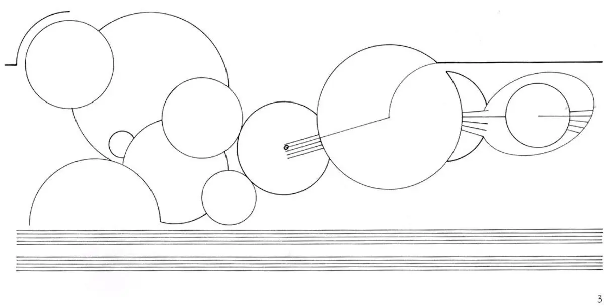
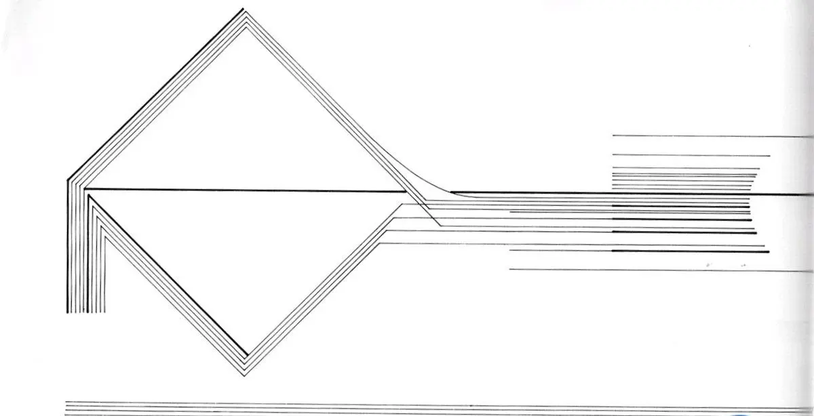
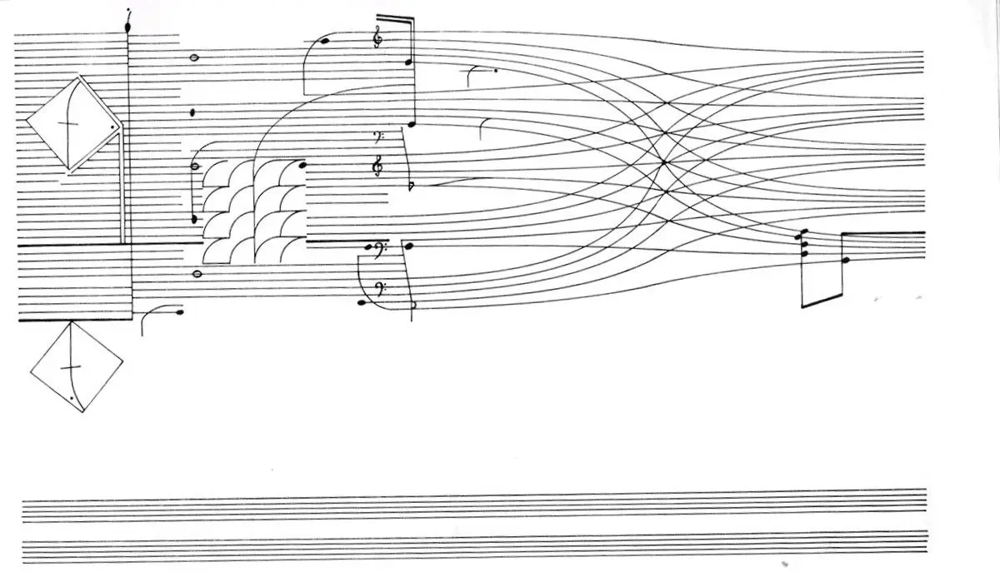
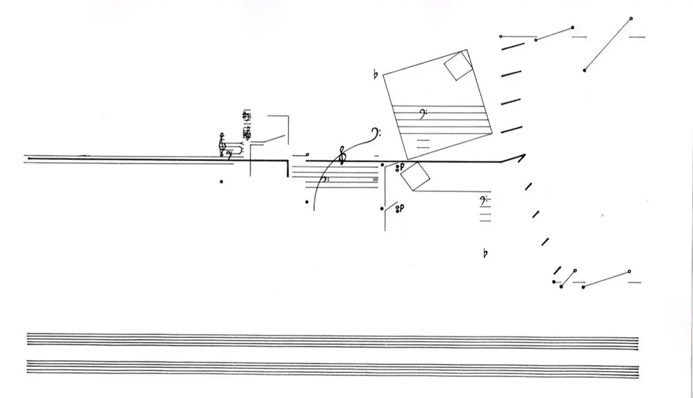
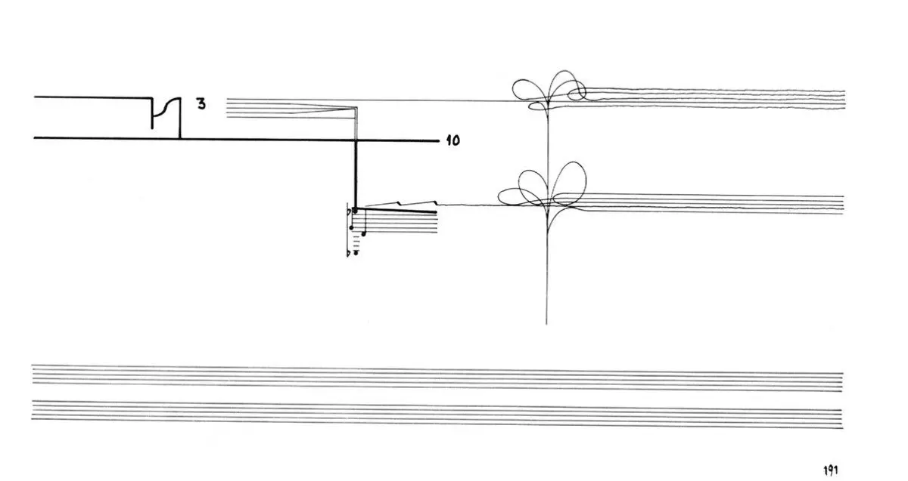
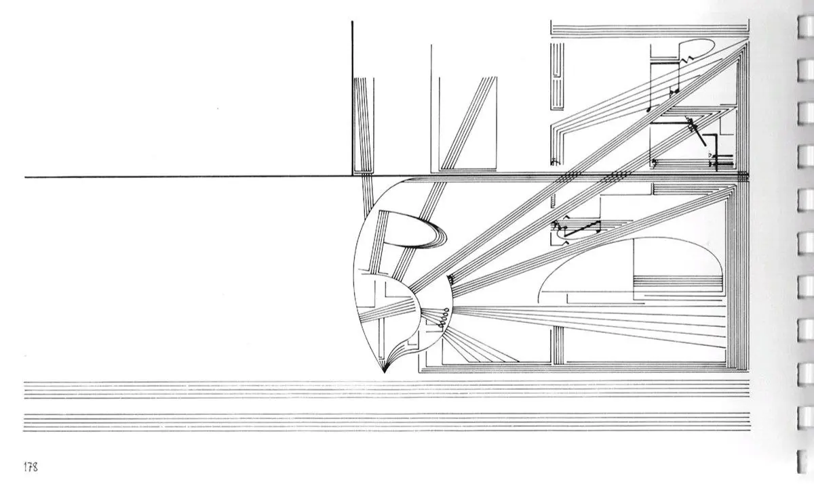
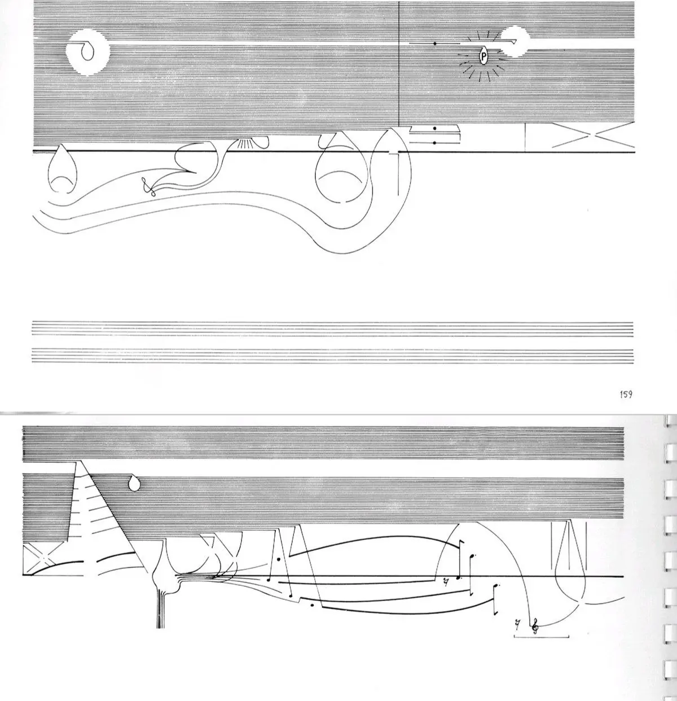

:::gallery
{width="1200" height="611" data-color="#f5f5f5"}

{width="1200" height="614" data-color="#f4f4f4"}

{width="1200" height="705" data-color="#ebebeb"}

{width="1200" height="690" data-color="#f5f5f5"}

{width="1200" height="637" data-color="#f5f5f5"}

{width="1200" height="715" data-color="#ebebeb"}

{width="1200" height="1242" data-color="#e4e4e4"}
:::

Эту графическую музыкальную партитуру, 173 рисунка, можно читать и интерпретировать как угодно. Для Кардью нотная запись — не инструкция, а средство коммуникации. В отличие от его современников, которые хоть и ценили волю случая \[см. алеаторика\], никогда так не доверяли произволу исполнителя!

Ну, это было в «свингующие шестидесятые»)) Почти сразу после он заинтересовался культурой Востока, пошёл на вечерние курсы китайского языка, где стал ярым приверженцем идей «Великого кормчего».

Ученик Карлхайнца Штокхаузена, лидера музыкального авангарда, Кардью написал труд «Штокхаузен служит империализму» и отрекся от всех прежних убеждений.

Стал продвигать идеи маоизма, создал кружок революционной пролетарской самодеятельности. Стал одним из создателей Революционной коммунистической партии Великобритании, между прочим.

Музыка его тоже изменилась.

Вот несколько интерпретаций его «Трактата» (1963-1967), который не так уж часто исполняется:

[Studio Musikfabrik](https://youtu.be/faYBELplm0U?feature=shared)

[KYMATIC ensemble](https://youtu.be/b0V9_xqaw8Q?feature=shared)

[Francois Houle (для кларнета соло! и электроники))](https://youtu.be/_wqMZenZAek?feature=shared)

А ниже его китчево-романтические сочинения семидесятых годов:

[Revolution Is the Main Trend in the World Today — Cornelius Cardew](https://t.me/gattavasis/257){.audio data-duration="200"}

**Корнелиус Кардью**
«Революция - главная тенденция современного мира»

[The East Is Red — Cornelius Cardew](https://t.me/gattavasis/258){.audio data-duration="96"}

**Корнелиус Кардью**
«Алеет Восток» \[Похоже, вдохновился [самой известной китайской революционной песней](https://vk.com/video-28233296_456239072)🎧 1930-х гг.\]

[Bring the Land a New Life — Cornelius Cardew](https://t.me/gattavasis/259){.audio data-duration="254"}

**Корнелиус Кардью**
«Подарите земле новую жизнь»

[The Croppy Boy — Cornelius Cardew](https://t.me/gattavasis/260){.audio data-duration="168"}

**Корнелиус Кардью**
«Стриженый»
The Croppy Boy \[The Croppy Boy — [ирландская баллада](https://youtu.be/Jhe6rlo_jpI?feature=shared) об обреченном повстанце, основанная на событиях восстания 1798 года.\]
