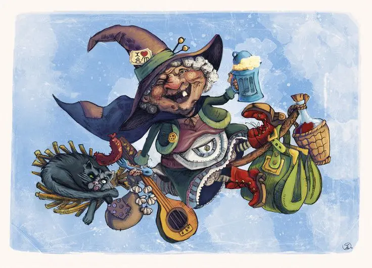

{width="736" height="531" data-color="#989ea7"}

**Воскресные откровения об опере от героев «Плоского мира» Терри Пратчетта:**

> Well, basically there are two sorts of opera. There's your heavy opera, where basically people sing foreign and it goes like "Oh oh oh, I am dyin', oh, I am dyin', oh, oh, oh, that's what I'm doin"', and there's your light opera, where they sing in foreign and it basically goes "Beer! Beer! Beer! Beer! I like to drink lots of beer!", although sometimes they drink champagne instead. That's basically all of opera, reely.'

> Есть два типа оперы: тяжелая опера, в которой люди поют по-чужеземски. И звучит это примерно так: «Ох, ох, ох, помираю, ох, помираю, ох, ох, ох, вот что я делаю». А вот тебе легкая опера, где тоже все поют по-чужеземски, но слова в них по большей части такие: «Пива! Пива! Пива! Пива! Наливай да не жалей!» Хотя иногда они вместо пива хлещут шампанское. Вот тебе и вся опера.

 P. S. Лучшего чтива на английском не сыскать! Ироничное фэнтези, высмеивающее нашу нефэнтезийную действительность, наполненное трехэтажными каламбурами, в которых бывает не так-то легко разобраться.
А музыка и театр, по мнению автора, ничуть не менее чудесны, чем чудеса.
