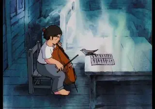

[{width="320" height="224" data-color="#4f5f68"}](https://t.me/gattavasis/270){.video data-duration="60"}

В век рационализма популяция музыкальных кукушек претерпевала серьёзный кризис.

Не то чтобы философы-энциклопедисты, которые и заложили фундамент для эстетики классицизма, запрещали дразнить птичек. И всё же почти все композиторы в то время считали такое занятие легкомысленным и неосновательным.

Доходило даже до скандалов. [Известен случай](https://t.me/gattavasis/271), например, который произошёл с [Йозефом Гайдном](https://www.belcanto.ru/haydn.html), представителем Венской классической композиторской школы, и [квакухами](https://t.me/gattavasis/271).

У меня нет намерения надолго отвлекаться от обсуждения кукух, однако, тема квакух также занимает значительное место в моих мыслях.
См. [«Спасём жаб!»](https://t.me/gattavasis/42) и [«Лягушка в медитации»](https://t.me/gattavasis/29).

P.S. На видео фрагмент из мультфильма про незадачливого виолончелиста, про который я [недавно рассказала](https://t.me/gattavasis/228?single). Звучит 6-я симфония Бетховена!

В то время готовилась фортепианная версия оркестровой партии для оратории «Времена года».

Гайдн непринужденно попросил транскриптора исключить из неё кваканье в одном из номеров:

> Весь этот отрывок с имитацией лягушек не был моей идеей: я был вынужден написать этот французский отброс. Эта жалкая идея довольно незаметна, когда играет весь оркестр, но включить ее в редукцию фортепиано просто недопустимо.

Случайно об этом узнал редактор одного музыкального журнала, о чем и раструбил, рассорив Гайдна с либреттистом в пух и прах.

Либреттист, в свою очередь, обещал «натереть в кожу Гайдна соль и перец за утверждение, что он вынудил его сочинять квакающих лягушек».

Про «французских отбросов» была шпилька в сторону [Андре Гретри](https://www.belcanto.ru/gretry.html), лягушачье сочинение которого Гайдну пришлось взять за образец. Про него пойдёт речь далее, и он, будучи французом, не брезговал не только квакушками, но и кукушками.

Услышали 🐸🐸?
