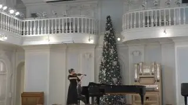

[{width="320" height="180" data-color="#817e7a"}](https://t.me/gattavasis/275){.video data-duration="136"}

Тот самый восхитительный момент в скрипичном концерте Брамса, когда после грозы небо светлеет, тучи рассеиваются и сквозь них пробиваются первые лучи солнца
🌅 🥹
