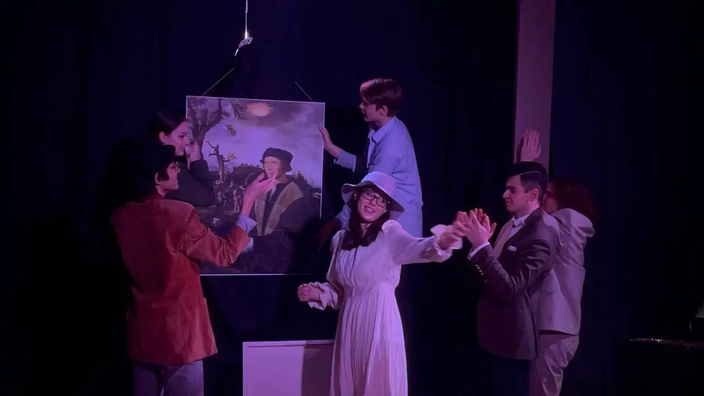
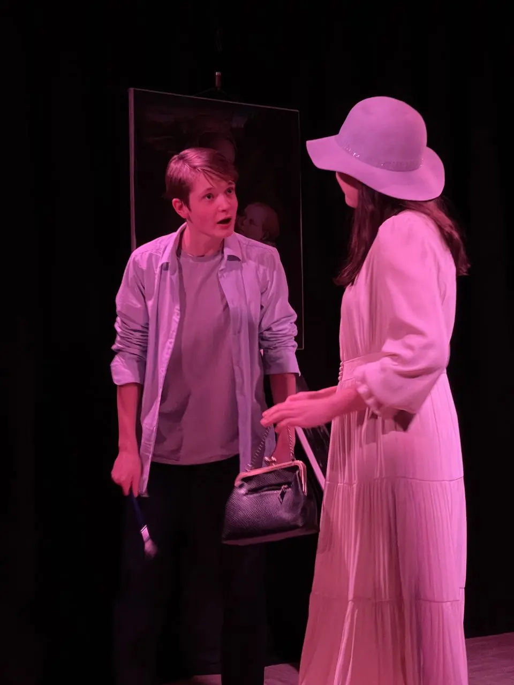
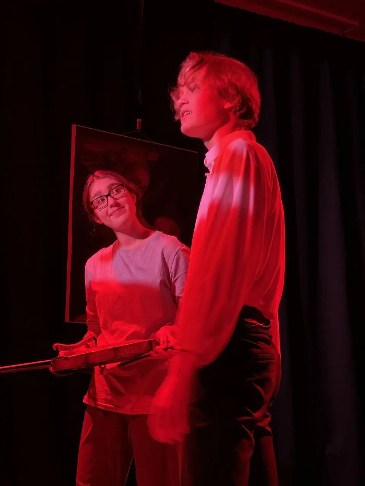
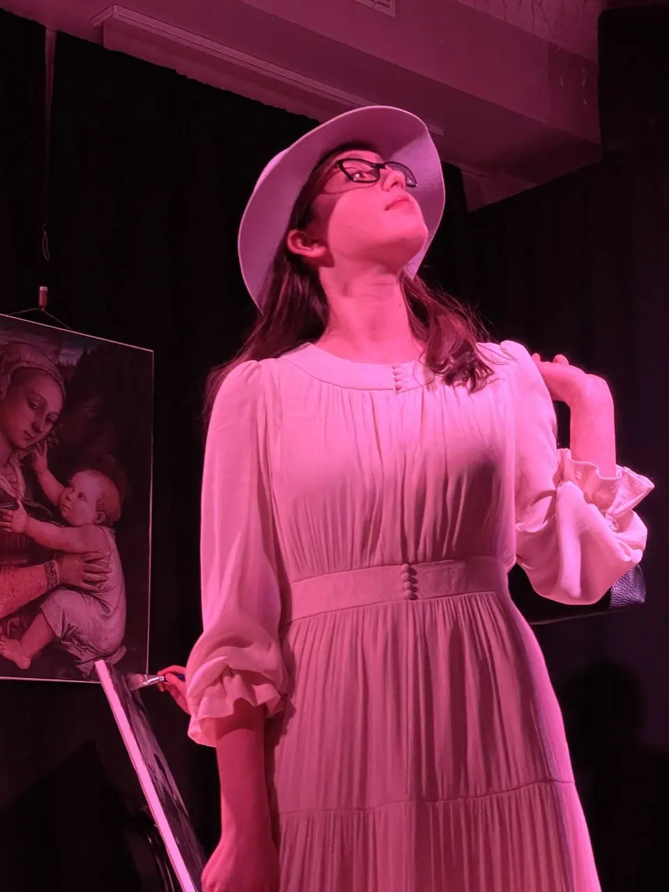
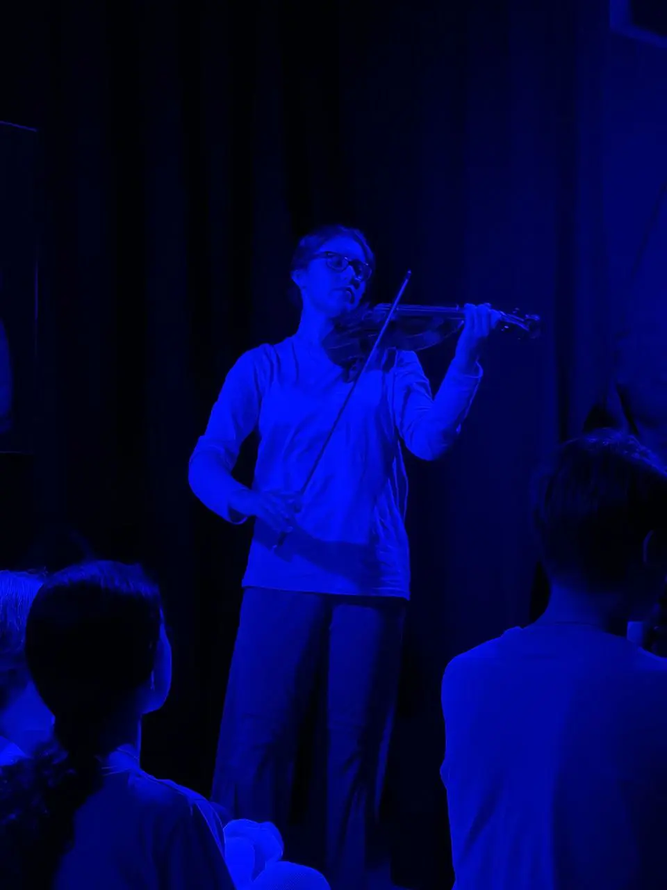
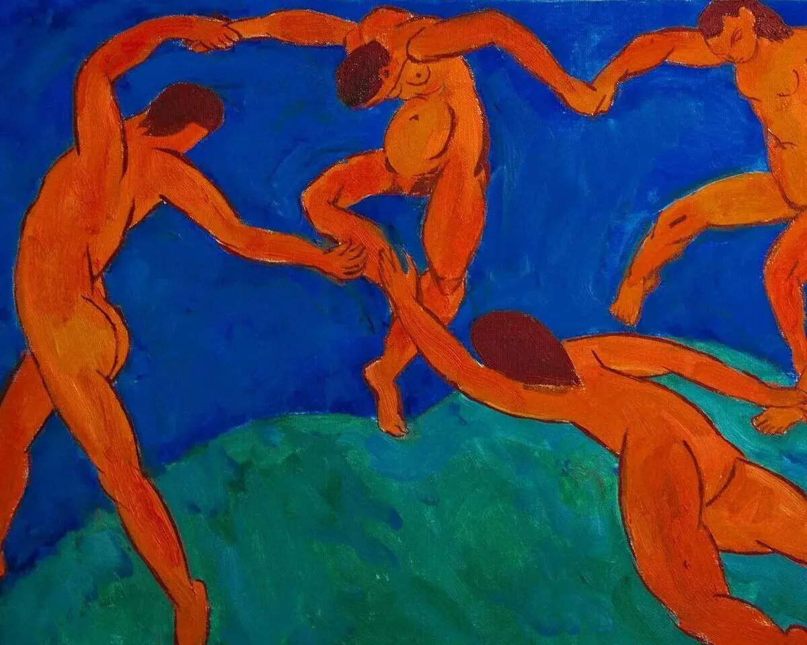

:::gallery
{width="1280" height="720" data-color="#1e0d2b"}

{width="960" height="1280" data-color="#481c31"}

{width="960" height="1280" data-color="#3e060c"}

{width="960" height="1280" data-color="#69253f"}

{width="960" height="1280" data-color="#000146"}
:::

Приходите! ✨✨✨
4 и 5 апреля в 19 часов.

🎫 [Билеты по ссылке🔗](https://ano-prosvetitelskiy-klub.timepad.ru/event/3219966/)

📍[Нащокинский пер., 14](https://yandex.ru/maps/org/aleksandr/86343990352?si=hkgv88xffz97ba3h76tajv9ey0)
     [Клуб «Александр»](https://yandex.ru/maps/org/aleksandr/86343990352?si=hkgv88xffz97ba3h76tajv9ey0)
     [м. Кропоткинская](https://yandex.ru/maps/org/aleksandr/86343990352?si=hkgv88xffz97ba3h76tajv9ey0)

А вот и разгадка на вопрос [«Какая музыка могла бы звучать в этой красной-красной сцене?»](https://t.me/gattavasis/207?single)⬇️

[Philippe Hirshhorn, Морис Равель - Tzigane](https://t.me/gattavasis/289){.audio}

**Морис Равель** (1875-1937)

*Рапсодия «Цыганка»*
🔗 [Немного о ней](https://www.belcanto.ru/ravel_tzigane.html)

Играет потрясающий советский и бельгийский скрипач **Филипп Хиршхорн**!

{width="1200" height="960" data-color="#463d4c"}

Для «Цыганки» Равеля [художественным отражением был выбран](https://t.me/gattavasis/196) «Танец» Анри Матисса из диптиха панно «Танец» и «Музыка», который был создан художником по заказу Сергея Щукина.

По-моему, это идеальное попадание! Будет красочный калейдоскоп литературных, музыкальных и художественных образов, всех ждём!
