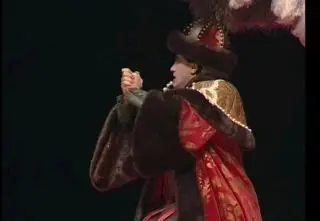

[{width="180" height="320" data-color="#856f5f"}](https://t.me/gattavasis/301){.video data-duration="20"}

**Иоганн Маттезон**, близкий друг Генделя, которого он чуть не заколол на премьере своей оперы ==о, если б не пуговица!=={.spoiler}, во всех отношениях личность фантастическая.

Играл на семи инструментах! Певец и капельмейстер в оперном театре Гамбурга и соборе Святой Марии. Как и Бетховен, к концу жизни потерял слух.

Основоположник современного музыкознания, Маттезон первым ввёл в нём понятие интуиции, которое воспринял от своего великого современника Джона Локка, и полагал, что гениально одарённые артисты и художники способны достичь гораздо большего, чем учёные, вооружённые точными инструментами познания.

Издавал первый в Германии музыкальный журнал, написал свыше сотни трудов по истории и теории музыки. В том числе две школы генерал-баса \[basso continuo\], в которых он предлагает клавесинисту упражняться в искусстве импровизации пьес по басу — одна из таких probstück на видео!

**А ещё он написал «Бориса Годунова» на 160 лет раньше Мусоргского!**

[{width="180" height="320" data-color="#9f887b"}](https://t.me/gattavasis/302){.video data-duration="62"}

[{width="320" height="221" data-color="#201714"}](https://t.me/gattavasis/303){.video data-duration="119"}

**«Борис Годунов, или Коварством достигнутый трон»** считается первой в истории оперой на русский сюжет.

У неё очень любопытная судьба. Она не была поставлена ни при жизни, ни после смерти композитора.

По одной из версий, гамбургские власти не хотели испортить нарождающиеся отношения с Россией, где действовал запрет выводить на сцену царствующих особ.

Долгое время партитура хранилась в архиве в Гамбурге. Затем была отправлена в Дрезден, архив которого в конце Второй мировой войны был вывезен по репарации в Ленинград. Оттуда партитура попала в архив Еревана. А в 1998 году была возвращена в Германию.

Маттезон — ярый противник господствовавшей с античности иерархии жанров, поэтому драматический сюжет дополнен буффонными эпизодами. Исторической достоверности, разумеется, искать не приходится — это опера.

Мировая премьера состоялась лишь в XXI веке! В Бостоне в 2005 году, в России — в 2007 в Михайловском театре.

🎬 **Итак, Иоганн Маттезон «Борис Годунов», 1710:**
[Акт I](https://youtu.be/5DfCbZpfIck?si=-J-9O9T3grN13bZ5)   [Акт II](https://youtu.be/bIwqpd9xDEw?si=-Wdzvj41GU-yN9dV)
  [Акт III](https://youtu.be/wBJdDww_5U4?si=ZMoMsQ-V2Fezvjpj)

==Как вам пёрышки Бориса?💅=={.spoiler}
