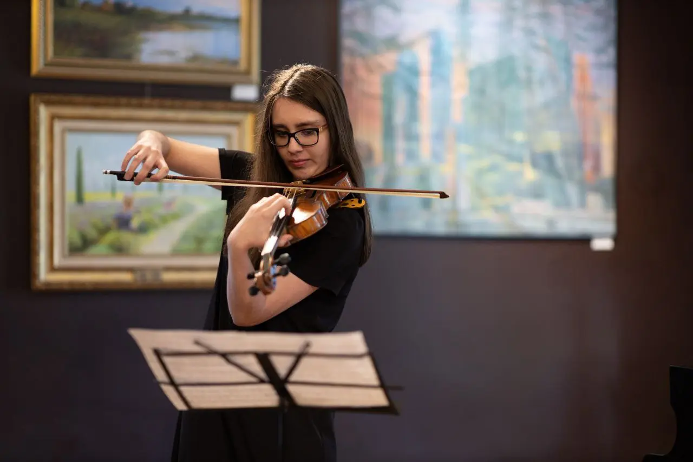
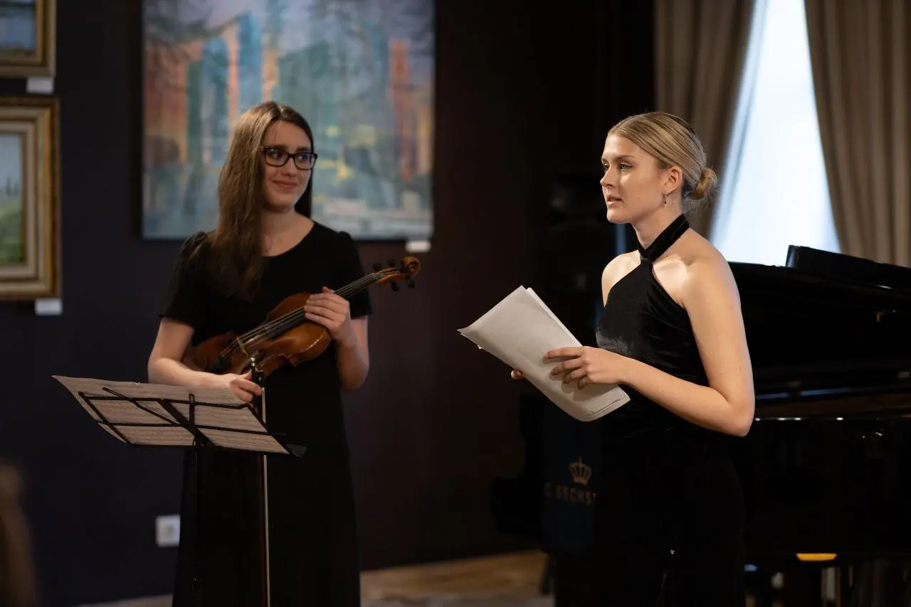
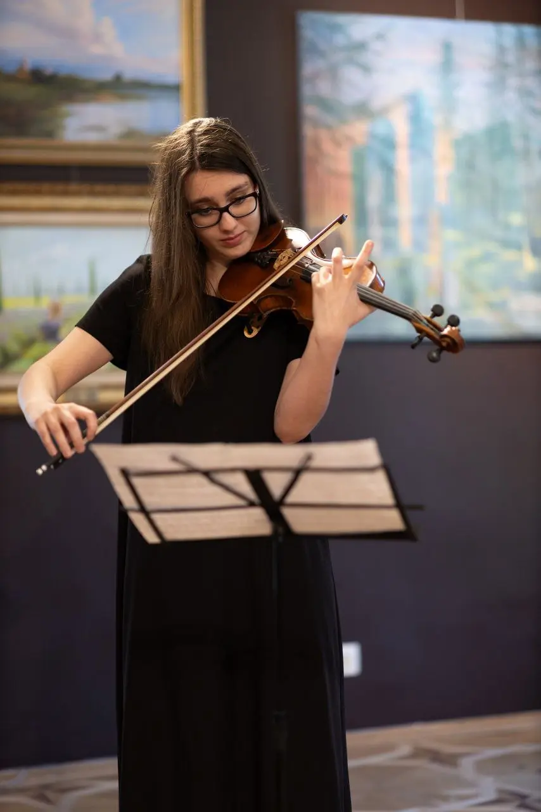
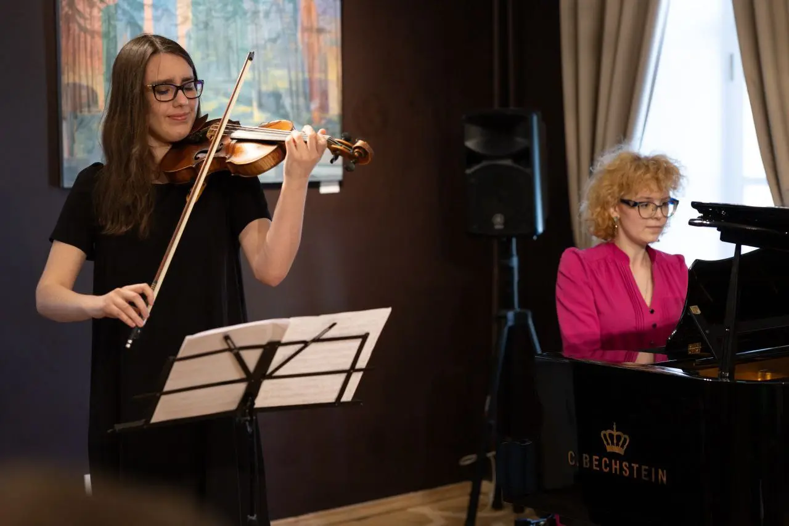
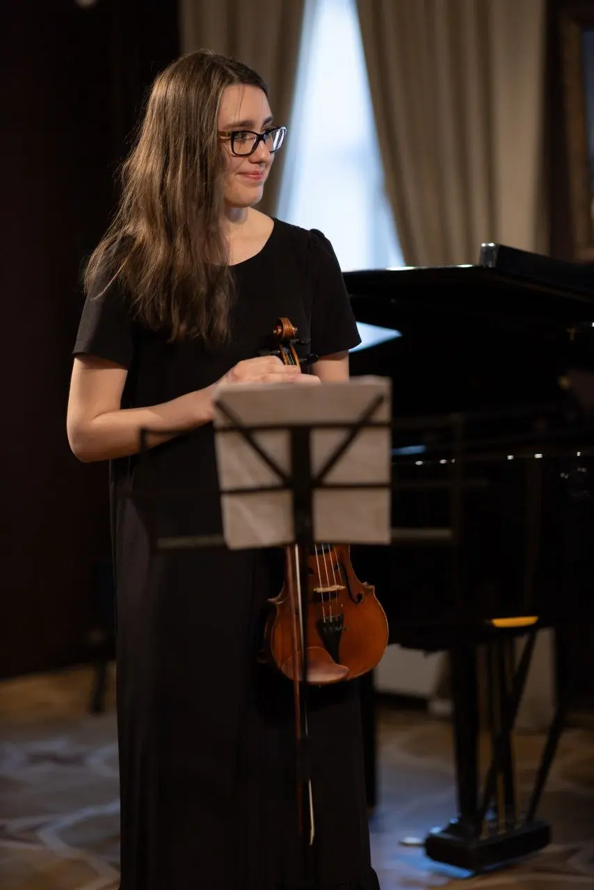

:::gallery
{width="1280" height="854" data-color="#645852"}

{width="1280" height="854" data-color="#372d28"}

{width="854" height="1280" data-color="#605450"}

{width="1280" height="854" data-color="#473531"}

{width="854" height="1280" data-color="#2c211c"}
:::

У меня грядет насыщенная и очень интересная неделя)) Приходите меня поддержать, буду очень рада всех видеть!

🎻**26.04** **сб** [«Библионочь» в Центре Булгакова на Арбате](https://t.me/bulgakovmuseum/2631)
Начало в 20 часов. Вход свободный по [регистрации](https://tickets.mos.ru/widget/visit?eventId=64862&agentId=museum29&date=2025-04-26).

🎻**27.04** **вс** [Collegium musicum](https://t.me/collegiummusicumru):
[Все кантаты Баха с Романом Насоновым](https://collegiummusicum.ru/concerts/vse-kantaty-baha-sezon-viii-konczert-pyatyj-2040/?utm_campaign=tg_cm_21_04)
Начало в 20 часов.
🎫 Билеты по [ссылке](https://collegiummusicum.intickets.ru/seance/28100019/#abiframe). Промокод - `ПРОШЛОЕ`.

🎻**30.04** **ср** [Грандиозный вечер «Телеман без баса»](https://pokrovka27.com/april#rec921184909)
Начало в 19 часов. Вход свободный.

🎻 **01.05 чт**
[Вечер камерной музыки в Парке Горького](https://gorky-park.timepad.ru/event/3348448/)
Начало в 19 часов. Вход свободный, регистрация по ссылке. Потрясающая трио-программа!

🎹**4.05** **вс**  [Концерт класса Заслуженной артистки России М. С. Евсеевой. К 340-летию со дня рождения Баха](https://www.mosconsv.ru/ru/concert/193534)
Начало в 14 часов. Будут пригласительные, пишите мне в тг [@Julia\_violin](https://t.me/Julia_violin) ))

🎻🎻🎻🎻🎻**5.05** **пн**
[Закрываю наш кафедральный концерт!](https://www.mosconsv.ru/ru/concert/193484)
✨✨✨
Начало в 19 часов. Будут пригласительные, пишите мне в тг [@Julia\_violin](https://t.me/Julia_violin) ))

❤️ Спасибо [Марине Лавинской](https://marina-lavinskaya.wfolio.pro/) за чудесные фотографии с Пасхального концерта [«Soundout»](https://t.me/SoundOutFoundation)!
