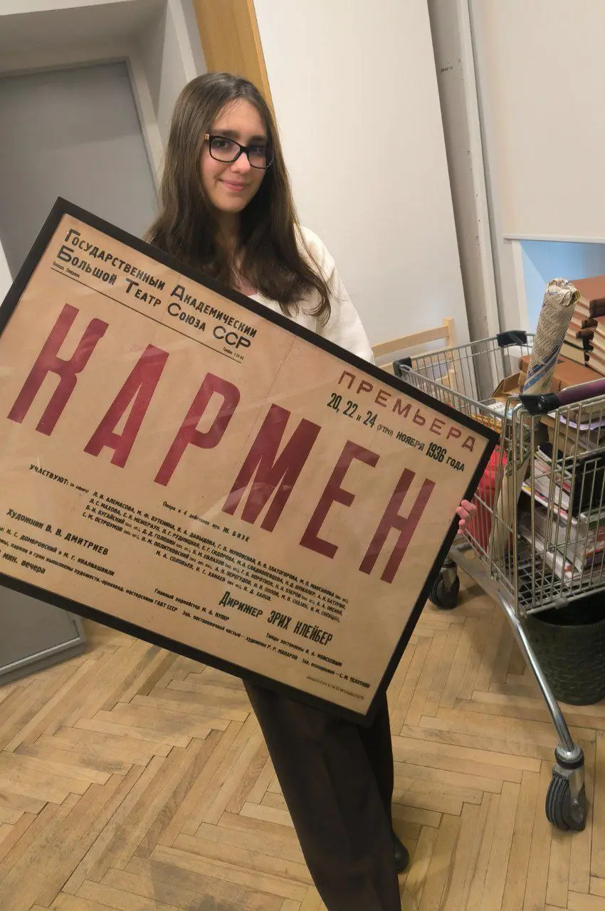

{width="850" height="1280" data-color="#947860"}

С удовольствием приглашаю вас в этот понедельник в 19 часов на очень важный для меня концерт —
[Вечер нашей кафедры](https://www.mosconsv.ru/ru/concert/193484) в
📍[Рахманиновском зале консерватории](https://yandex.ru/maps/org/moskovskaya_gosudarstvennaya_konservatoriya_imeni_p_i_chaykovskogo_rakhmaninovskiy_zal/38104528288?si=hkgv88xffz97ba3h76tajv9ey0).

В его заключении прозвучит Фантазия Франца Ваксмана на темы из оперы «Кармен» Жоржа Бизе в моём исполнении.

Причём не в общепринятой редакции Хейфеца! А в знаменитой версии Когана🤩

==Не спрашивайте, как я снимала на слух блестящие пассажи с записей Леонида Борисовича😱😱😱=={.spoiler}
