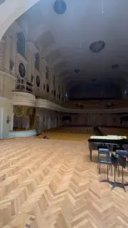

[{width="180" height="320" data-color="#6b5e55"}](https://t.me/gattavasis/312){.video data-duration="43"}

Первый раз прикоснулась к знаменитому Кавайе-Коль в Большом зале консерватории.
На Всемирной выставке 1900 года в Париже он был признан одним из лучших органов в мире.
