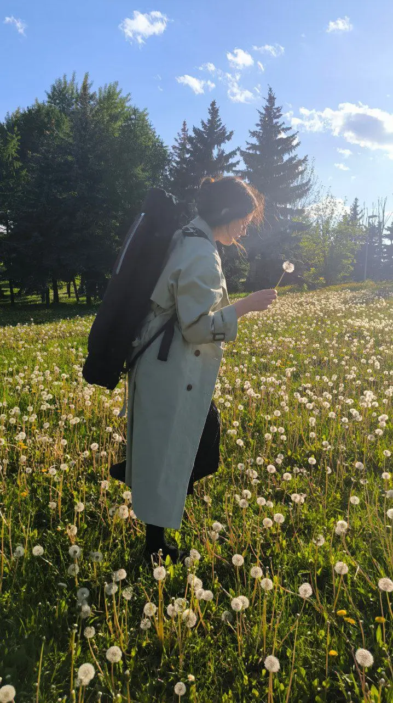

{width="718" height="1280" data-color="#646652"}

🎻**Завтра, 19.06, в 12 часов** приходите меня поддержать на мой экзамен по специальности! Буду рада!
📍[Рахманиновский зал Московской консерватории](https://yandex.ru/maps/org/38104528288?si=hkgv88xffz97ba3h76tajv9ey0)

🎶**22.06, вскр**
Вновь приглашаю на концерт из цикла [«Все кантаты Баха»](https://collegiummusicum.ru/concerts/vse-kantaty-baha-sezon-viii-konczert-pyatyj-2042/)!
Ансамбль [Collegium musicum](https://t.me/collegiummusicumru), концерт ведёт Роман Насонов!
Начало в 20 часов.
📍[Кафедральный собор святых Петра и Павла](https://yandex.ru/maps/org/1036790838?si=hkgv88xffz97ba3h76tajv9ey0)
[Старосадский переулок, 7/10с6](https://yandex.ru/maps/org/1036790838?si=hkgv88xffz97ba3h76tajv9ey0)

🎻**26.06, чт**
**Моцарт**
в📍[Галерее на Мосфильме](https://yandex.ru/maps/org/27857923291?si=hkgv88xffz97ba3h76tajv9ey0)
Фортепианный концерт «Jeunehomme» и мотет «Exultate jubilate».
Начало в 19:00.

🥳**27.06, пт**
**Не очень серьёзный**
**очень несерьезный** концерт в Парке Горького в мой день рождения!
Начало в 18:00.
📍[Музей Парка Горького](https://yandex.ru/maps/org/1702515828?si=hkgv88xffz97ba3h76tajv9ey0)

✨**29.06, вскр**
[Теллур-трио](https://t.me/tellurium_trio) в **Усадьбе Свиблово**!
Следите за нашими анонсами в тг-канале и вк! [@tellur\_trio](https://t.me/tellur_trio)

Хотите прийти на какой-нибудь из концертов? Пишите мне в телеграм на [@Julia\_violin](https://t.me/Julia_violin), отправлю пригласительные❤️

**Буду очень рада всех видеть!**
