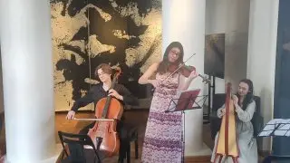

[{width="320" height="180" data-color="#8e837c"}](https://t.me/gattavasis/322){.video data-duration="481"}

**Не имей сто рублей, хотя лучше всё-таки тоже имей, а имей сто друзей, которые придут к тебе на День Рождения, чтобы устроить праздничный концерт!**

27-го июня я отметила свой 21-й день рождения в Парке Горького в компании талантливых молодых музыкантов, по совместительству моих прекрасных отзывчивых друзей, согласившихся поучаствовать в этом авантюрном капустном концерте, который в итоге случился просто потрясающим!!!
Спасибо вам огромное!

В этом видео я собрала несколько, как говорят американцы, верховных светофоров полуторачасового концерта — т.е. show's best highlights.

Это видео можно было бы озаглавить иначе. Например, «8 минут хвастаюсь, какие у меня крутые друзья», «как развлекается творческая интеллигенция» или «а вам когда-нибудь друзья дарили в честь праздника целый настоящий концерт?».
Но я довольно скромная.

P.S. Этот монтаж-коллаж я делала очень-очень долго. Буду дальше совершенствоваться в этом непростом деле, обещаю!

📺 [Смотреть можно здесь!](https://vkvideo.ru/video-231322904_456239017?list=ln-efTwIQbb16oVhyeUQY) 🔗
