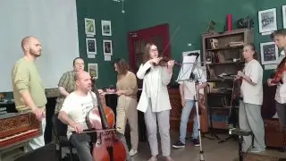

[{width="320" height="180" data-color="#716e69"}](https://t.me/gattavasis/323){.video data-duration="5"}

Последний из моих текстов про музыку, ради которых я и заводила канал, [датируется](https://t.me/gattavasis/301?single) концом апреля. Не потому, что этой любопытной Варваре оторвали нос, и я перестала находить занимательные бирюльки. В общем, что-то здесь наверняка скоро появится.

Но не раньше впечатлений от посещения заброшенной финской ГЭС. Как вы можете заметить, я наслаждаюсь каждой минутой этих выходных.

P.S. Это я позавчера на барочном практикуме в Санкт-Петербурге. Вчера уже жарила лисички, да-да, [те самые](https://t.me/gattavasis/30), и один белый гриб.

P.P.S. Видела кабанов.
