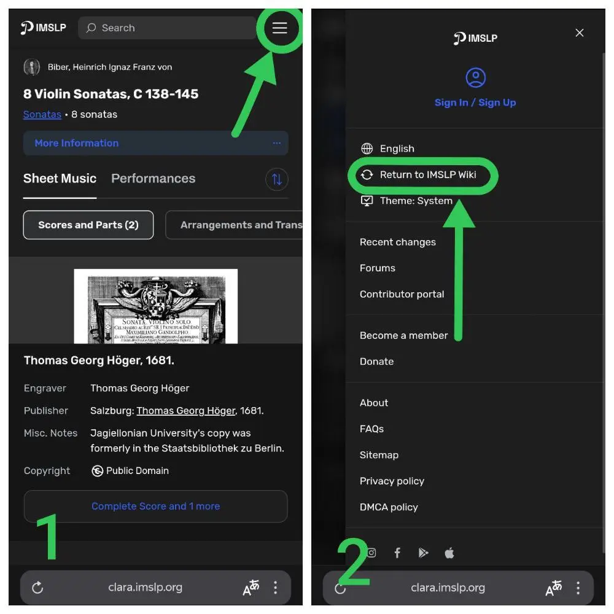

{width="1000" height="1000" data-color="#2f3231"}

Многие коллеги жалуются, что перестал работать один из главных интернет-ресурсов в жизни академических музыкантов, сайт Петруччи — [imslp.org](https://imslp.org)

Проект IMSLP (International Music Score Library) — самый крупный интернет-архив сканированных нотных материалов, существует с февраля 2006 года.

Многие материалы в открытом доступе в оцифрованном виде находятся только там!

Перебои в его работе периодически случаются на территории России, но альтернатив у нас пока что не очень много.

В новом обновлении с основного адреса [https://imslp.org/](https://imslp.org/) стал автоматически выполнять переадресацию на другие родственные домены и альтернативные адреса [imslp.eu](https://imslp.eu) ; [imslp.com](https://imslp.com) ; [clara.imslp.org](https://clara.imslp.org) ==и др=={.spoiler}, где активнее, чем обычно, предлагает пользователю платную подписку и не даёт скачать ноты без авторизации на сайте.

На самом деле, обойти нововведения очень просто: если хорошо поискать, прямо на странице можно найти ссылку на оригинальную версию сайта.

Прикрепила инструкцию⬇️

📝 А теперь публикую [мой небольшой материал](https://telegra.ph/Istoriya-cifrovogo-Robina-Guda-i-vopros-ob-avtorskom-prave-07-23) о драматичной истории [IMSLP](http://imslp.org/), нашей любимой,
~~по большей части~~ легальной нотной библиотеке, и её войне с издательскими титанами.

[https://telegra.ph/Istoriya-cifrovogo-Robina-Guda-i-vopros-ob-avtorskom-prave-07-23](https://telegra.ph/Istoriya-cifrovogo-Robina-Guda-i-vopros-ob-avtorskom-prave-07-23)
