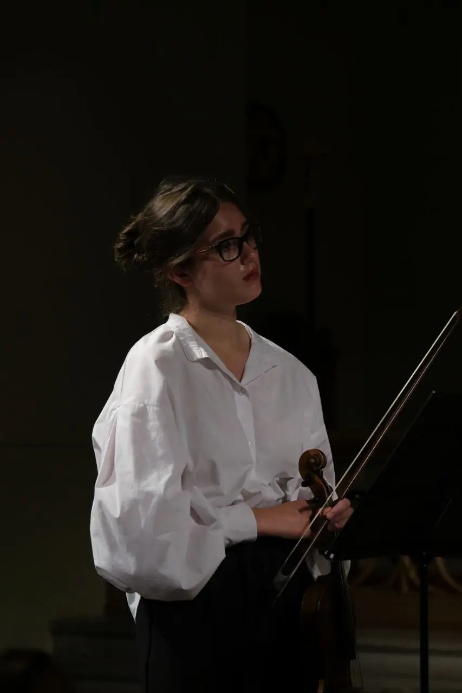
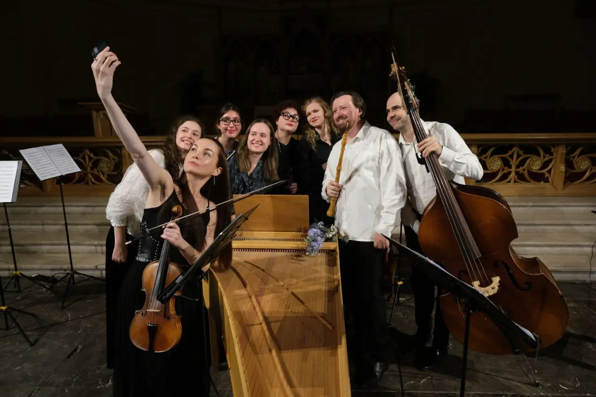
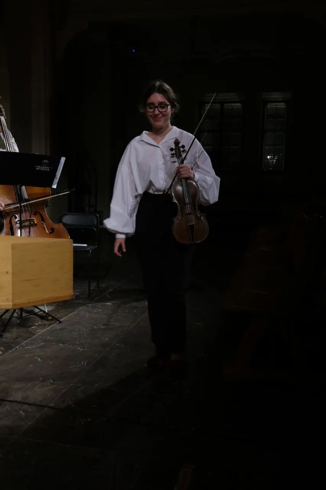

:::gallery
{width="853" height="1280" data-color="#221f1b"}

{width="1280" height="853" data-color="#3e3023"}

{width="853" height="1280" data-color="#13100c"}
:::

Врываемся в новый концертный сезон [@collegiummusicumru](https://t.me/collegiummusicumru)'а с виртуозным барокко в потрясной компании!

[х](https://t.me/gattavasis/355){.audio data-duration="10"}

Среди прочего там был 5-й Бранденбургский Баха! И только послушайте как играет каденцию первой части сподвижник несравненного Shunsuke Sato блестящий клавесинст и дирижер Richard Egarr.

🎧 [Слушать запись целиком](https://youtu.be/LHjbRMIIhuM?si=CBNy49A_T3zYF37i)

[{width="180" height="320" data-color="#50463b"}](https://t.me/gattavasis/356){.video data-duration="32"}

Что-то мне это напоминает...чем вам не Лигети😁
