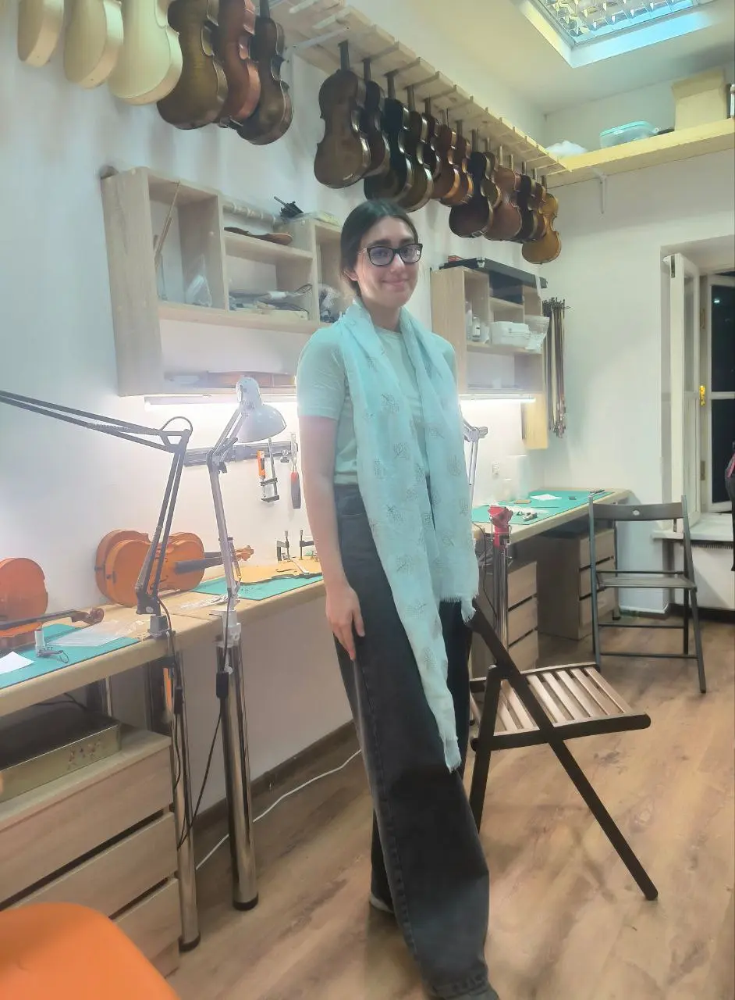
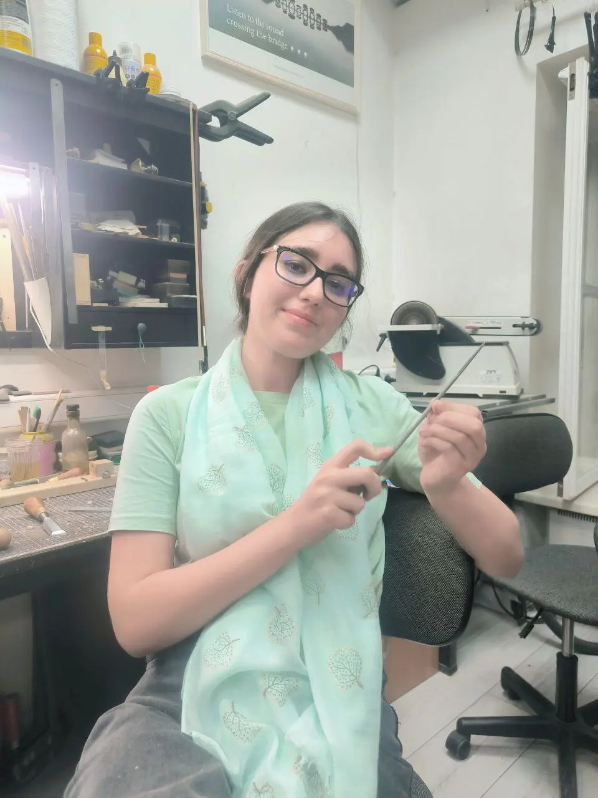
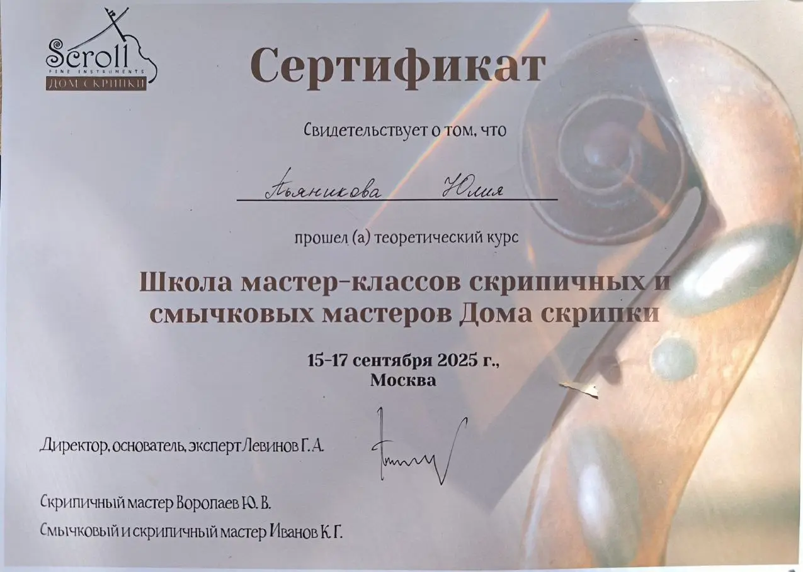

:::gallery
{width="942" height="1280" data-color="#8f8d82"}

{width="960" height="1280" data-color="#9c9d96"}

{width="1275" height="910" data-color="#afa8ac"}
:::

Вспоминая гениального Самуила Маршака:

«**Застучало долото:**
**— Это, дядя, ты про что?»**

Могу с уверенностью заявить, что со стамеской, напильником, надфилем, струбциной и осетровым клеем я теперь на «ты».

Так что, если у вас есть не безвозвратно испорченный инструмент или смычок, требующий замены волоса, лучше держитесь от меня подальше.

Хочется поблагодарить [@violinscroll](https://t.me/violinscroll), Георгия Левинова, Юрия Воропаева и Константина Иванова за то, что позволили немного прикоснуться к тонкому искусству скрипичных и смычковых мастеров. Я узнала очень много интересного!
