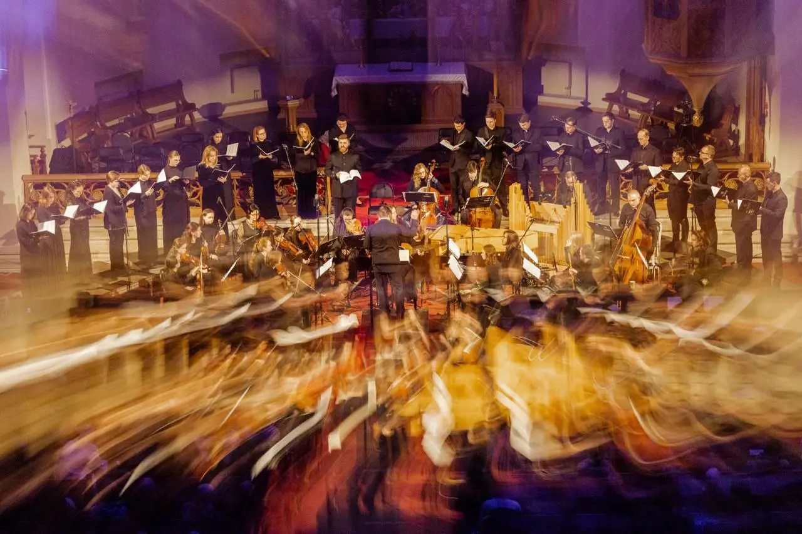

[{width="320" height="320" data-color="#5a4940"}](https://t.me/gattavasis/366){.video .round data-duration="18"}

[{width="320" height="320" data-color="#57433a"}](https://t.me/gattavasis/367){.video .round data-duration="26"}

{width="1280" height="853" data-color="#845439"}

Начало в 19 часов!

Бессменный проводник, открывающий дверь в XVIII век — Роман Насонов. А за клавесином и органом (даже не одним) потрясающий Фёдор Строганов, у которого мне повезло немного поучиться мастерству бассо континуо [в прошлом году](https://t.me/gattavasis/302?single).

За промокодами и пригласительными
— [@Julia\_violin](https://t.me/Julia_violin) ))
