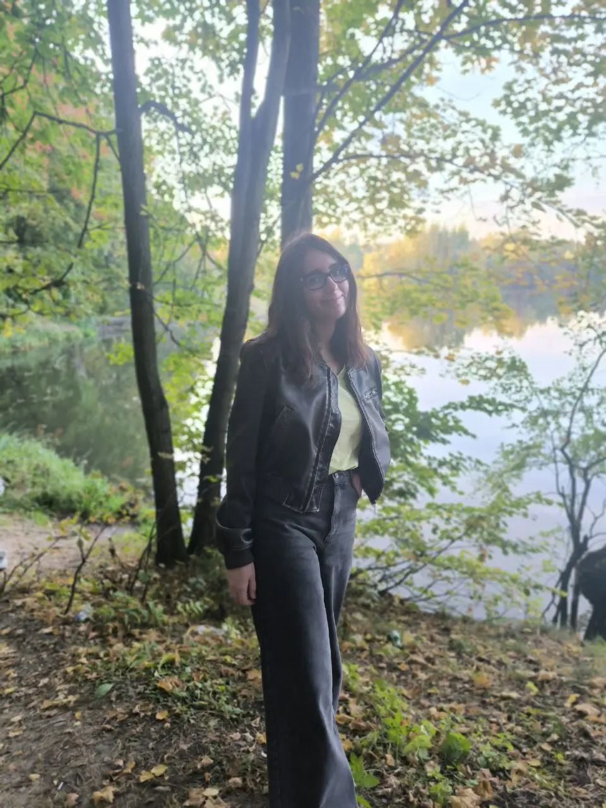
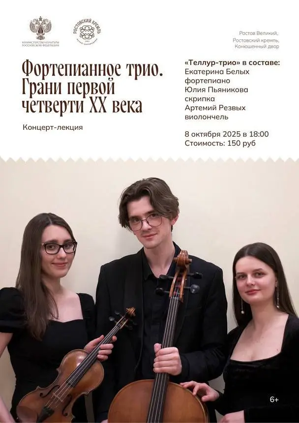
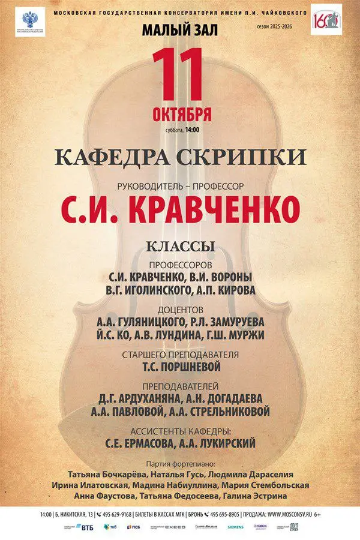

:::gallery
{width="960" height="1280" data-color="#818879"}

{width="608" height="860" data-color="#aba09c"}

{width="600" height="900" data-color="#d9bb9d"}
:::

**Воскресные кантаты отгремели, и новая неделя сезона обещает быть тоже очень интересной:**

🍁 [Сегодня в 20 часов](https://gorky-park.timepad.ru/event/3612357/) сольная программа в **Парке Горького** — исполню Баха, Паганини, Ваксмана.

🍁 Завтра **Теллур-трио** выступает с концертом-лекцией [в Ростовском кремле](https://t.me/gattavasis/372) — Рославец и Танеев.

🍁 А в эту субботу в 14 часов всех жду на [Концерте кафедры скрипки](https://www.mosconsv.ru/ru/concert/195113) под руководством моего профессора Сергея Ивановича Кравченко — я в начале 2-го отделения!

Буду рада всех видеть! О пригласительных — мне в тг [@Julia\_violin](https://t.me/Julia_violin)

🍁 P.S. Следующие три кантаты в Кафедральном лютеранском соборе Свв. Петра и Павла [уже 26 октября — BWV 35, 45, 102.](https://collegiummusicum.ru/concerts/vse-kantaty-baha-sezon-ix-trista-let-spustya-tretij-kantatnyj-czikl-baha-26-10-2025-1900/)

125 баховских кантат уже исполнено, так что осталось всего ничего — около 40 кантатных концертов😁😁😁

P.P.S. Первая фотография с экскурсии консерваторского Литклуба в Переделкине! Спасибо дорогим [@lina\_mkrtychyan](https://t.me/lina_mkrtychyan) и [@soniazeltser](https://t.me/soniazeltser)
