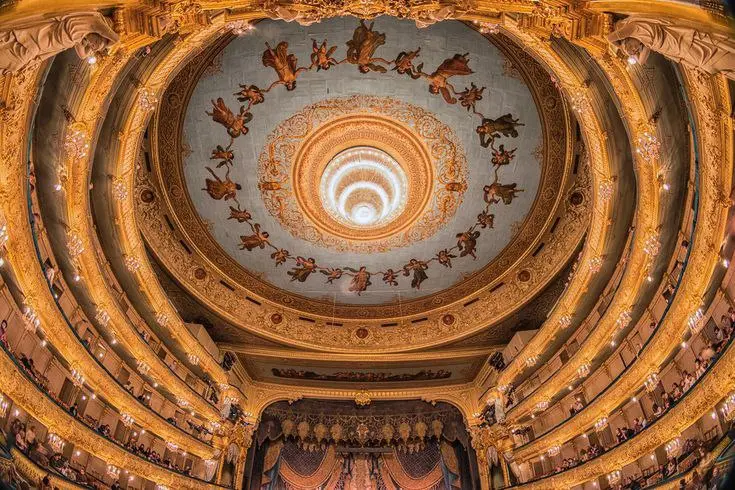
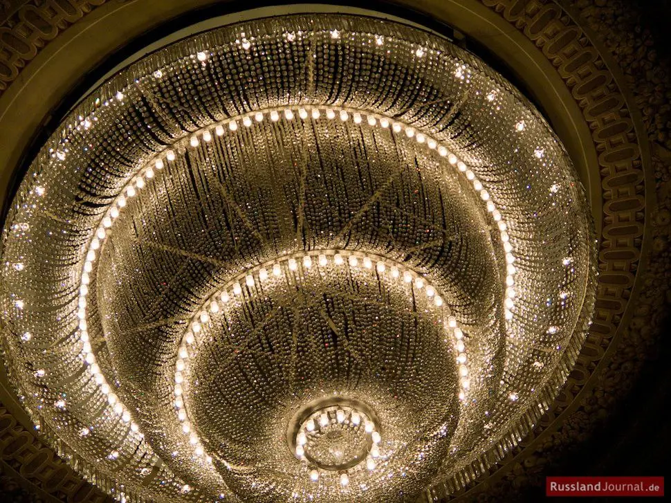
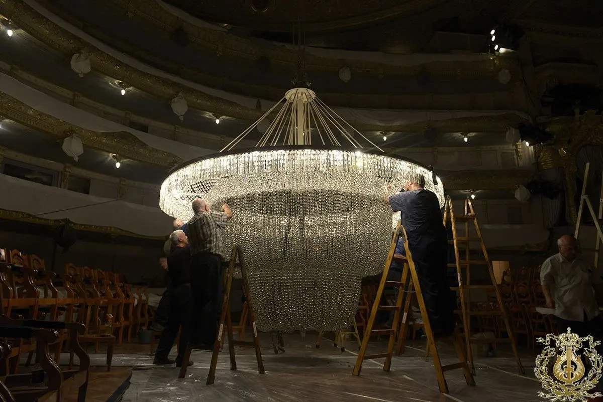
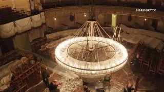
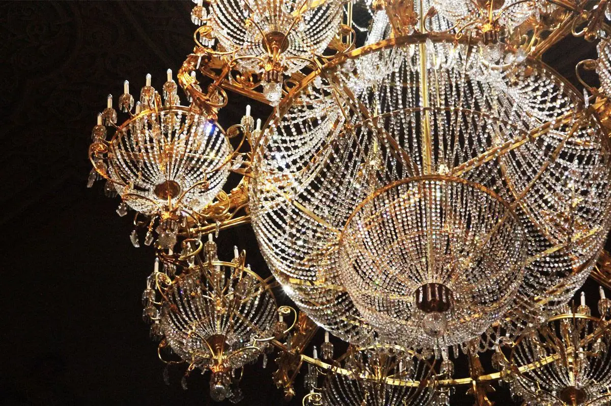
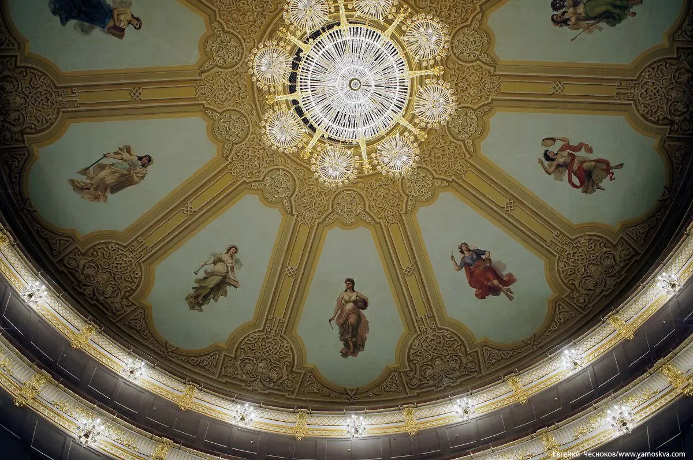
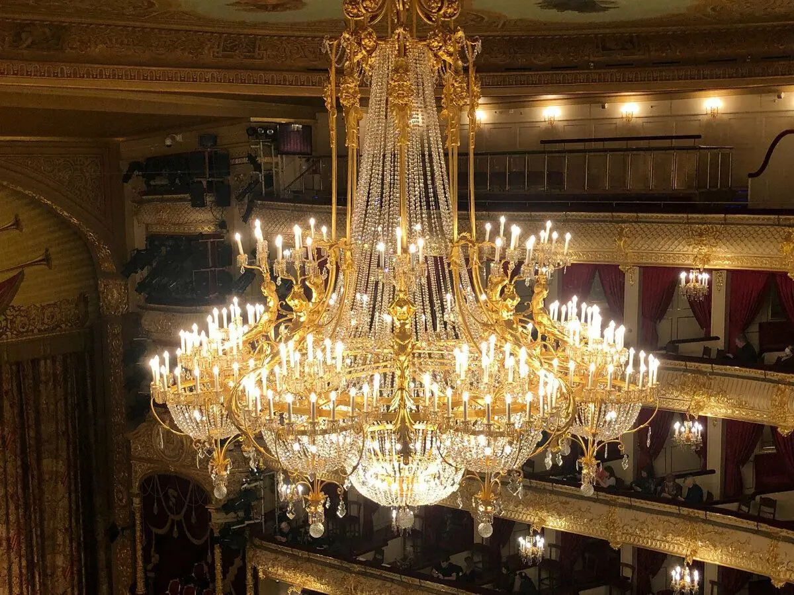

:::gallery
{width="735" height="490" data-color="#91613b"}

{width="970" height="727" data-color="#5f4c30"}

{width="1200" height="801" data-color="#322b1d"}
:::

В общем, я изучила вопрос, сопоставила два царь-светильника страны и сейчас всё расскажу!

По легенде, когда в Мариинке пел Шаляпин, то подвесы люстры от его баса входили в резонанс и издавали специфический звук.

Трехъярусная «хрустальная примадонна» появилась в Мариинском в 1885 году. Тогда в театре сделали полное электрическое освещение.

**Тех. параметры:**
30 тысяч хрустальных подвесок
вес - 2,5 т
215 лампочек
высота - 2,5 метра
диаметр ≈ 3 метра

[{width="320" height="180" data-color="#674b35"}](https://t.me/gattavasis/379){.video data-duration="113"}

Ежегодно в Мариинском театре меняют все 215 лампочек люстры, потому что обновить перегоревшие получится только через год.

Механизм, который поднимает и опускает люстру, был установлен в 1956 году. До сих пор это происходит вручную, при помощи лебедки. Это ежегодная традиция Мариинского театра.

*NB!* Рекомендую к прочтению этот [трогательный репортаж «Известий»](https://iz.ru/1566121/zoia-igumnova/moia-prelest-kak-proshel-bannyi-den-dlia-liustry-bolshogo-teatra) о «банном дне» для люстры Большого 🥺🥺🥺

> ...«Моя прелесть», — нежно обращается к люстре появившийся в зале рабочий сцены. Глаза у него сияют в предвкушении особого ритуала.
> «Я уже 33 год мою люстру. Для меня это дело привычное. У нас в театре много люстр, мы не только эту моем.»
> «Только мой шарик не мойте, пожалуйста, — обращается к рабочим ведущий инженер художественно-постановочной части Татьяна Волощук. — Для меня это традиция — помыть главный шарик на люстре. Я его натираю с 1977 года.»

:::gallery
{width="1200" height="800" data-color="#675342"}

{width="1200" height="797" data-color="#6a6147"}

{width="1200" height="900" data-color="#6b5132"}
:::

Люстру **Большого театра** повесили в 1863 году, 162 года назад.

Изначально она была газовой, но когда появилось электричество в 1893 году, люстру переделали.
В ней остались все трубки, газовые рожки, а вентили убрали и переделали под цоколи лампочек.

Люстру заказала дирекция Императорских театров у французских мастеров.

Для освещения Императорских театров, Большого и Малого, на месте нынешнего ЦУМа была построена динамо-машина.

76 канделябров в ложах на ярусах тоже раньше были свечными.
Хрусталь для замены повреждённых деталей театр заказывает в Гусь-Хрустальном.

==Интересно, многим ли зрителям выпадает счастливая возможность получить хрустальной подвеской по башке? Такой ценный сувенир...=={.spoiler}

**Тех. х-ристики:**
высота - 8,5 метров
диаметр - 6,5 метров
металл. основа - 2т
хрусталь - 300 кг
336 лампочек
суммарная мощность -
14 кВт
≈всего лишь как две кухонных плиты

**Итак, какую часть стоимости билета на спектакль в Большой театр составляют 336 сверкающих лампочек великолепной люстры?**

**И какая люстра круче?**
