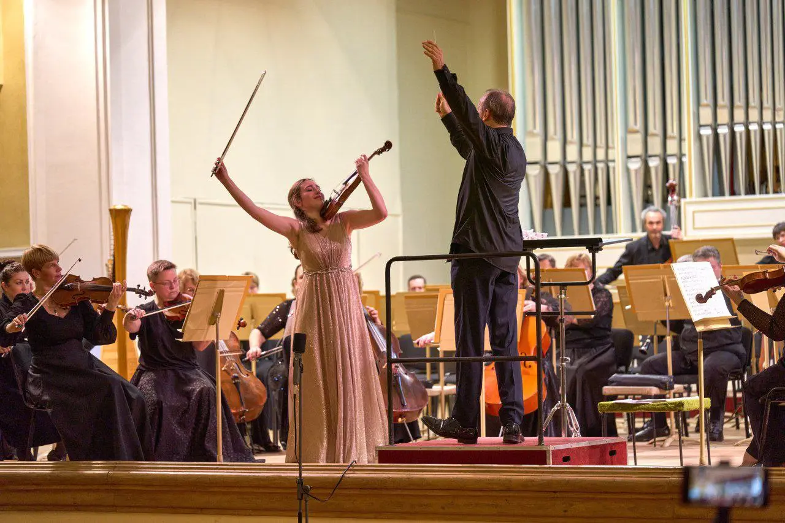
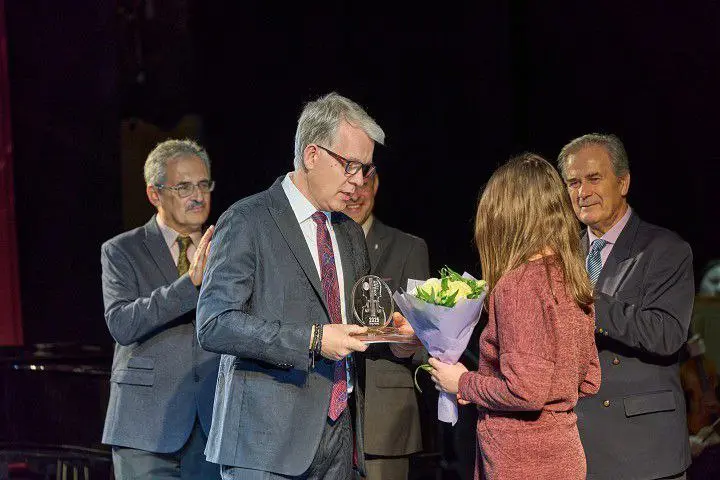
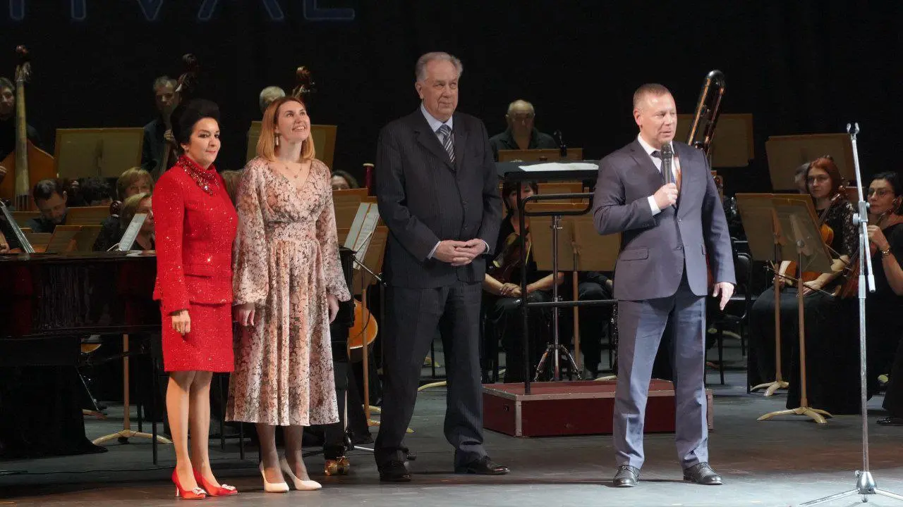
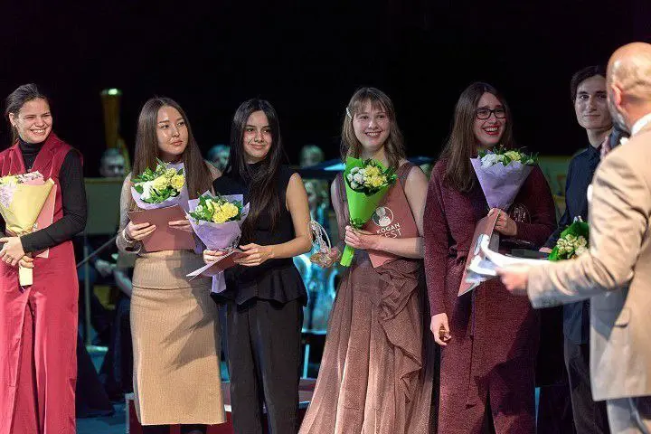
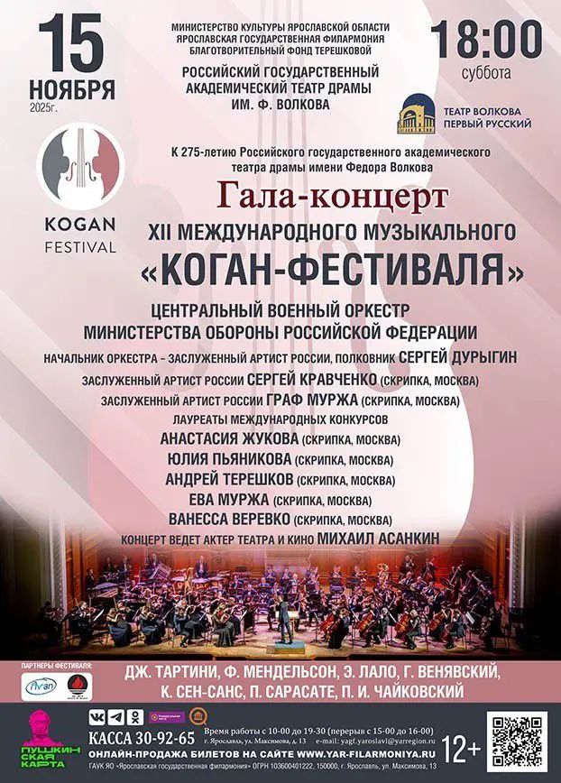

:::gallery
{width="1280" height="853" data-color="#977b67"}

{width="720" height="480" data-color="#3d3131"}

{width="1280" height="720" data-color="#3b2b28"}

{width="720" height="480" data-color="#533f3e"}

{width="622" height="868" data-color="#b39c9f"}
:::

Во-первых, я только что получила первую премию на Международном конкурсе скрипачей Коган-Фест!🤩

Благодарю жюри за такую высокую оценку и моих партнёров по сцене на конкурсных турах за поддержку — со мной выступила прекрасная пианистка Мадина Набиуллина и артисты Ярославского филармонического оркестра, Заслуженный артист РТ дирижёр Василий Валитов, с которыми мы исполнили Концерт Брамса на 3-м туре!

Вообще хочется сказать много добрых слов благодарности всем моим близким и учителям! И, конечно, моему профессору Сергею Ивановичу Кравченко, прямому наследнику исполнительской традиции Леонида Борисовича Когана!

Вторая новость заключается в том, что прямо сейчас я еду репетировать к закрытию Когановского фестиваля, в рамках которого и проходил конкурс скрипачей. 15 ноября в 18 часов состоится [Гала-концерт в Театре Волкова](https://yar-filarmoniya.ru/afisha/view.php?af_id=5802) в Ярославле!

Исполню Фантазию Франца Ваксмана на темы из оперы «Кармен» в версии Леонида Когана, о [которой писала раньше](https://t.me/gattavasis/310).

Будет трансляция, подключайтесь!

==P.S. На этом новости ноября, разумеется, не заканчиваются. Например, на следующей неделе с любимыми теллурианцами везём 5 фортепианных трио в Петербург! Анонсы в нашем тгк=={.spoiler} [@tellur\_trio](https://t.me/tellur_trio) ))

==P.P.S. Как-нибудь я расскажу, насколько чудовищная это была авантюра изначально...=={.spoiler}
