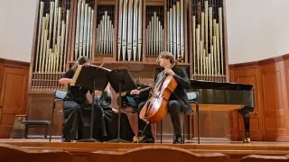

[{width="320" height="180" data-color="#765744"}](https://t.me/gattavasis/396){.video data-duration="118"}

О том, что какой-либо временной отрезок бывает непростым, принято говорить в конце декабря и по всем телеканалам, но позвольте мне высказаться именно про ноябрь.

**Занимательная арифметика:**
я прошла **6** (шесть) конкурсных прослушиваний, где звучало в общей сложности примерно **4** (четыре) часа музыки.

**И стала трижды (3/3) лауреатом!**

 ==Планировалось максимум дважды😁, но Анна Романовна Янчишина внесла свои коррективы.=={.spoiler}

[7-11 ноября — Когановский конкурс](https://t.me/gattavasis/391?single) в Ярославле

[24 ноября — Конкурс-фестиваль квартетов «Гайдн-Марафон»](https://www.mosconsv.ru/ru/concert/200206?ysclid=mily6vpa7a537463009) с Соней Зельцер, Ренатой Мулюковой и Женей Сахаровой!
❤️❤️❤️

И, наконец, [24-30 ноября — Танеевский конкурс](https://t.me/tellurium_trio/145), на котором мы с моими любимыми [@tellur\_trio](https://t.me/tellur_trio) представили просто фантастическую программу!!!

🤹‍♀ И, кстати, прошло ровно три с половиной месяца, как я решила и отказалась от мостика🌉 или подушечки🛌 при игре на скрипке!

Звучали Бах, Гайдн, Моцарт, Бетховен, Брамс×2, Аренский, Танеев, Ваксман, Паганини и Рославец...
Мой канал, могу и похвастаться!
