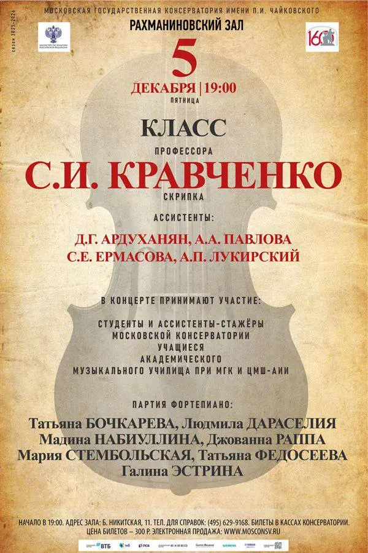
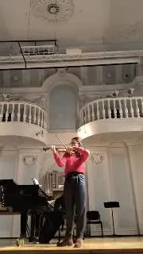

{width="600" height="900" data-color="#cdb595"}

[{width="180" height="320" data-color="#7b6c5f"}](https://t.me/gattavasis/400){.video data-duration="121"}

Хочу сделать концертную программу, в которой одни и те же сочинения Баха, будь то цикл Sei Solo или эти сонаты с облигатным клавесином, исполнялись бы **дважды**:
один раз в аутентичном исторически-ориентированном исполнении, на историческом инструменте, в правильном строе, словом, согласно всем новым канонам, которые всё больше преобладают и в среде академических музыкантов, и на конкурсах,
 а сразу после — в медленно умирающем романтическо-героическом прочтении великих музыкантов прошлого, начиная с тех, кто открыл для нас эту музыку снова после долгих лет забвения.

Очень не хотелось бы, чтобы эта традиция угасла, хотя она и считается сейчас почти везде моветоном...

Иногда задаюсь вопросом, не будут ли исследователи-исполнители через 50 лет восстанавливать эти забытые потрясающие интерпретации, хоть и далёкие от духа эпохи, с той же скрупулезностью?

Приходите слушать моё самое романтическое прочтение этой сонаты **на нашем классном вечере завтра!**

🎫 [БИЛЕТЫ](https://www.mosconsv.ru/ru/concert/200081)

[174930 (1)](https://t.me/gattavasis/401){.audio data-duration="995"}

P.S. Хотя мои личные предпочтения легко можно уловить по моей любимой записи этой сонаты!   Блистательные Эндрю Манце и Ричард Игарр!
