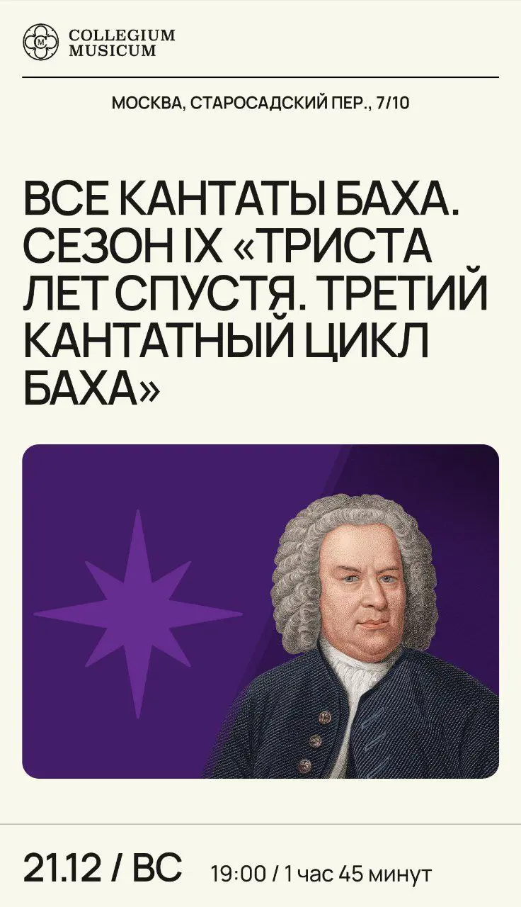

:::gallery
{width="736" height="1280" data-color="#a295a4"}

{width="600" height="900" data-color="#4c6673"}
:::

**для вас**🎁

Самые рождественско-новогодние концерты, которые я жду с нетерпением! То, что доктор прописал для предвкушения праздника и чуда!

🎄**21.12 вскр 19:00**
 [Предрождественские кантаты, последние в уходящем году](https://collegiummusicum.ru/concerts/vse-kantaty-baha-21-12-2025-1900/)

Будут BWV 57 «Блажен муж», BWV 151 «О утешенье сладкое! мой Иисус приходит» и BWV 110 «Да исполнятся уста наши веселия»!
Ну, вы поняли короче)

🎄**28.12 вскр 19:00**
 [Наш новогодний подарок из Вены в Рахманиновском зале!](https://www.mosconsv.ru/ru/concert/195332#&gid=1&pid=1)

Не успели взять билет на Neujahrskonzert в Золотой зал Венского Мюзикферайн на 1-е января?

Не отчаивайтесь! 😁
Ждём вас, будет Бетховен и «Форель» Шуберта, та самая, с контрабасом (всё весьма шампанскообразное)!

Приходите ~~разделить~~ умножать радость!!!

==P.S. Будут пригласительные, пишите на=={.spoiler} [@Julia\_violin](https://t.me/Julia_violin)
