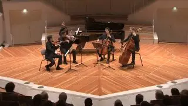
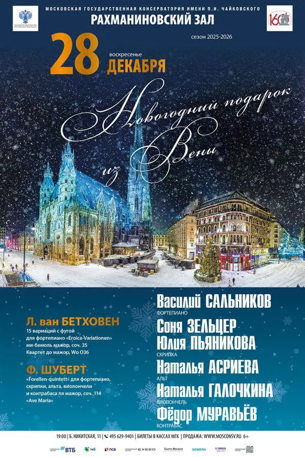
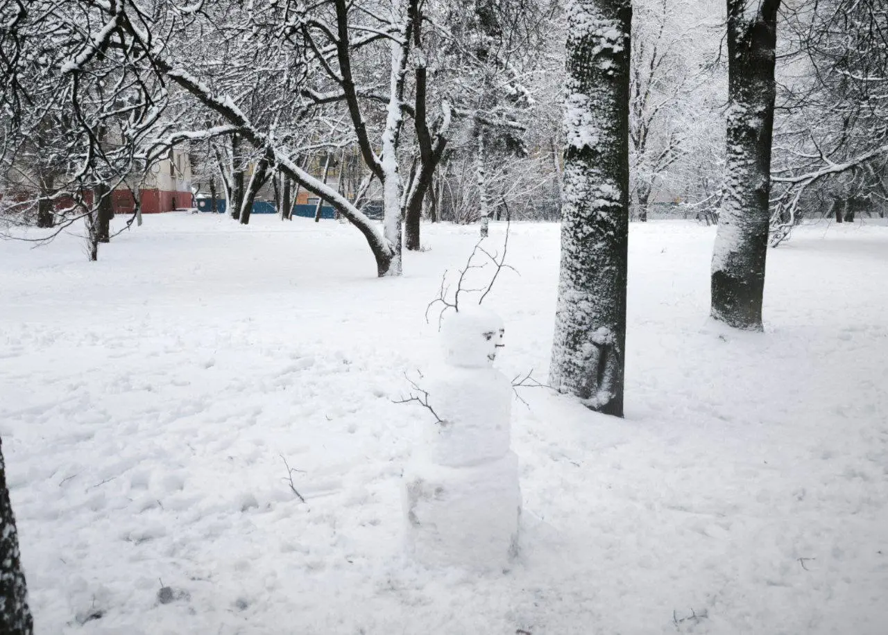
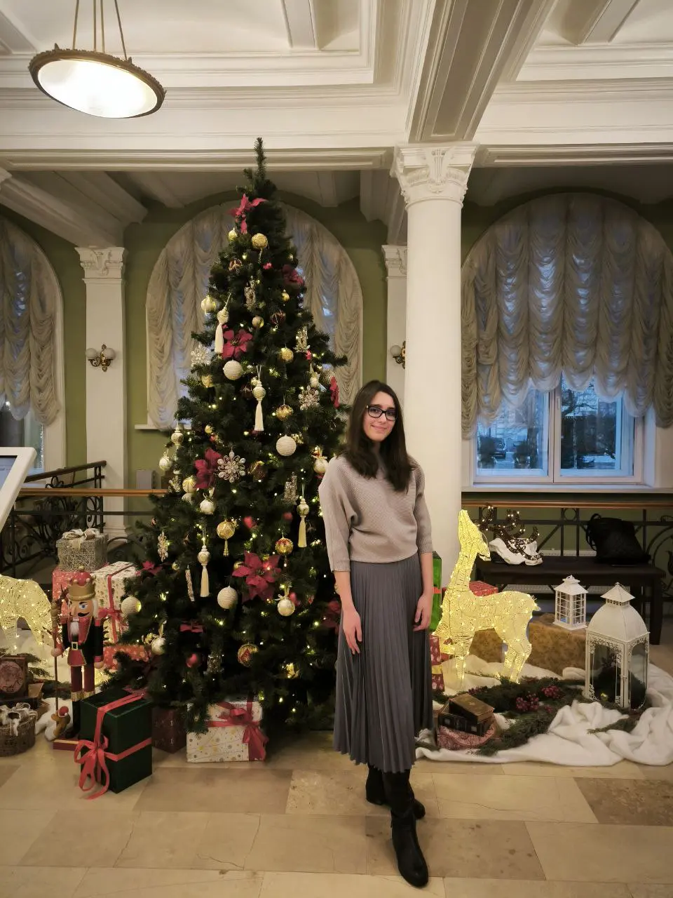

[{width="320" height="180" data-color="#926248"}](https://t.me/gattavasis/414){.video data-duration="66"}

**Вдохновляемся потрясающей записью квинтета Шуберта Ноа Бендикса-Бэлгли и солистов Берлинской филармонии!**

Удалось ли «рыбаку со злобною улыбкой» поймать рыбку, как завещал Шубарт для Шуберта, приходите выяснять **завтра в 19:00!**

📍Рахманиновский зал Московской консерватории

🎫 [БИЛЕТЫ](https://www.mosconsv.ru/ru/concert/195332#&gid=1&pid=1)

Со мной аквакультурную тему развивают:
Наташа Асриева - альт
Наташа Галочкина - виолончель
Федя Муравьев - контрабас
Василий Сальников - фортепиано

Соня Зельцер в этой программе ответственна за квартет Бетховена!
А в конце вас ждёт сюрприз (в афишу чур не подглядывать).

Всех ждём🎄🎄🎄

P.S. Есть пригласительные)

:::gallery
{width="600" height="900" data-color="#4c6673"}

{width="1280" height="916" data-color="#b5b7bc"}

{width="960" height="1280" data-color="#6c5f4b"}
:::
