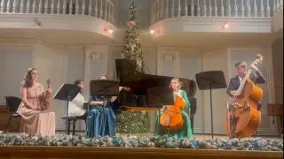
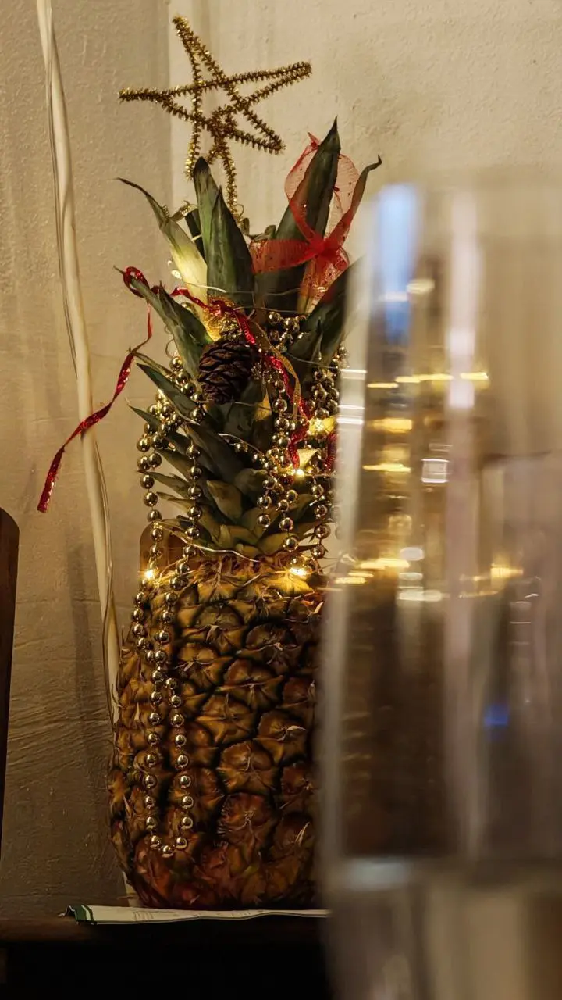
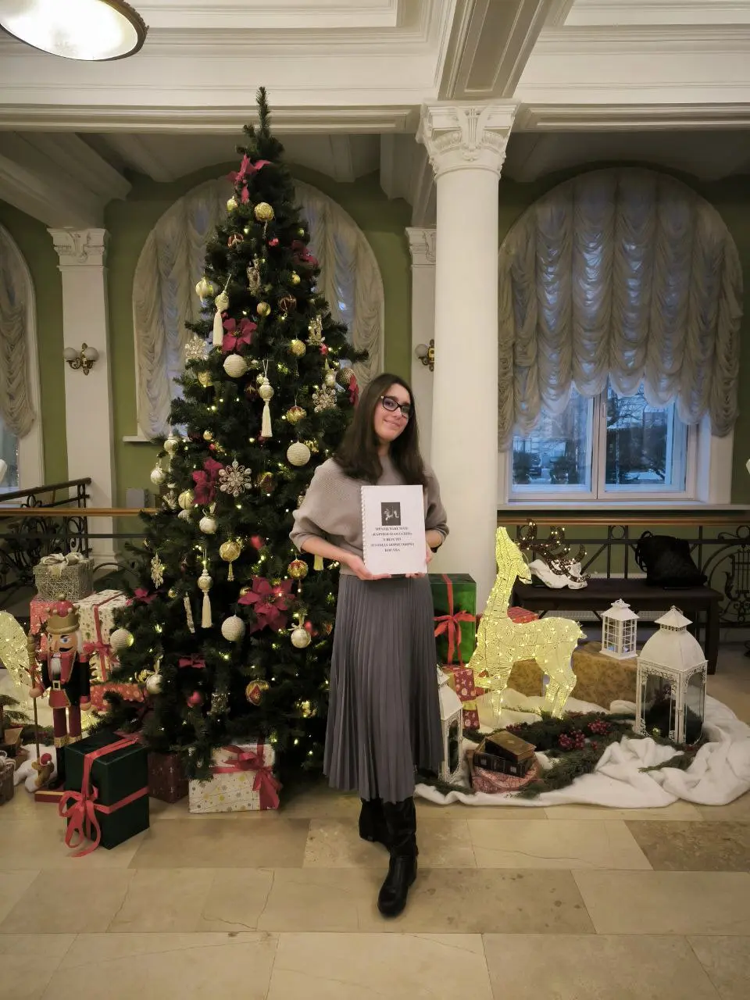
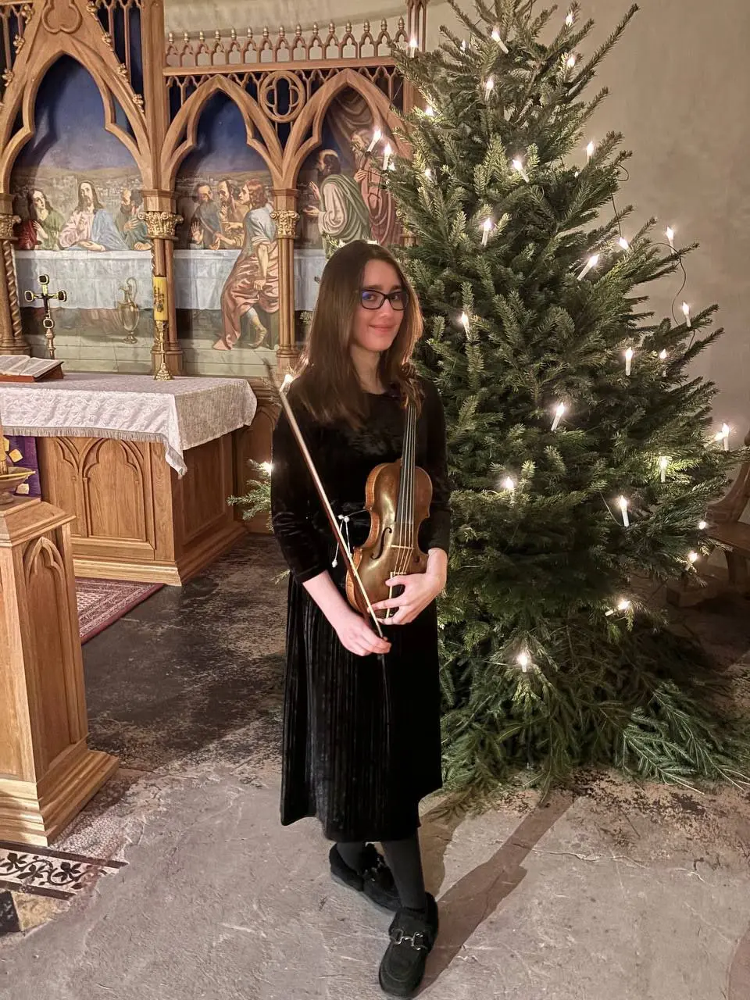
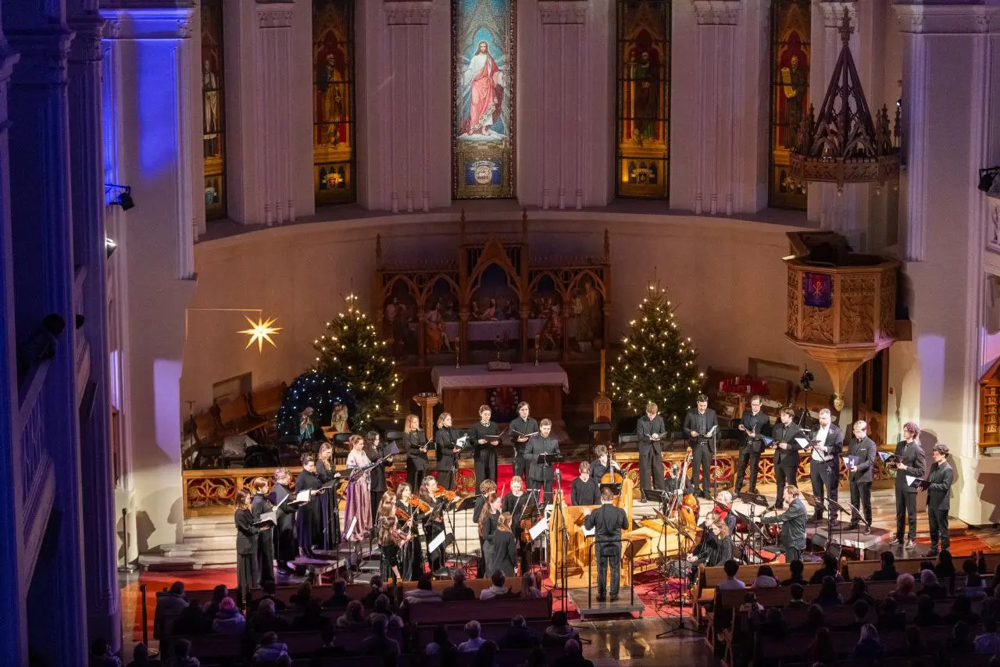
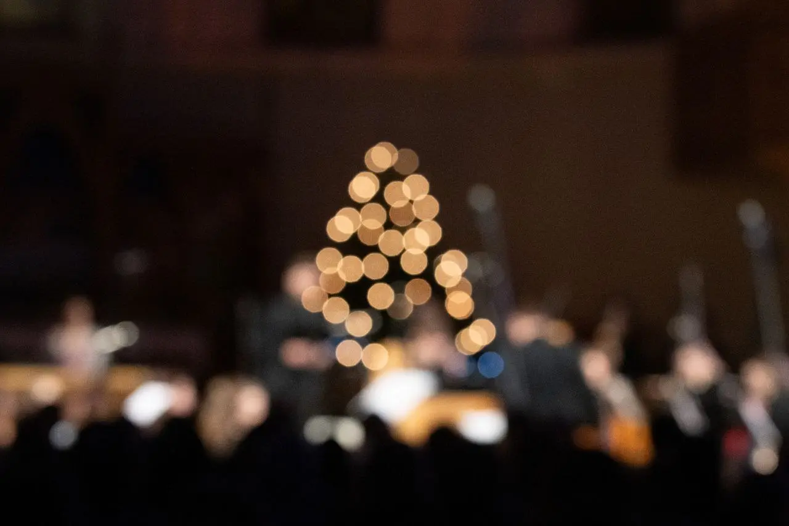
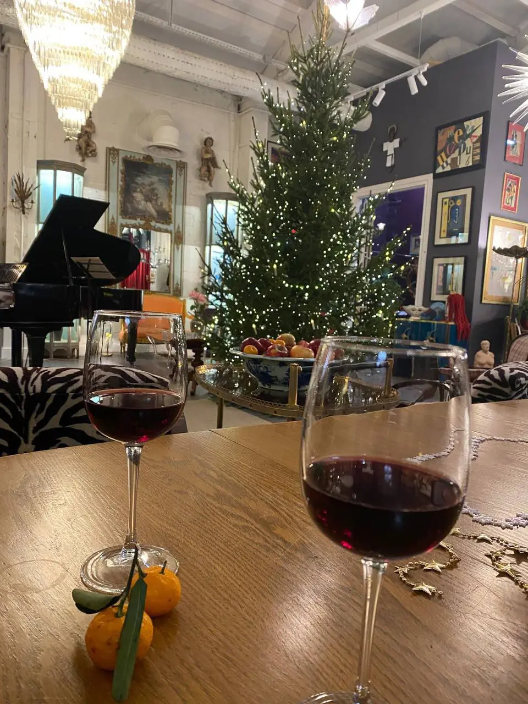

[{width="320" height="180" data-color="#7c6855"}](https://t.me/gattavasis/418){.video data-duration="130"}

Традиционно в этом канале под Новый Год публикую открытку из Рахманиновского зала для всех моих друзей!
В прошлом году был [романс на стихи Афанасия Фета](https://t.me/gattavasis/170) в необычном ансамбле, а в этом — бис от [«Венского подарка» 28 декабря](https://t.me/gattavasis/417?single)!
🎧🎁Уже можно распаковывать!😁

Ещё до курант успела получить много прекрасных новогодних подарков — и от консерваторского «Тайного Санты», и от Центральной библиотеки Цюриха (ноты, которые я искала полтора года!🤩), и 🍬🎅детский набор сладостей от моего профессора, для которого мы, несмотря ни на какие консерватории, навсегда останемся маленькими цмшовцами, и от себя тоже, закончив один [довольно масштабный замысел](https://t.me/gattavasis/310) (см. 3 фото😆). А за весь год так вообще много чего интересного произошло!

**С наступающим Новым Годом!**
Мои самые прекрасные пожелания и лучи добра всем, кто это сейчас читает!!!
✨✨✨
До встречи в 2026!
🎄

:::gallery
{width="720" height="1280" data-color="#785d3d"}

{width="960" height="1280" data-color="#675c49"}

{width="960" height="1280" data-color="#6a5645"}

{width="1280" height="854" data-color="#553838"}

{width="1280" height="854" data-color="#36261d"}

{width="960" height="1280" data-color="#6f5f4d"}
:::
