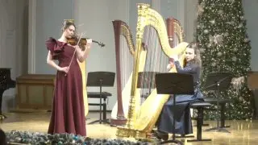
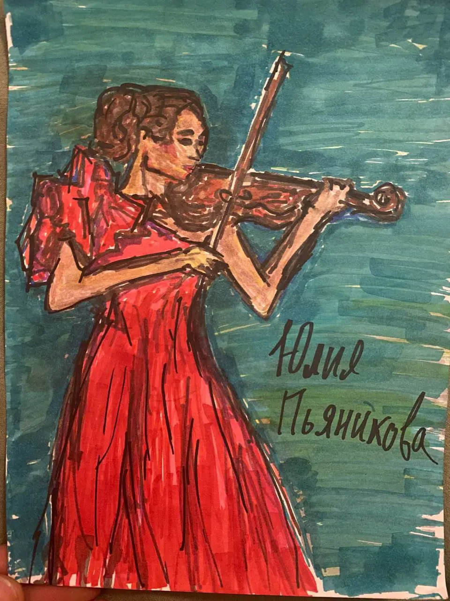

[{width="320" height="180" data-color="#7e7464"}](https://t.me/gattavasis/433){.video data-duration="234"}

В июле 1924 года **Равель** создал  не только оркестровку **«Цыганки»**, но и версию для скрипки и Luthéal — гибридного фортепиано с механизмом, которое было создано в 1919 году.

С помощью четырёх регистров пианист мог изменять тембр инструмента, например, чтобы создать **«эффект» арфы или лютни**, а в некоторых регистрах — цимбал.

Премьера пьесы состоялась в апреле 1924 в сопровождении фортепиано, а второе её исполнение состоялось в октябре этого же года именно в этом необычном составе в Париже.

Автор переложения для арфы — Софья Москалёва. А в субботу состоялась наша премьера!

P.S. Спасибо автору рисунка)

{width="960" height="1280" data-color="#775d51"}
