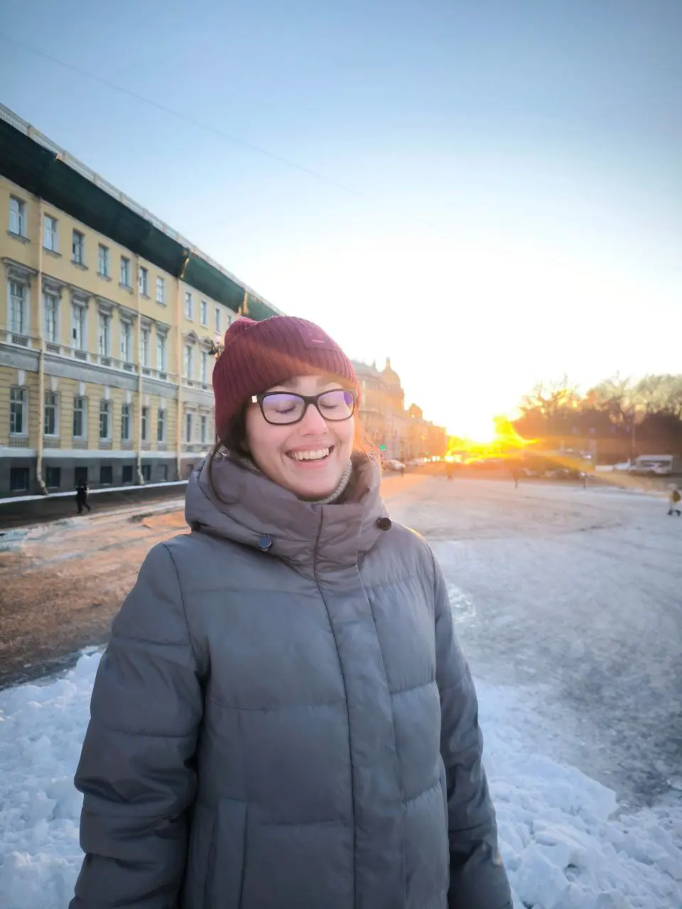
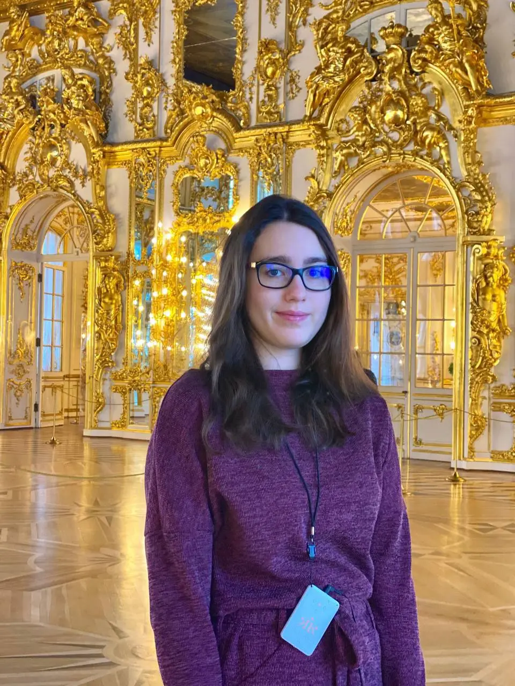
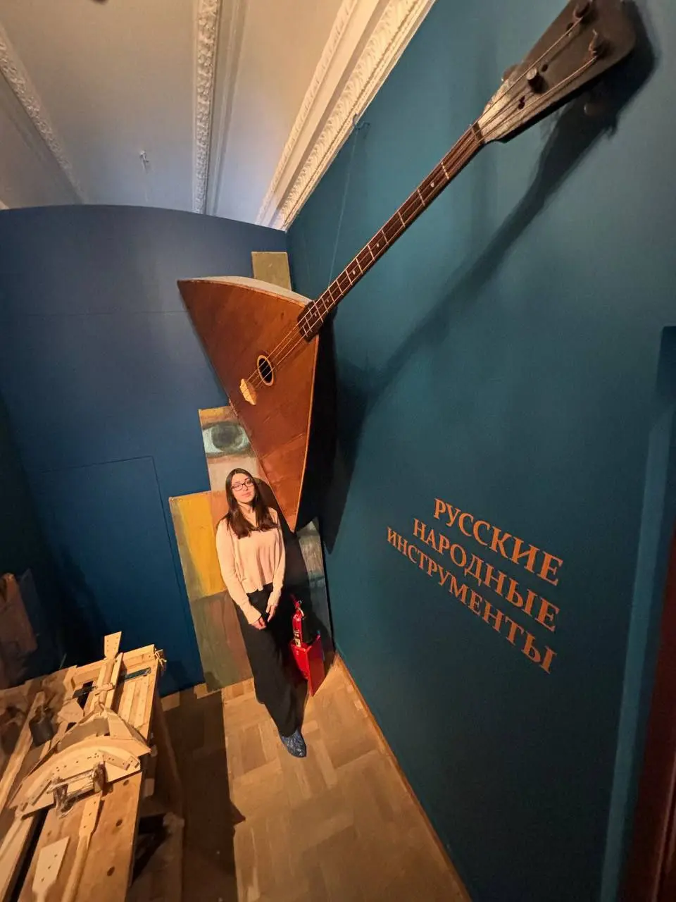
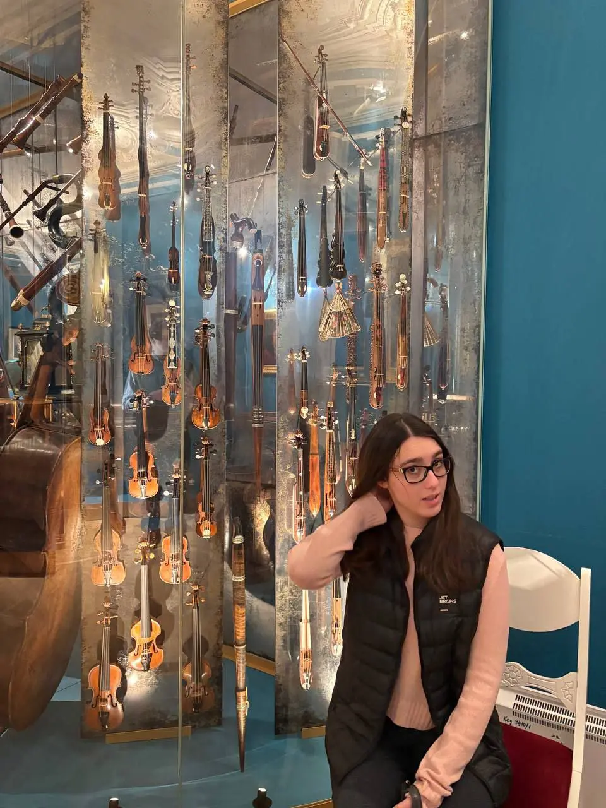
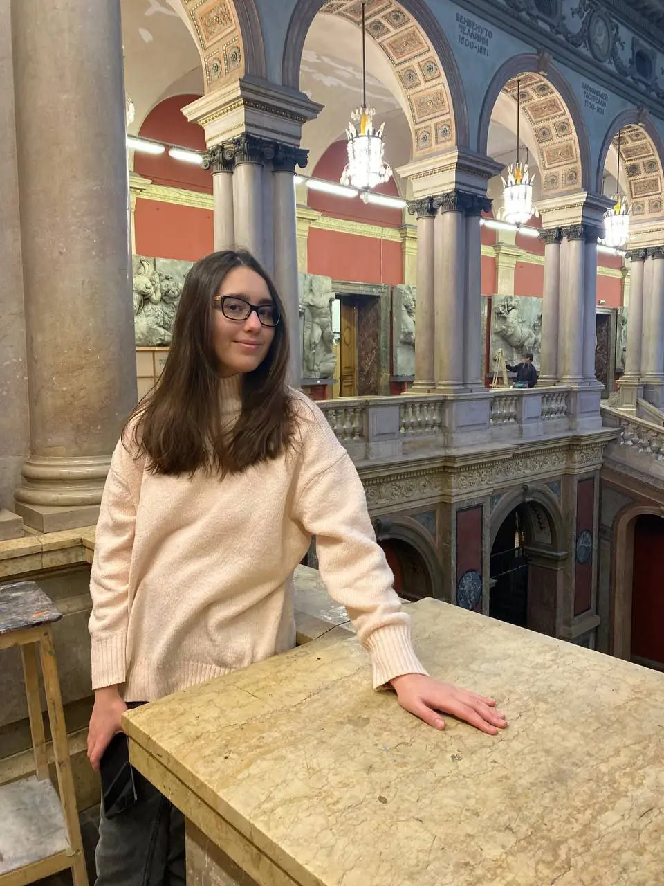
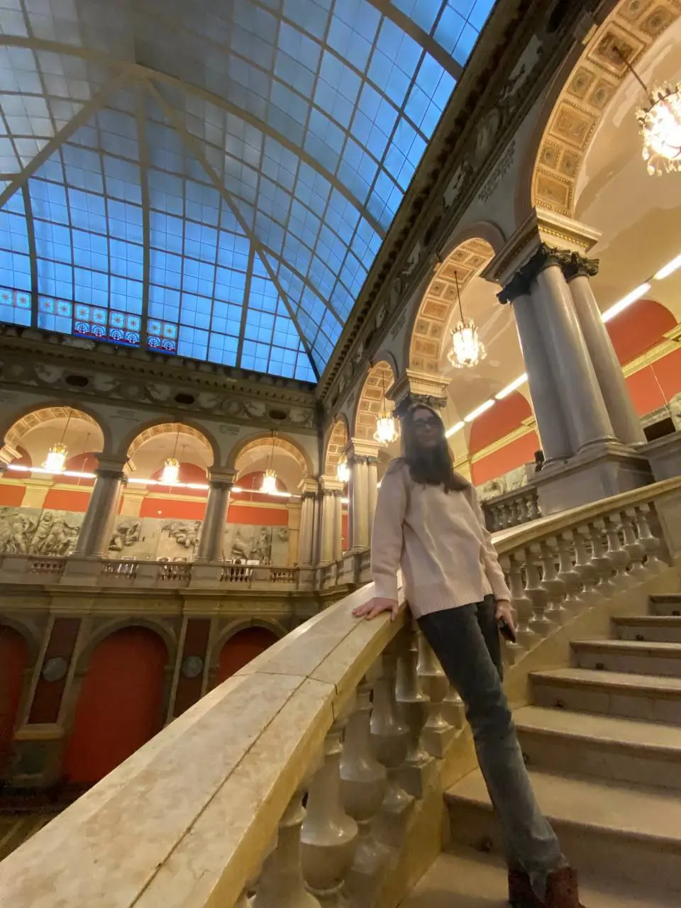
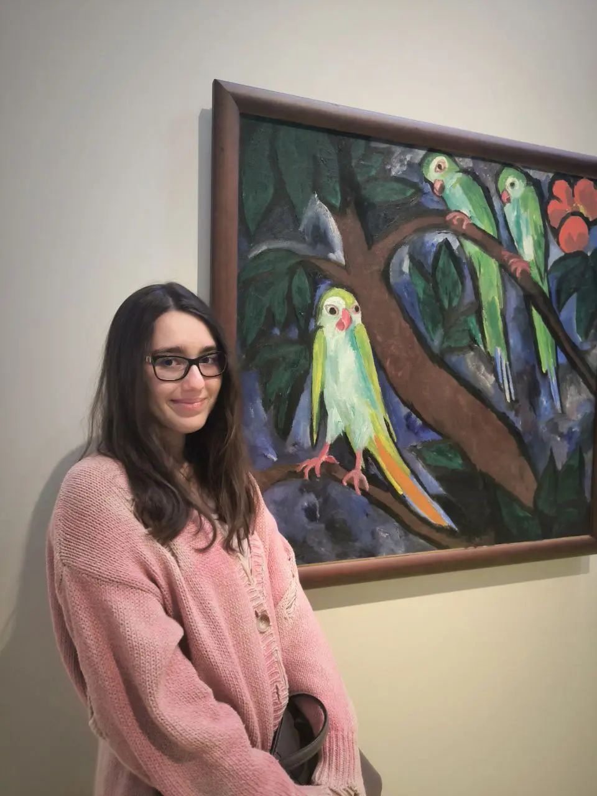
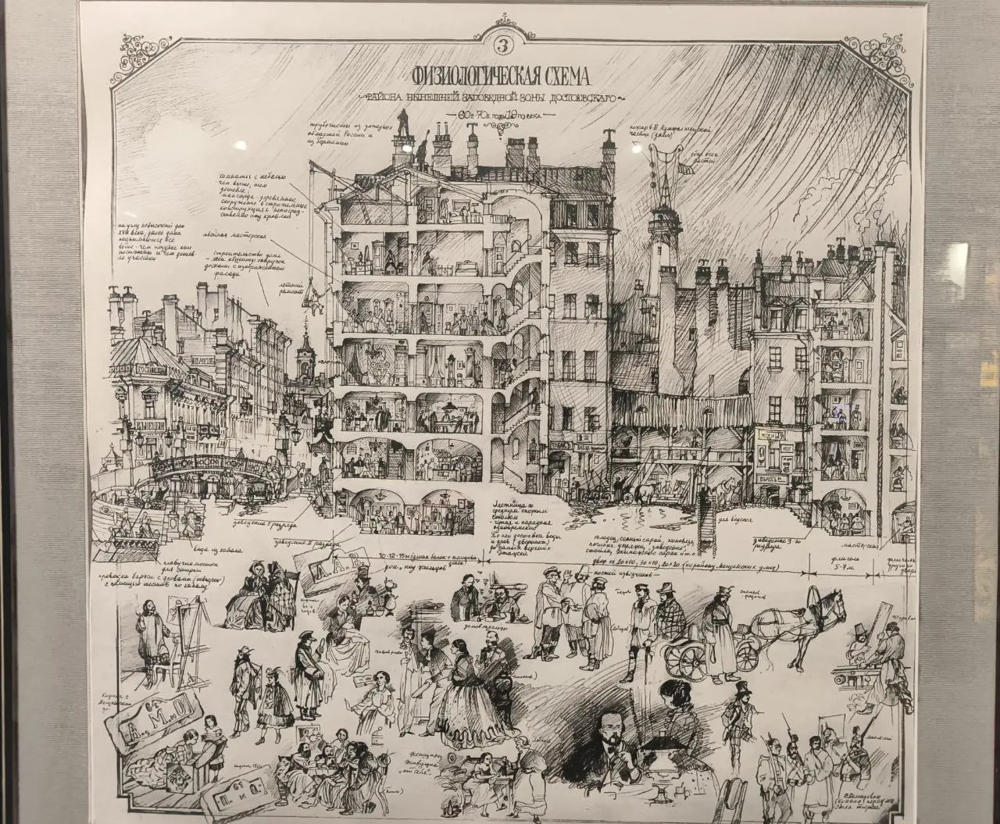
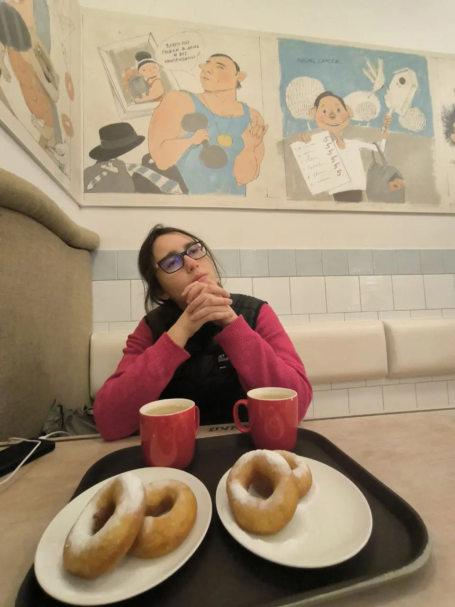
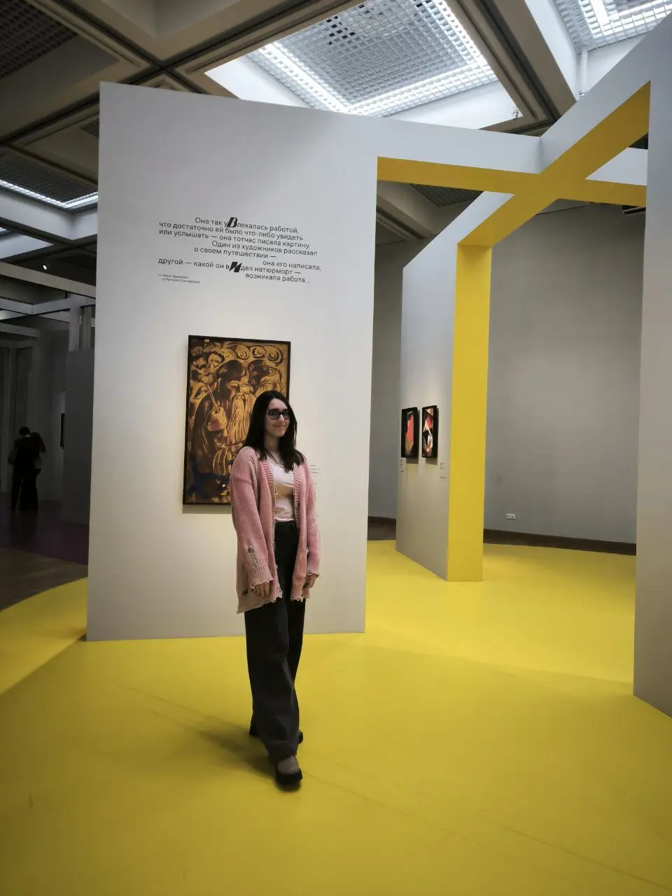

Вот мне, например, удалось обновить детские впечатления от нескольких знаковых мест Петербурга за начало февраля. И посетить новые для меня — учебную экспозицию Музея прикладного искусства Академии Штиглица и на исходе сессии с Машей Зарецкой «Архетипы авангарда» в Третьяковке на Кадашевской.

Не в последнюю очередь благодаря моим петербургским и московским друзьям, у которых было шило в одном месте🌚📌 специально для таких случаев.

Временных выставок не случилось в этот приезд, поэтому, когда будете проездом, у вас есть уникальный шанс повторить мой потрясающий музейный маршрут:

🏛 **Музей музыки в Шереметевском дворце**
В Московском музее музыки я не была лет 5, к своему стыду, а в петербургском лет 10, соответственно. Теперь там интерактивные экспозиции, видео- и аудиоматериалы к каждому стенду, огромная коллекция всех времен и народов. На самом деле всех.
Для него приберегу отдельный пост, там слишком много всего хотелось запечатлеть, а как иначе.

🏛 **Академия Штиглица**
Место, популярное в узких инстаграмных кругах, чтобы пофоткаться «типа я во дворе итальянского палаццо»💅
Конечно же, мы тоже пришли туда за этим))

Экспозиция заслуживает особого внимания. И здание, и музей с трагической судьбой, невостребованный в прошлом веке ввиду своей буржуазности и сильно пострадавший во время авианалетов. Кроме потрясающих интерьеров в музее экспонируются предметы прикладного искусства из коллекции Эрмитажа, которые некогда принадлежали музею и многое-многое другое.

🏛 **Екатерининский дворец**
Его экспозиции стоит посещать с некоторой периодичностью не только ради Янтарной комнаты.
Реконструкция интерьера и экспонатов продолжается с 50-х годов и по сей день! Это титанической труд, и в следующем году открывается несколько новых залов для широкой публики.
С главной летней резиденцией Романовых, по-моему, может соперничать только Эрмитаж...На одну парадную залу ушло порядка 10 килограмм  сусального золота.

Дворец тоже очень пострадал во время войны, хотя многое было вывезено. А что не было, то стало настоящим триумфом российской реставрационной школы.

🏛 **Мемориальная квартира Достоевского**
В этот раз мне посчастливилось посетить Музей Достоевского с человеком, который к 20 годам прочитал все его романы. В моем понимании не фанат, но фанатик. Отрицает, разумеется.

Здесь меня впечатлила не только сама выставка — множество личных предметов и писем писателя и дополнительная экспозиция с «литературным взглядом» на его жизнь с редкими архивными документами, а сообщество специалистов вокруг этого музея, множество своих изданий, научных и популярных. Мы не встретили ни одного случайного человека! Экскурсия началась ещё на кассе и охране. Ну и личное видение экскурсовода произвело неизгладимое впечатление
 ==вы когда-нибудь видели, чтобы экскурсанты плакали...?=={.spoiler}

Музей проводит не только классические экскурсии по музею, но и по «Петербургу Достоевского».  [Вся информация на сайте](https://www.md.spb.ru/)

🏛 [«Архетипы Авангарда»](https://www.tretyakovgallery.ru/exhibitions/o/arkhetipy-avangarda/?ysclid=mletup3u4n716395254)
Очень популярная сейчас выставка в самой новой Третьяковке. Личный взгляд на историю русского авангарда сквозь призму архетипов по Юнгу.
Оч круто! Всем советую.

:::gallery
{width="960" height="1280" data-color="#999ca4"}

{width="960" height="1280" data-color="#967755"}

{width="960" height="1280" data-color="#494641"}

{width="960" height="1280" data-color="#6a635a"}

{width="960" height="1280" data-color="#92806a"}

{width="960" height="1280" data-color="#736554"}

{width="960" height="1280" data-color="#81756c"}

{width="1280" height="1055" data-color="#a59b8e"}

{width="960" height="1280" data-color="#9e8771"}

{width="960" height="1280" data-color="#8f845e"}
:::

За кадром остались мои друзья🥺
[@maria\_majocchi](https://t.me/maria_majocchi)
[@Coqpb9l](https://t.me/Coqpb9l)
[@gusevajulie](https://t.me/gusevajulie)
[@tellur\_trio](https://t.me/tellur_trio)
