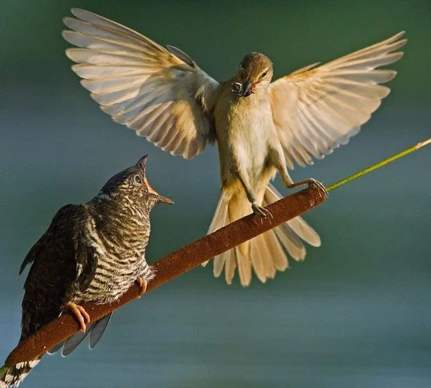

{width="736" height="662" data-color="#5b5e4f"}

Если вы на этом канале достаточно давно, то знаете, что одна из главных его миссий — **объединение музыкальных кукушковедоведов.**

И сегодня в программе такие выдающиеся кукушковеды, как Густав Малер, Петр Ильич Чайковский, Фредерик Делиус, Станислав Монюшко и многие другие.

**Читайте приквелы:**

[Хичкок. Птицы](https://t.me/gattavasis/238) (Введение):

[I. Барочные кукушки](https://t.me/gattavasis/239)

[II.](https://t.me/gattavasis/270) [Кукушки эпохи Просвещения](https://t.me/gattavasis/270)

**Спин-оффы:**
[I. Квакухи у Гайдна](https://t.me/gattavasis/42)
[II. Спасём жаб](https://t.me/gattavasis/42)[!](https://t.me/gattavasis/42)
(размышления на тему)
[III. Лягушка в медитации](https://t.me/gattavasis/29)
(в визуальном искусстве не для слабаков)

[Stanisław Moniuszko — Kukułka](https://t.me/gattavasis/459){.audio data-duration="149"}

Станислав Монюшко:
*сер. XIX в.*
Романс Kukułka

[Kukułka (Agata Schmidt, Bartłomiej Wezner) — Stanisław Moniuszko](https://t.me/gattavasis/460){.audio data-duration="174"}

И ещё одна Kukułka Станислава Монюшко

Этот романс, как правило, называют кукушкой по-литовски — «Gegutė».

[Mahler - le coucou (extrait "des Knaben Wunderhorn") — joselapuerta123](https://t.me/gattavasis/461){.audio data-duration="109"}

Gustav Mahler - Le coucou из «des Knaben Wunderhorn» («Волшебный рог мальчика)

[Berliner Philharmoniker, Claudio Abbado, Густав Малер Symphony](https://t.me/gattavasis/462){.audio}

Густав Малер
Симфония No. 1 (D-dur) «Титан»:
I. Langsam, Schleppend. Wie ein Naturlaut — Im Anfang sehr gemächlich \[Медленно, растянуто. Как звучание природы. В начале очень спокойно\]

Робкие ку-ку кларнетов постепенно вырастают в масштабную пасторальную тему.

[Le Carnaval Des Animaux: IX. Le Coucou Au Fond Des Bois — Камиль Сен-Санс, Martha Argerich, Lilya Zilberstein](https://t.me/gattavasis/463){.audio data-duration="145"}

*Камиль Сен-Санс*
*Карнавал животных:*
*IX. Кукушка в глубине леса*

[Respighi: The Birds - V. The Cuckoo — Atlanta Symphony Orchestra](https://t.me/gattavasis/464){.audio data-duration="263"}

*Отторино Респиги*
*Оркестровая сюита «Птицы»:*
*V. Кукушка*

[Arensky Six pièces enfantines Opus 34 No. 2 Le coucou M. Chapochnikova… — Michel Cardinaux](https://t.me/gattavasis/465){.audio data-duration="94"}

Антоний Аренский
Шесть детских пьес, соч. 34:
II. Le coucou

[П.И.Чайковский Не кукушечка/P.Tchaikovsky Not a Cuckoo — SuperLuckydream](https://t.me/gattavasis/466){.audio data-duration="217"}

Пётр Ильич Чайковский:
«Не кукушечка...»
 🫢 😱😵

[16 Songs for Children, Op. 54: VIII. The Cuckoo — Irina Arkhipova](https://t.me/gattavasis/467){.audio data-duration="135"}

Пётр Ильич Чайковский:
Шестнадцать детских песен, соч. 54:
VIII. Кукушка

==Ну слава богу😌=={.spoiler}

[English Chamber Orchestra, Daniel Barenboim Delius On Hearing](https://t.me/gattavasis/468){.audio}

Фредерик Делиус
«Услышав первую кукушку весной», 1912

[Кабалевский «Артистка» — Wonderful Life](https://t.me/gattavasis/469){.audio data-duration="133"}

Запись с Новогоднего концерта Младшего хора «Синяя птица»!🤩

Дмитрий Борисович Кабалевский «Артистка» (про Кукушку, разумеется)

[Coucou — Django Reinhardt](https://t.me/gattavasis/470){.audio data-duration="159"}

**«Кукушка» Джанго Рейнхардта**
 — французского джазового гитариста-виртуоза цыганского происхождения, основателя стиля «джаз-мануш».

[Кукушечка — Екатерина Матусова](https://t.me/gattavasis/471){.audio data-duration="130"}

«Кукушечка» Михаила Вольпина из к/ф «Морозко», исполняет Екатерина Матусова

[Adhémar Decq: Boite à musique et coucou — PSearPianist](https://t.me/gattavasis/472){.audio data-duration="125"}

Adhémar Decq: Boite à musique et coucou «Музыкальная шкатулка и кукушка»

[Maurice Emmanuel -  Le Coucou (1897) — Fausto Bongelli piano](https://t.me/gattavasis/473){.audio data-duration="156"}

Maurice Emmanuel -  Le Coucou (1897)

[Philipp Fahrbach II, Kukuk, Polka, Op. 124, Arr. CPE Strauss — CPE Strauss](https://t.me/gattavasis/474){.audio data-duration="261"}

Philipp Fahrbach II, Kukuk, Polka, Op. 124, Arr. CPE Strauss

Арранжировка Карла Филиппа Эммануэля Штрауса, [а не того](https://t.me/gattavasis/480), про которого вы подумали)

[La Veillée - Emile Jaques-Dalcroze: Coucou / Le Chant Sacré, Sophie… — Claves Records](https://t.me/gattavasis/476){.audio data-duration="342"}

La Veillée - Emile Jaques-Dalcroze: Coucou / Le Chant Sacré, Sophie Graf, Soprano

Эмиль Жак-Далькроз:
«Вечер. Кукушка»

[Elyane CELIS - "Ou Chante le Coucou " - Valse (1935) — uchukyoku1](https://t.me/gattavasis/477){.audio data-duration="173"}

Elyane Celis - "Ou Chante le Coucou " - Valse (1935)

— бельгийская актриса, известна тем, что в 1938 году записала песни и диалоги из анимационного фильма «Белоснежка и семь гномов».

[Gurlitt - Little Flowers, Op. 205 No. 4 — Piano Music](https://t.me/gattavasis/479){.audio data-duration="59"}

Gustav Gurlitt - Little Flowers, Op. 205 No. 4

«Fleur de Coucou» — Кукушкин цвет

Азалия короче)

[Le coucou, polka française — Johann Strauss](https://t.me/gattavasis/480){.audio data-duration="101"}

Тот Штраус, [про которого вы подумали](https://t.me/gattavasis/474), тоже засветился, разумеется.

Полька «Кукушка»

["Chants d'Oiseaux"  Olivier Messiaen // Louis-Claude d'Aquin's "Le… — Raymond Falcon-Lugo](https://t.me/gattavasis/481){.audio data-duration="254"}

А венчают наш список фрагмент из
Мессиановых «*Chants d'Oiseaux» \[Песни птиц\], где, к сожалению, нет кукушки*

*большое упущение с его стороны вообще-то*

*и* «Кукушка» Луи Клода Дакена на органе подряд!

**Песен еще ненаписанных, сколько?**

**Итак, в нашем каталоге НЕ представлены:**

а) **Замечательные кукушки следующих композиторов:**  Жан-Батист Арбан, Феликс Годфруа, Михаэль Генкель, Шарль Лекок, Жюль Браер, Александр Ильинский, Юрий Капр, Фредерик Бине, Габриэль Гровлец, Вальтер Ниман, Жозеф Дебру, Поль Зильхер, Луи Шарль Боне, Теодор Лак

— редкие настолько, что, взяв ноты, которые в большинстве случаев есть в открытом доступе на [IMSLP](https://t.me/gattavasis/325), вы рискуете выступить с премьерой. Записей не нашла!

б) я вполне могла забыть каких-нибудь **ранних пташек барочной эпохи**, их очень-очень много

в) **Русские и не только народные песни про кукушечек**, которые представлены только в Российском государственном архиве фонодокументов

г) **Самую известную Кукушку постсоветского пространства**
Она не требует представления!

Буду рада вашим дополнениям!
🦅
