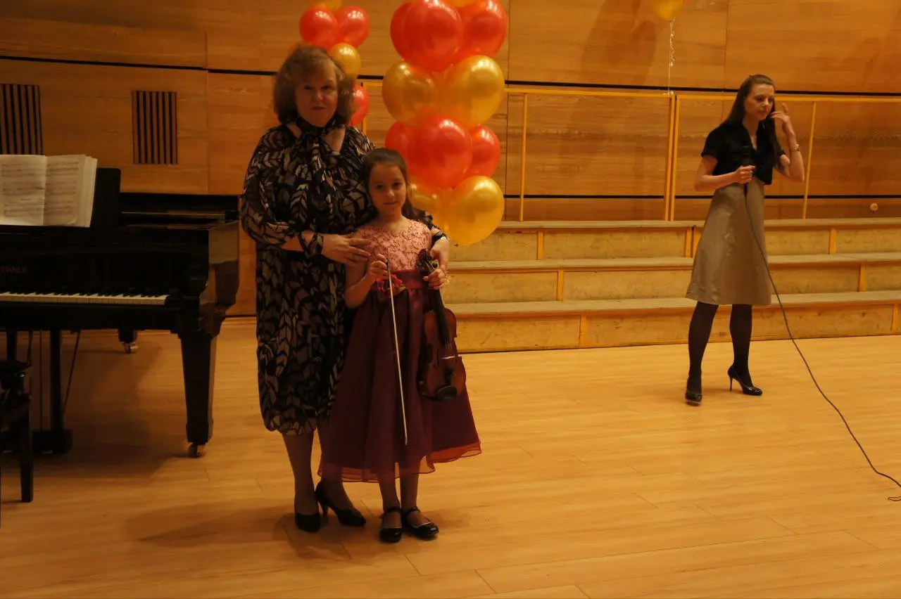
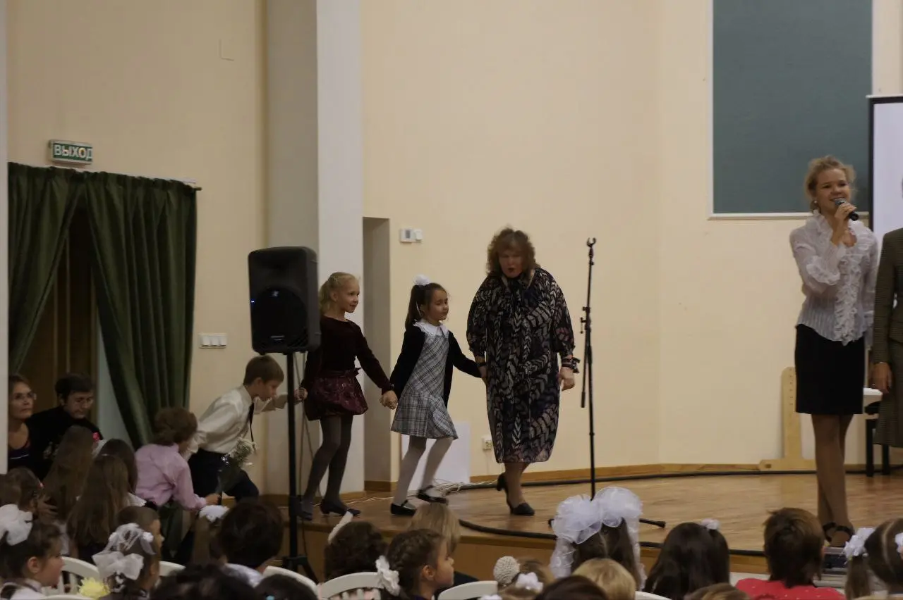
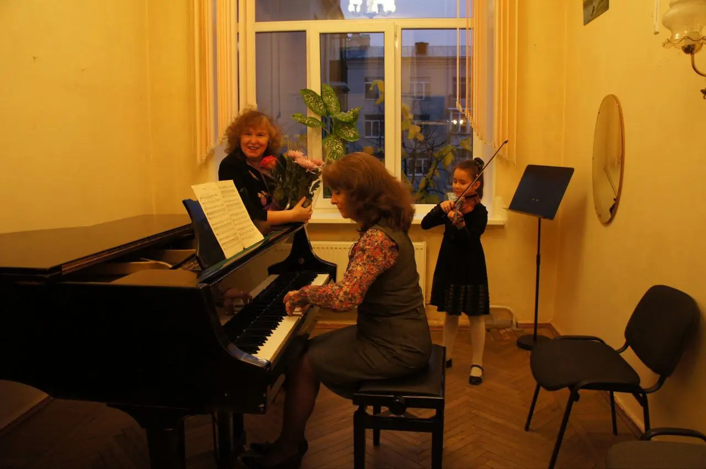
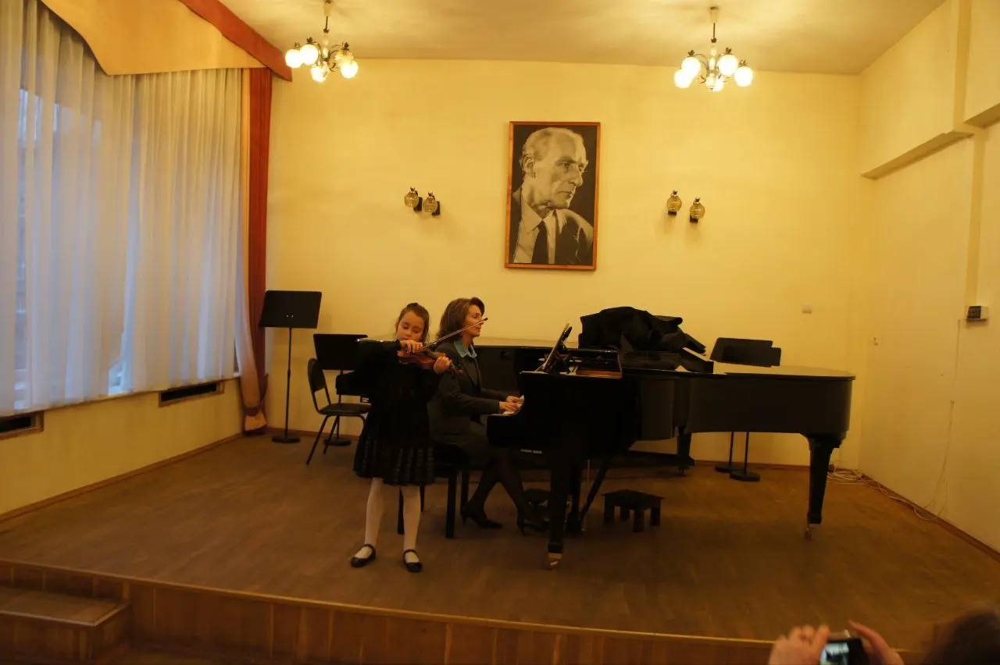
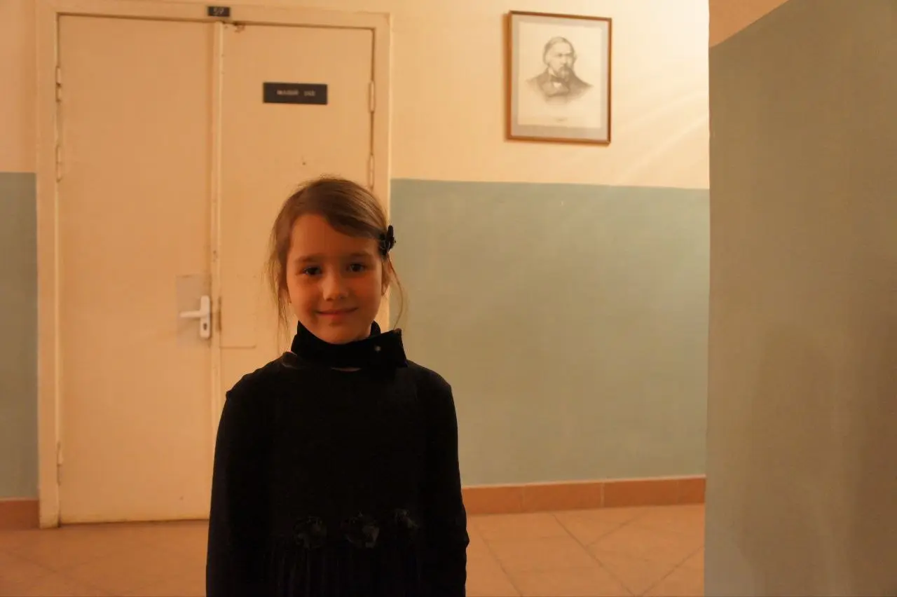
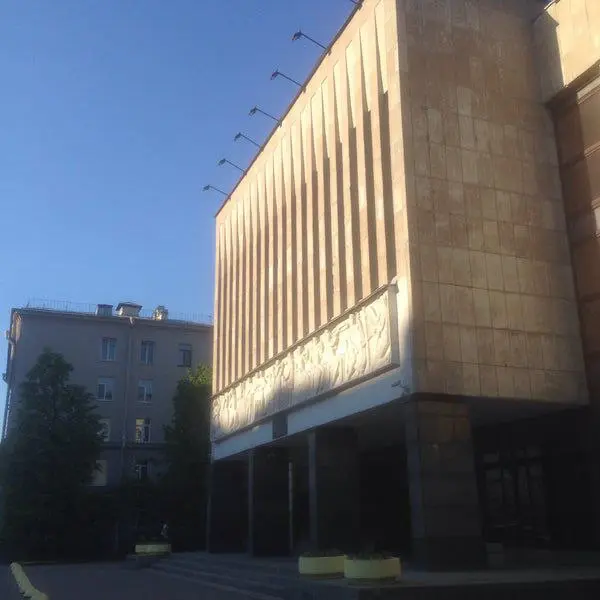
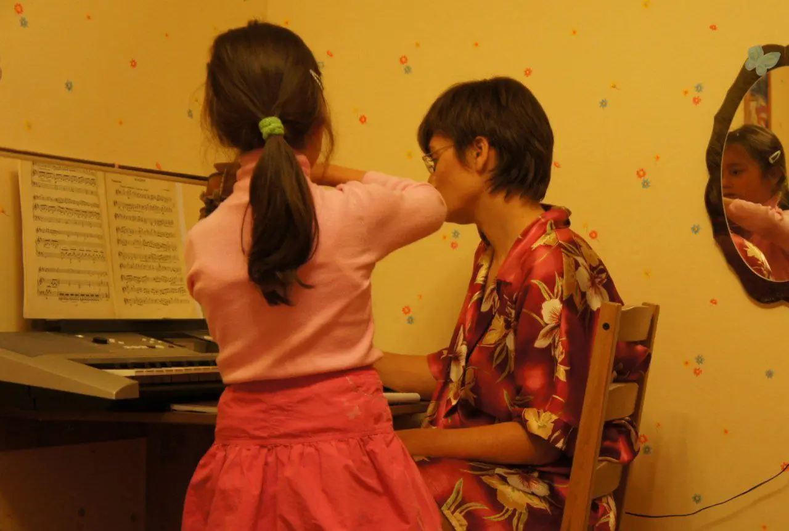
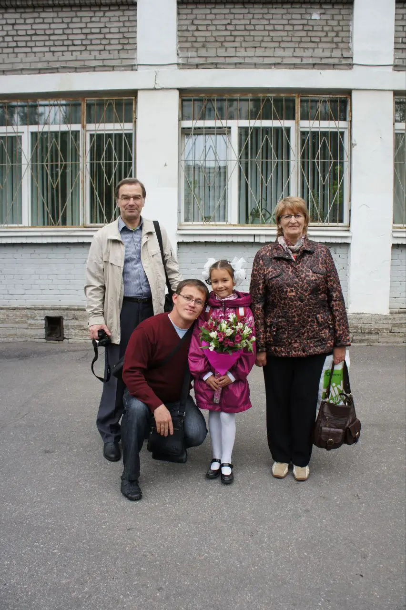
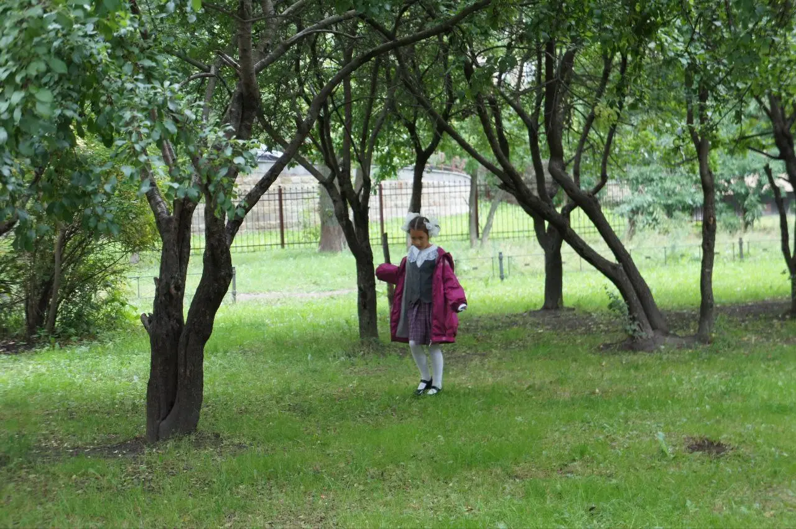
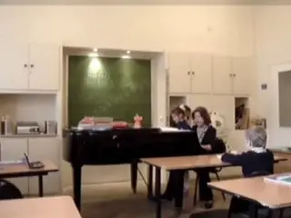

[Bach, JS: Concerto for 2 Violins in D Minor, BWV 1043: I. Vivace — Shunske Sato](https://t.me/gattavasis/483){.audio data-duration="220"}

28 ноября 2025 года, ровно три месяца назад, ушла из жизни Галина Александровна Верес — мой первый учитель скрипки.

Глупо говорить о том, как много значит для меня первый проводник в мир музыки, из которой сейчас и состоит вся моя жизнь, поэтому просто немного расскажу, как все началось для меня вместе с ней.

В Московском районе Петербурга есть детская музыкальная школа, названная в честь великого петербургского дирижера Е.А. Мравинского — там мы познакомились.

Она жила совсем неподалёку от Парка Победы, где я часто гуляла в детстве. Там же был мой любимый парк аттракционов с американскими горками-гусеницами.¹

Мне очень нравилась моя музыкалка. Обычно всем, кто успевает по сольфеджио, НЕ играет на фо-но и скрипке, нравится музыкалка, удел же остальных — страдания.

Там был буфет с кислючками, магазин нотной канцелярии, и там на концерте я впервые услышала [Двойной концерт Баха](https://t.me/gattavasis/483), после чего захотела играть именно на скрипке.

Нельзя сказать, что я училась в музыкалке. Вообще-то вся моя семья училась в музыкалке вместе со мной:
дед записывал великих скрипачей на диски, мама вспоминала три класса фортепианного образования и помогала с домашкой, папа отвозил в музыкалку, а с бабушкой мы возвращались домой.

Короче, школа была классная. И все учителя. Потом от одного из старших учеников в 6 лет мне досталась скрипочка — и все случилось.

Галина Александровна Верес училась у видного профессора Петербургской консерватории М. А. Славутской, воспитанницы Одесской школы Столярского, и Юлия Эйдлина — ученика Ауэра. У Эйдлина учился почти весь цвет Петербургской скрипичной школы — Вайман, Гутников, Камиларов, Фишер, Носырев.
Всю жизнь проработала у Бадхена в нынешнем Государственном симфоническом оркестре Санкт-Петербурга.

Из самых важных личных черт её, по-моему, — скромность и человеколюбие.

Вообще-то, как показывает практика, «скрипка высших достижений» и человеколюбие очень редко пересекаются. В этом есть зерно, ведь на самом деле добиться истинного мастерства в нашем деле стоит совершенно нечеловеческих усилий.

Совсем недолго я у неё проучилась. Спустя всего два года, уходя на пенсию, она отправила меня на вступительные экзамены в специальную музыкальную школу при Петербургской консерватории, которые я успешно сдала и продолжила свое обучение во втором классе без повтора года(!) у другого замечательного педагога, про которого тоже обязательно должна написать!

Хотя уроков с ней было немного, среди них есть те, к которым мне придётся возвращаться всю мою жизнь.

Наверное, странно вспоминать учителя по скрипке таким образом, но весь этот район Петербурга, когда возвращаюсь, я ощущаю как чудесный стеклянный шар, в котором остались только хорошие воспоминания.

Семья, друзья, детсад и первая школа, парки и кружки — конечно, все составляют его, но там остался и волшебник, который радостно и попросту познакомил меня со скрипкой.

\_.\_.\_.\_.\_.\_.\_.\_.
¹Много позже я узнала, что до войны на месте парка, в мемориальной его части, был кирпичный завод, который в блокаду использовали как крематорий, где сожгли тела примерно 1,5 миллиона погибших от истощения ленинградцев.

² За фортепиано — наш концертмейстер Альбина Михайловна Луммейоки. Урок сольфеджио ведёт Татьяна Петровна Нестерова.

:::gallery
{width="1280" height="852" data-color="#7e4714"}

{width="1280" height="852" data-color="#726656"}

{width="1280" height="852" data-color="#744b16"}

{width="1280" height="852" data-color="#8e6b34"}

{width="1280" height="852" data-color="#9e774e"}

{width="600" height="600" data-color="#5f626a"}

{width="1280" height="862" data-color="#995819"}

{width="852" height="1280" data-color="#7f7a78"}

{width="1280" height="852" data-color="#60764e"}
:::

[{width="320" height="240" data-color="#92806c"}](https://t.me/gattavasis/494){.video data-duration="12"}
