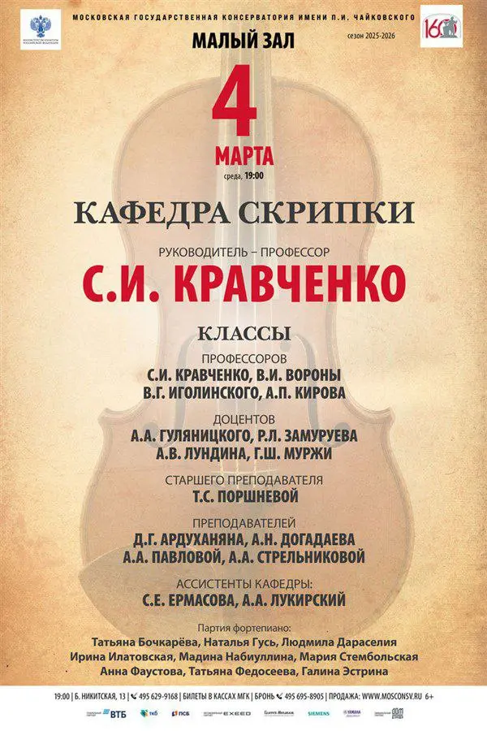
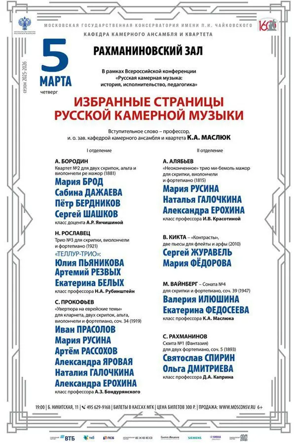

:::gallery
{width="600" height="900" data-color="#dabb9d"}

{width="600" height="900" data-color="#dde0e2"}
:::

**Il est venu le temps des cathédrales...**

Как поётся в одном французском мюзикле — настало время кафедральных!

💃**4.03** **среда**
**Кафедра скрипки**
Малый зал Московской консерватории

Открываем 2-е отделение Цыганкой Равеля с неподражаемым и редким гостем на концертах кафедры скрипки Софьей Москалевой [@Coqpb9l](https://t.me/Coqpb9l) !
==Хотя вру, на самом деле, ради меня Софья отсидела бесчисленное количество длиннющих скрипичных концертов=={.spoiler}

🦷**5.03 четверг**
**Кафедра камерного ансамбля** **и квартета**
Рахманиновский зал

[@tellur\_trio](https://t.me/tellur_trio) × Рославец n°3

Начало концертов в 19 часов!
Пригласительные [@Julia\_violin](https://t.me/Julia_violin)

[Le temps des cathédrales — Bruno Pelletier](https://t.me/gattavasis/497){.audio data-duration="202"}

[Видео](https://t.me/gattavasis/498){.video data-duration="6"}
