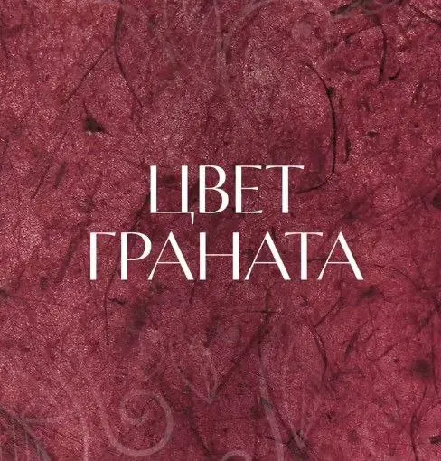

{width="488" height="510" data-color="#7d3541"}

[«Цвет граната»](https://m.vk.com/granat.podcast)!

Герои его интервью — самые известные российские музыканты, противоречивые и, что называется, «на острие». Уже можно посмотреть выпуски с Давыдченко, Вишневским, Никифорчиным и многими другими.

С удовольствием рекомендую к просмотру!
**Не реклама**😁
Семён обещает ещё больше интересных героев, так что обязательно подписывайтесь!

[Смотрите новый выпуск в VK Видео](https://m.vk.com/video-233897821_456239078?list=01014d208af3eebf1e)

P. S.
Кстати, интересно, почему же именно «Цвет граната», по Параджанову?
