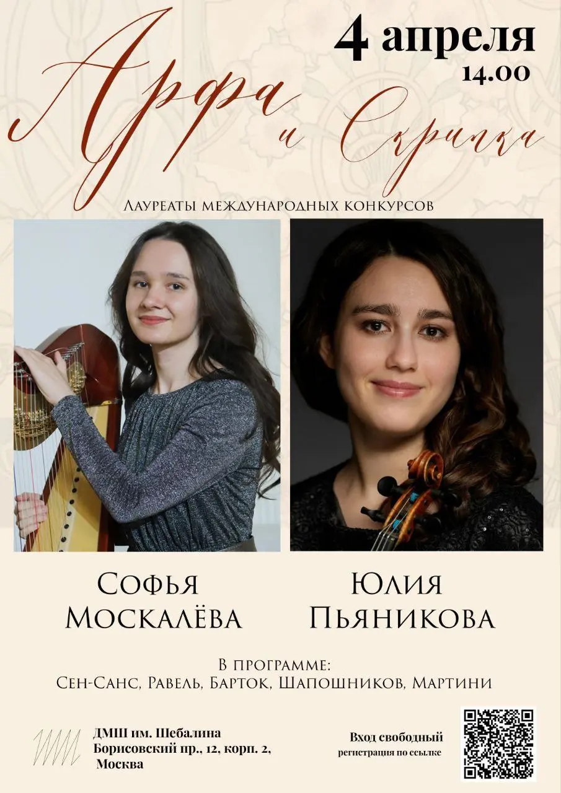
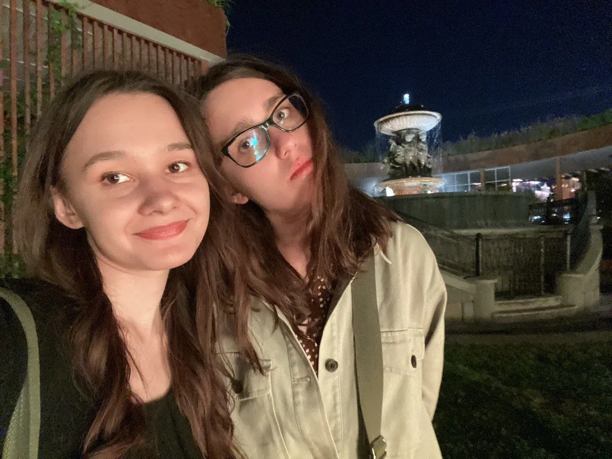

:::gallery
{width="905" height="1280" data-color="#968d83"}

{width="1280" height="960" data-color="#574639"}
:::

[@Coqpb9l](https://t.me/Coqpb9l)

4 апреля прозвучат и главные сочинения для этого ансамбля, и несколько очень редких вещиц в авторском переложении!
Кроме того, состоится мой дебют на виоль д'амур!!

Вход свободный. [Регистрация на концерт по ссылке](https://forms.yandex.ru/cloud/69afdf16068ff0fb29dbcc30)!

Концертный зал имени Шебалина
Борисовский пр., 12к2
