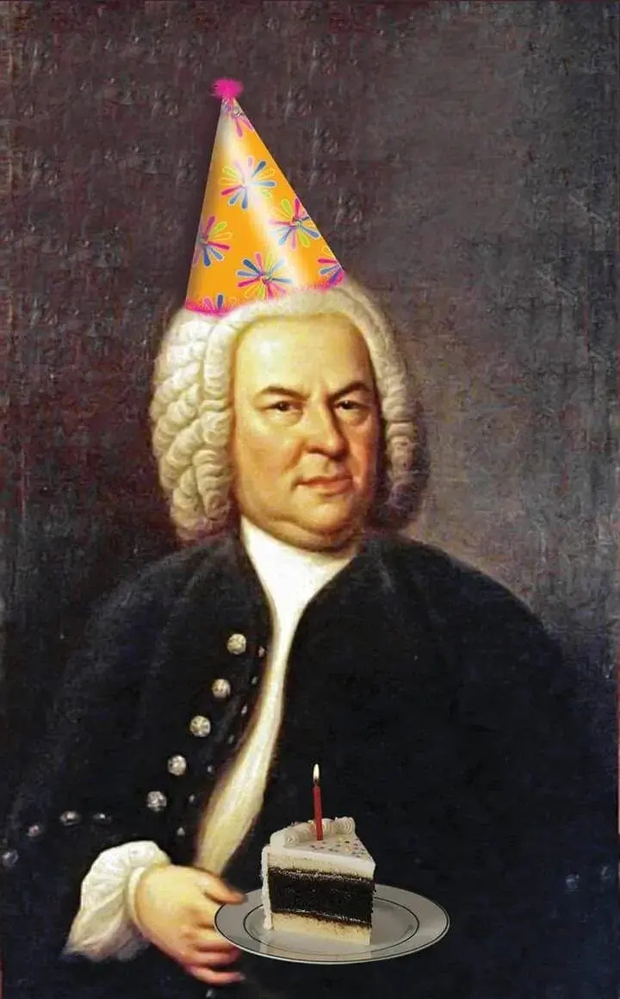

{width="720" height="1160" data-color="#53463c"}

**отмечаем с размахом🥳**

Но программа, разумеется, скорбная. Скучаем💔

🌱[29.03 вскр](https://collegiummusicum.ru/concerts/neizvestnyj-bah-kyotenskaya-traurnaya-muzyka-bwv-244a-29-03-2026-1900/?ysclid=mn776tc33575446327)
[Кётенская траурная музыка](https://collegiummusicum.ru/concerts/neizvestnyj-bah-kyotenskaya-traurnaya-muzyka-bwv-244a-29-03-2026-1900/?ysclid=mn776tc33575446327)

Ансамбль Collegium musicum [представит](https://muzlifemagazine.ru/kyotenskaya-traurnaya-muzyka-i-s-bakha/?ysclid=mn76dzi39j734286230) **премьеру в России** научной реконструкции Александра Фердинанда Грихтолика (2010), сочинения, написанного Бахом для заупокойного богослужения по князю Леопольду Ангальт-Кётенскому, покровителю композитора в годы службы при кётенском дворе. Традиционно с комментариями Романа Насонова.
Начало в 19 часов.
📍 Лютеранский кафедральный собор Петра и Павла

🌱[31.03 вт](https://www.zaryadyehall.ru/events/festival/6056/)
[Закрытие фестиваля «Московское барокко»](https://www.zaryadyehall.ru/events/festival/6056/)

Месса си-минор, Ренато Балсадонна, Хор Свешникова, Фестивальный барочный оркестр «Зарядье» и интересные солисты.
Начало в 19 часов.
📍Большой зал Зарядья

Пригласительные, промокоды в лс❣
Жду друзей!
