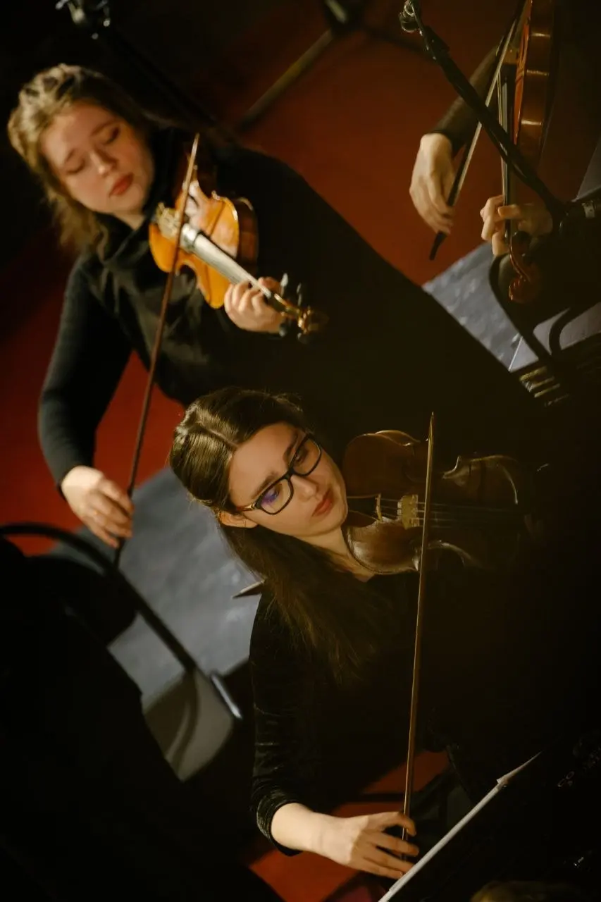
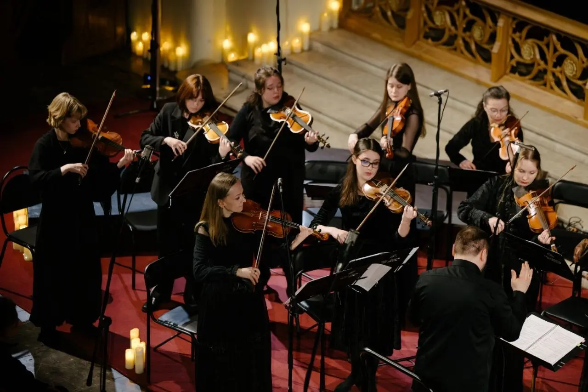
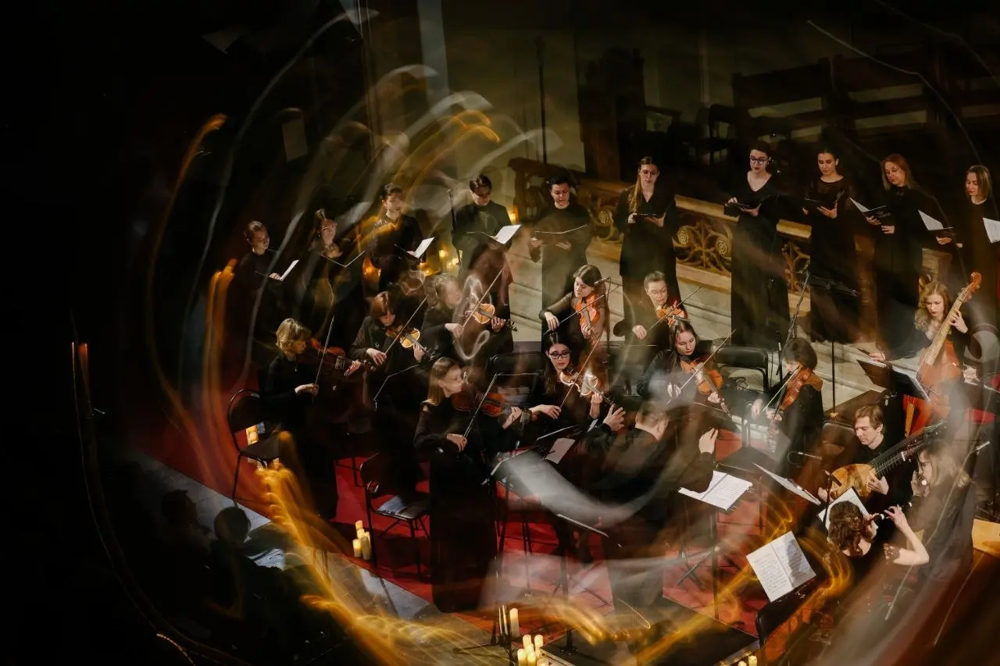
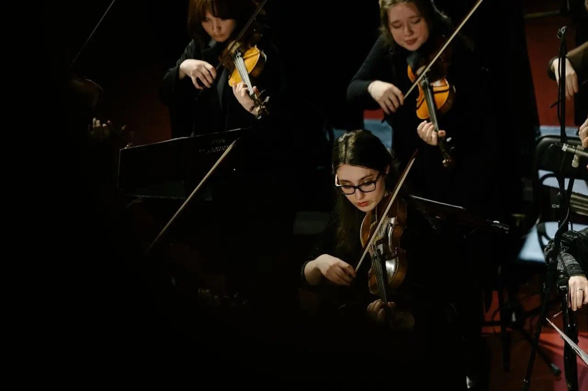
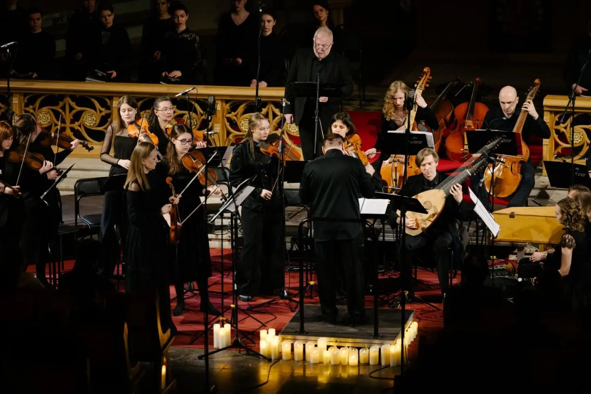
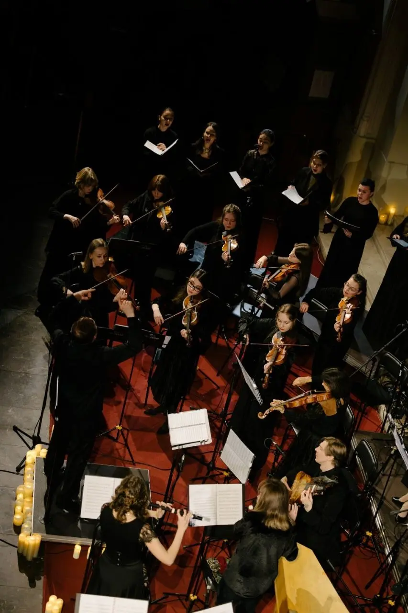
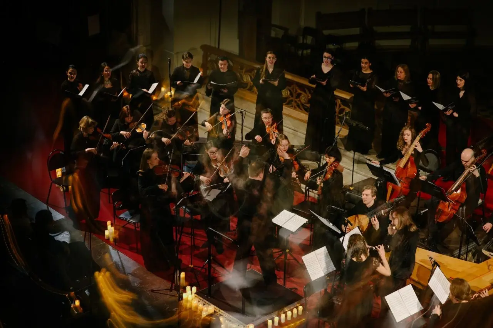

:::gallery
{width="853" height="1280" data-color="#2e1e0d"}

{width="1280" height="853" data-color="#38291c"}

{width="1280" height="853" data-color="#322314"}

{width="1280" height="853" data-color="#0d0a06"}

{width="1280" height="853" data-color="#2c1d11"}

{width="853" height="1280" data-color="#241911"}

{width="1280" height="853" data-color="#2e1d0e"}
:::

Оказывается это совершенно особенное переживание — быть к ней причастным. И все же слушать её нужно целиком — неизбежный катарсис.
Спасибо, Бах!

А фотки с воскресного концерта Collegium musicum в Кафедральном соборе Свв. Петра и Павла, где мы впервые в России исполнили Кётенскую траурную музыку, посвященную памяти друга и покровителя Баха — князя Леопольда Ангальт-Кётенского.

Тоже необыкновенный концерт получился! И к тому же репетиция к «Страстям по Матфею» 21 марта 2027 года. ==Несколько арий к ней взяты Бахом из «Страстей».=={.spoiler}
Запомните дату!😁

Пасхальные баховские недели, сопряженные не только с духовным праздником, но и с его др, всегда насыщенные, но эта получилась совершенно особенной.
