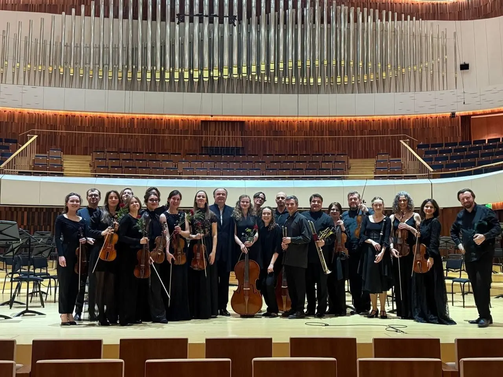
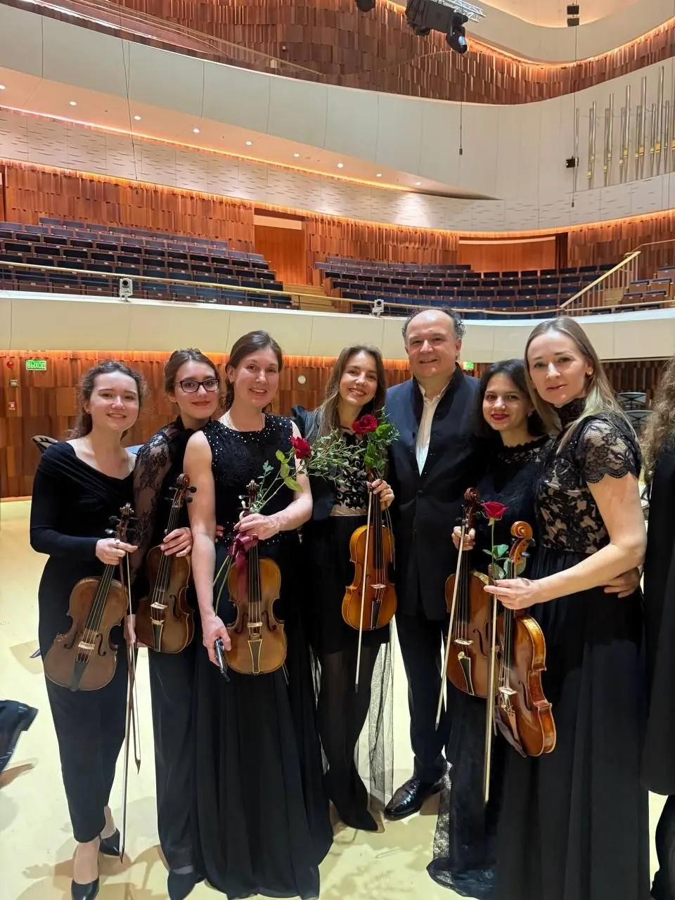
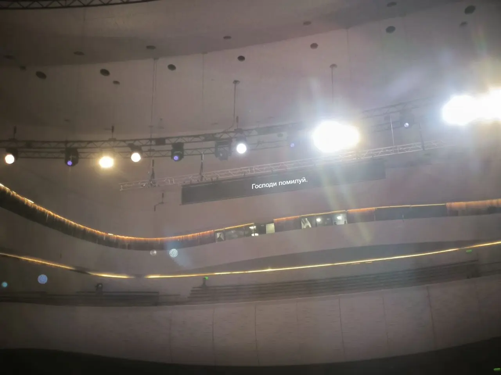

:::gallery
{width="1280" height="960" data-color="#615448"}

{width="960" height="1280" data-color="#6a5446"}

{width="1280" height="960" data-color="#706965"}
:::

Уже рассказала о своих впечатлениях об этих концертах, а теперь делюсь ссылками на записи трансляций:

**29.03**
**Бах Кётенская траурная музыка**
(реконструкция Александра Фердинанда Грихтолика)
Ансамбль Collegium musicum
Кафедральный лютеранский собор Свв. Петра и Павла

📺 [ВК](https://vkvideo.ru/video-59334823_456239705) [Ютюб](https://youtube.com/live/2nvLavYE83g)

**31.03 Бах Месса h-moll**
Большой зал Зарядья
Ренато Балсадонна, Хор Свешникова, Фестивальный барочный оркестр «Зарядье»
Елена Санчо-Перег, сопрано
Полина Шароварова, меццо-сопрано
Михаил Нор, тенор
Томас Ченхолл, баритон

📺[ВК](https://vkvideo.ru/video-170897026_456240305?list=de3decad0cc9bed606&t=4m34s)  [Ютюб](https://www.youtube.com/live/2FD8DGpouO0?si=Xbatr7WAcz-LsYjU)
