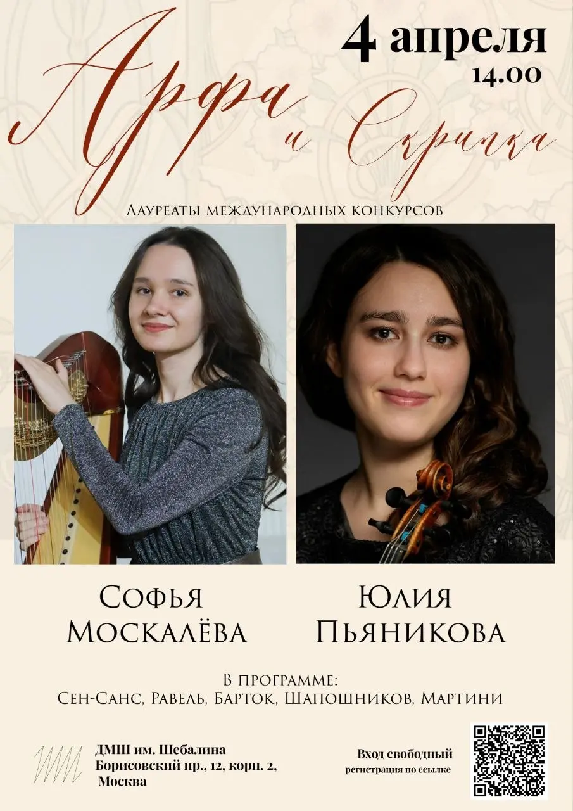

:::gallery
{width="390" height="472" data-color="#b89759"}

{width="905" height="1280" data-color="#968d83"}
:::

✨4 апреля в [Концертном зале имени В.Я. Шебалина](https://yandex.ru/maps/org/42721369965?si=hkgv88xffz97ba3h76tajv9ey0) состоится Концерт камерной музыки для арфы и скрипки.✨

[АНОНС](https://vk.ru/wall-1159788_3389)

🎼В программе прозвучат сочинения русских и зарубежных композиторов XIX-XX веков. Когда речь заходит об арфовом репертуаре, разумеется, нельзя избежать некоторой франкофонности — практически все произведения связаны с историей французской музыки. Но исполнители также познакомят публику с творчеством малоизвестного русского композитора XX века — Адриана Шапошникова и многими другими редкоисполняемыми сочинениями для этого необычного ансамбля.

Вход свободный!
Начало в 14 часов.
Регистрация на концерт по ссылке:
[https://forms.yandex.ru/cloud/69afdf16068ff0fb29dbcc30](https://forms.yandex.ru/cloud/69afdf16068ff0fb29dbcc30)
