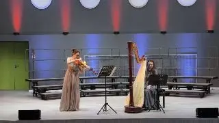
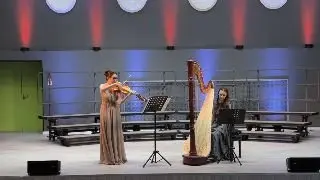
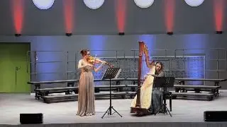

[{width="320" height="180" data-color="#656167"}](https://t.me/gattavasis/520){.video data-duration="23"}

Всем, кто жаловался, что слишком мало арпеджиато было — добавим! Нам и самим нравится. Так бы и вжухали весь день...

[{width="320" height="180" data-color="#646167"}](https://t.me/gattavasis/521){.video data-duration="35"}

👽Внеземные цивилизации на связи

[{width="320" height="180" data-color="#666268"}](https://t.me/gattavasis/522){.video data-duration="70"}

То были ~~цветочки~~ каденция, а теперь вы знаете, каким романсом XVIII века «вдохновился» Элвис Пресли для своего хита [Can't help falling in love](https://youtu.be/vGJTaP6anOU?si=dTf11ojmYtEYROcK)!

«Радость любви» Жан-Поль Мартини, 1784

Viole d'amour × Plaisir d’amour

Вот такое каламбурное боевое крещение случилось на нашем с [Софьей Москалёвой](https://vk.ru/harpsof) концерте!

Спасибо всем, кто пришёл! Скоро ещё фотографиями поделимся!!!
❤️❤️❤️
