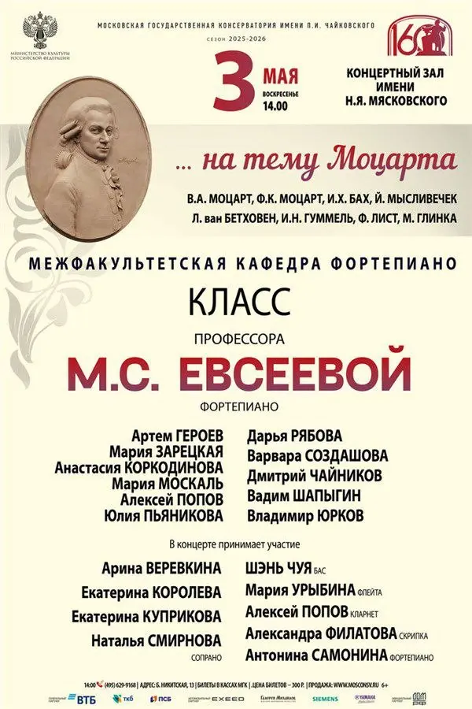
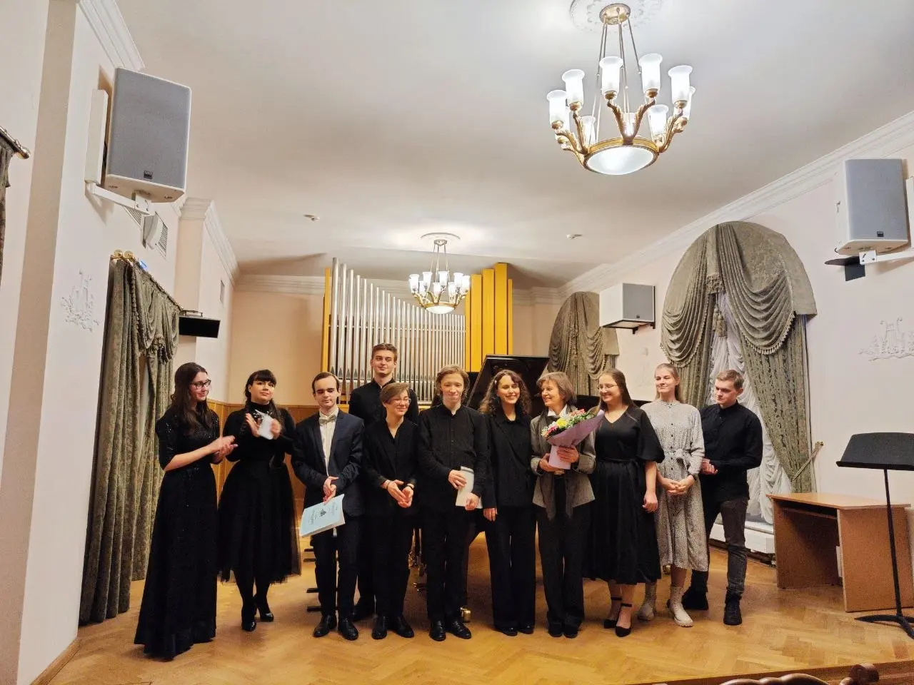

Это важный для меня концерт по нескольким причинам:

я заканчиваю свой общий курс фортепиано в консерватории. 4 года я провела с музыкантом, у которого научилась очень многому, — Марина Сергеевна Евсеева, ученица Татьяны Петровны Николаевой, которая стояла у истоков русской фортепианной школы, какая она есть сегодня. Внучка видного теоретика и композитора Сергея Васильевича Евсеева, ученика Танеева, Гольденвейзера и Катуара.

Марина Сергеевна — человек, вложивший много любви и мастерства, которые относились не только к собственно игре на фортепиано, но к музыке и исполнительству в целом.

В моей жизни было несколько замечательных педагогов по фортепиано, которых я вспоминаю с теплом: Ольга Анатольевна Ермакова и Эллина Станиславовна Горковенко в десятилетке в Петербурге; Фаина Семёновна Райская, ученица Григория Соколова. Ученица Валерия Кастельского Нина Михайловна Шимкунас, у которой я занималась в ЦМШ.

Можно сказать, сейчас я подхожу к логическому завершению моих изысканий))) на этом поприще.

Итак,
вторая причина, почему этот концерт важен для меня — он на тему Моцарта. Прозвучат сочинения и современников, учителей, учеников и всех, кто связан с ним не опосредованно, а, например, музыкой!

Исполню Адажио Моцарта си-минор KV540. 🎧[Послушайте](https://youtu.be/MSqDIeW6YbA?si=sVhqw9ogzkVPuxYC), как его играет Григорий Соколов!

Вспоминаю, как я выпускалась в ЦМШ с 🎧[Сонатой Моцарта Фа-мажор](https://youtu.be/DK_owDX5WOE?si=hSVd7IWEJpz3qtdW) и как мне было непросто: мне совсем не нравилось, что у меня получалось. Я все время думала: как я должна добиться пения на ударном инструменте, если звук постоянно угасает? Да и главное, зачем — у меня же есть скрипка!

Тогда я играла очень сложные программы, многое из того, что играли мои однокашники-пианисты, даже три года играла в фортепианном дуэте! Иногда вспоминаю и удивляюсь.

Нельзя сказать, что сейчас мне что-то даётся проще, все же это мой второй язык, и я чувствую, что мне не хватает мастерства, чтобы услышать в итоге то, что я хочу. Но я довольна! Моцарт — лакмусовая бумажка для пианиста, и в этот раз мне на самом деле нравится, как я играю!

Удивительное чувство!

Всех с удовольствием жду! На этом концерте вы услышите совсем не то, что можно было бы ожидать от концерта класса «межфакультетской кафедры фортепиано», — на самом деле, много талантливых пианистов и редко исполняемые сочинения.

:::gallery
{width="600" height="900" data-color="#e0d8c4"}

{width="1280" height="960" data-color="#958373"}
:::

**3 мая, вскр**

🎫 [Билеты](https://www.mosconsv.ru/ru/concert/202042)
📍 [Зал Мясковского](https://yandex.ru/maps/org/moskovskaya_gosudarstvennaya_konservatoriya_imeni_p_i_chaykovskogo_kontsertny_zal_imeni_n_ya_myaskovskogo/1037877252?si=hkgv88xffz97ba3h76tajv9ey0)

Начало в 14 часов.
За пригласительными в лс❣
[@Julia\_violin](https://t.me/Julia_violin)
