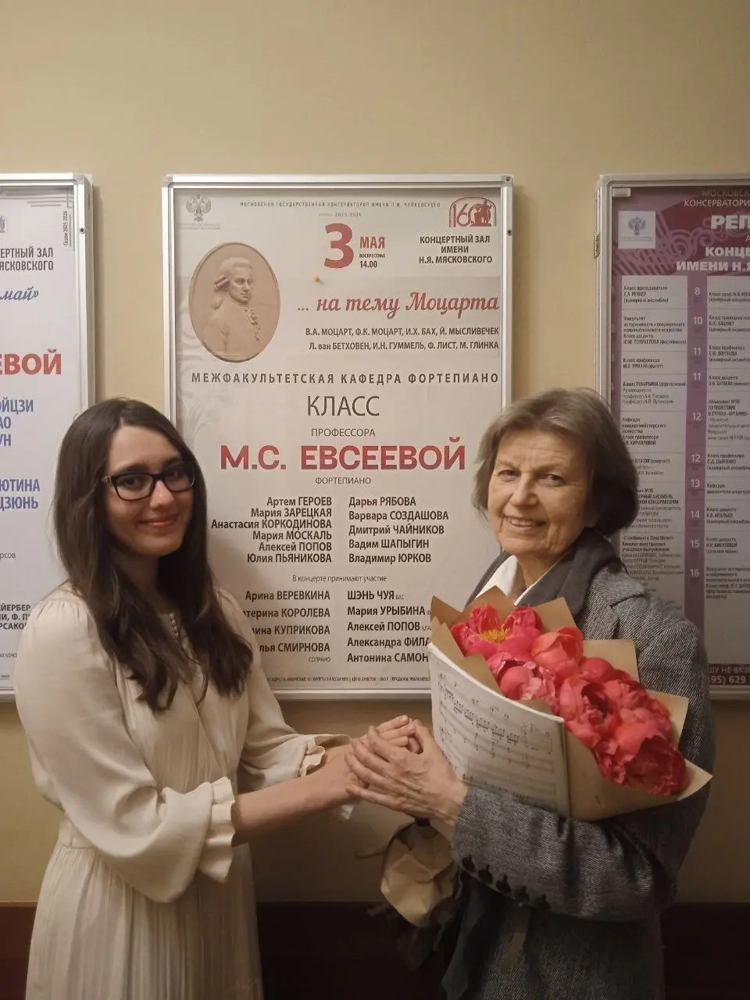
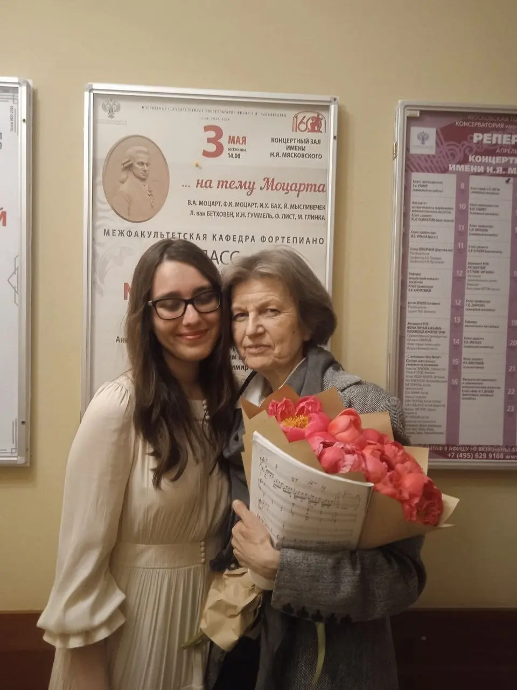

{width="960" height="1280" data-color="#8d7767"}

С моим профессором, заслуженной артисткой России Мариной Сергеевной Евсеевой, после концерта класса, который состоялся 3 мая в зале Мясковского!

Спасибо [Маше Зарецкой](https://t.me/+t-QSTyGI5LQ2MWRi) за фотографии и добрые слова!

[{width="320" height="180" data-color="#634634"}](https://t.me/gattavasis/534){.video data-duration="50"}

{width="960" height="1280" data-color="#8e7867"}

[{width="320" height="180" data-color="#614936"}](https://t.me/gattavasis/536){.video data-duration="36"}
