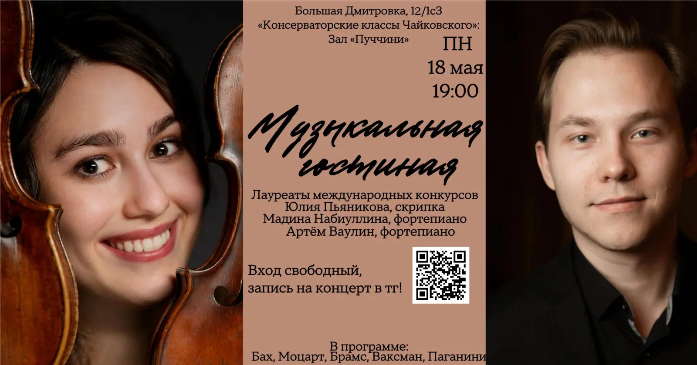

{width="1600" height="839" data-color="#6e4d3e"}

**В следующий понедельник, 18 мая, состоится наш совместный концерт с моим другом, пианистом Артёмом Ваулиным!**

В сольной программе меня поддержит лауреат международных конкурсов, мой концертмейстер в классе по специальности **Мадина Набиуллина**!🤍

**Приходите повидаться!** И нас поддержать🥰 В следующий раз увидимся не раньше середины июня, когда я снова буду в Москве! Потом поделюсь планами)

📍[Большая Дмитровка, 12/1с3](https://yandex.ru/maps/org/konservatorskiye_klassy_chaykovskogo/10737822888?si=hkgv88xffz97ba3h76tajv9ey0)
[«Консерваторские классы Чайковского»](https://yandex.ru/maps/org/konservatorskiye_klassy_chaykovskogo/10737822888?si=hkgv88xffz97ba3h76tajv9ey0)
[Зал «Пуччини»](https://yandex.ru/maps/org/konservatorskiye_klassy_chaykovskogo/10737822888?si=hkgv88xffz97ba3h76tajv9ey0)

**В программе:**
Бах, Моцарт, Брамс, Скрябин, Ваксман, Паганини

❕ **Вход свободный!** Если планируете прийти на концерт, напишите мне в личные сообщения [@Julia\_violin](https://t.me/Julia_violin)

Начало в 19 часов.

Буду всем очень рада!
🤍🤍🤍
