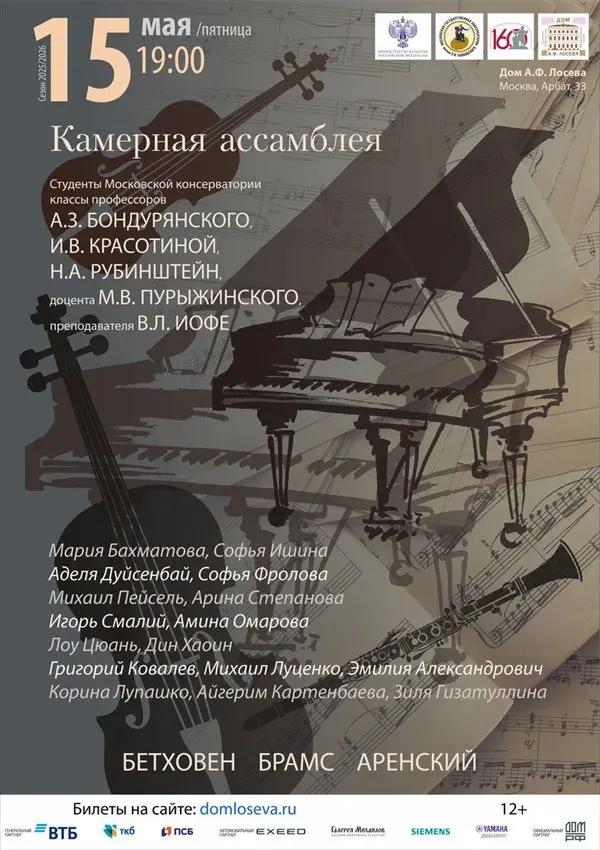

{width="600" height="850" data-color="#5b5650"}

Завтра исполним [сотый опус](https://www.belcanto.ru/brahms_violinsonata2.html?ysclid=mp5qipdlyb265698079) Брамса целиком на концерте класса камерного ансамбля наших дорогих профессоров!

Приходите насладиться вместе с нами

Начало в 19 часов!
🎫 [Билеты](http://domloseva.ru/events/afisha/event/5993-kontsert-kamernaya-assambleya-iz-tsikla-muzykalnoe-budushchee-studenty-moskovskoj-konservatorii)
📍 Дом А.Ф. Лосева
Арбат, 33
