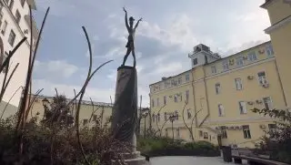

[{width="320" height="181" data-color="#858382"}](https://t.me/gattavasis/539){.video data-duration="26"}

**Точный адрес:**
[Большая Дмитровка, 12/1с3](https://yandex.ru/maps/org/konservatorskiye_klassy_chaykovskogo/10737822888?si=hkgv88xffz97ba3h76tajv9ey0)
[«Консерваторские классы Чайковского»](https://yandex.ru/maps/org/konservatorskiye_klassy_chaykovskogo/10737822888?si=hkgv88xffz97ba3h76tajv9ey0)
**Зал «Пуччини» (слева от ресепшн).**

**Как нас найти:**
**(см. видео⬆️ )**

8 выход станции метро Охотный ряд/Театральная выходит сразу на Б.Дмитровку:

Поворачиваете направо и поднимаетесь вверх по улице несколько кварталов до сквера М.Плисецкой (справа, при входе в сквер — мурал с балериной).

Код на двери: 4321#
Далее пройти через лифт на первый этаж.

Начало в 19 часов!
До встречи❤️
