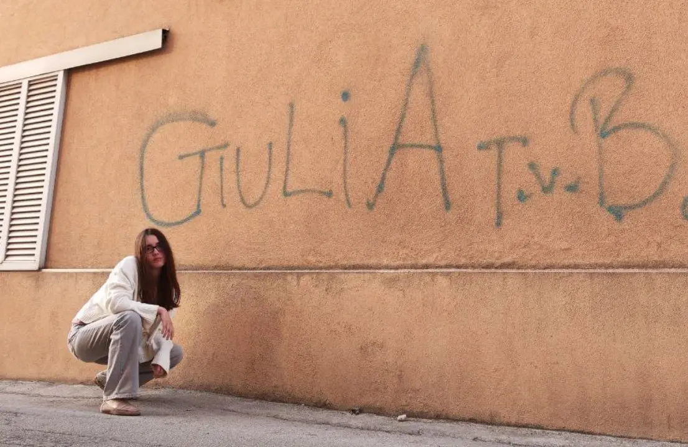

{width="1106" height="720" data-color="#bb8e72"}

**essere scritto anche sui muri** — итальянская идиома. Её аналоги на русском: «каждая собака знает», «ежу понятно», «прописная истина».

Буквально переводится
**«записано даже на стенах»**.

**tvb** = ti voglio bene = я тебя люблю!
