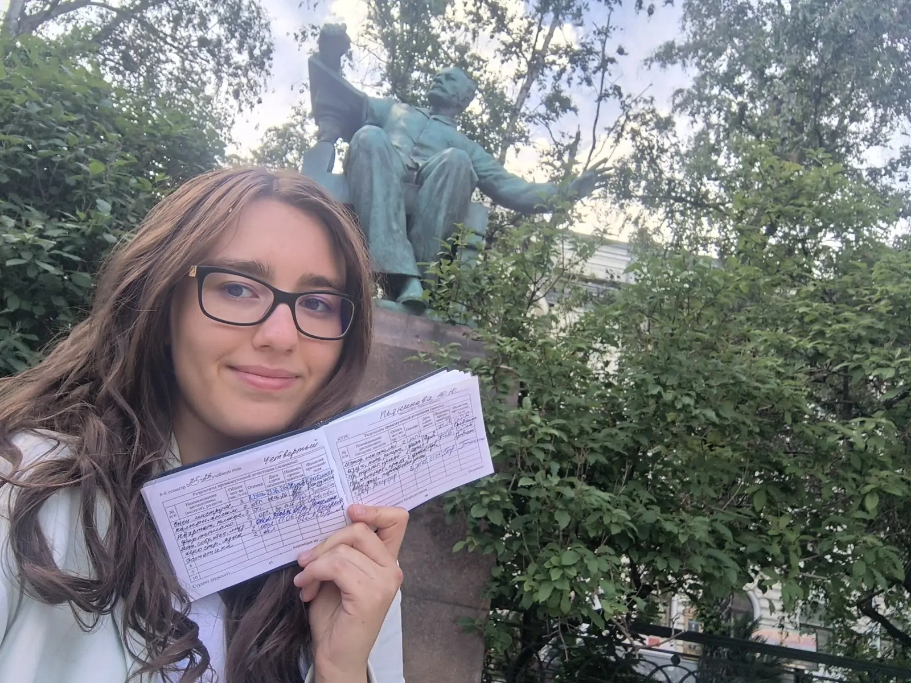
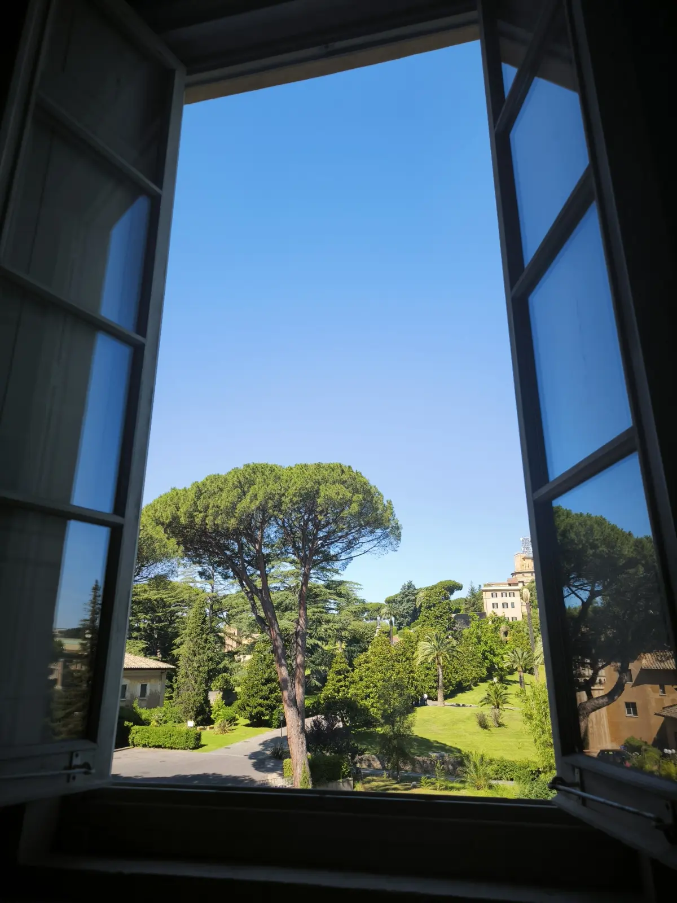
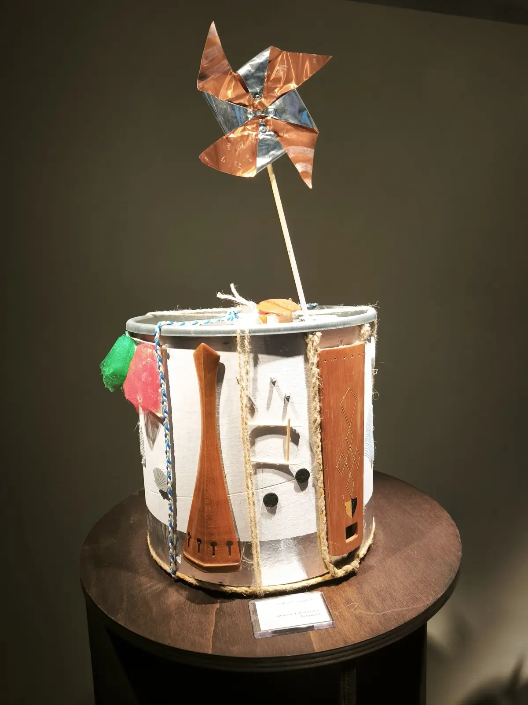
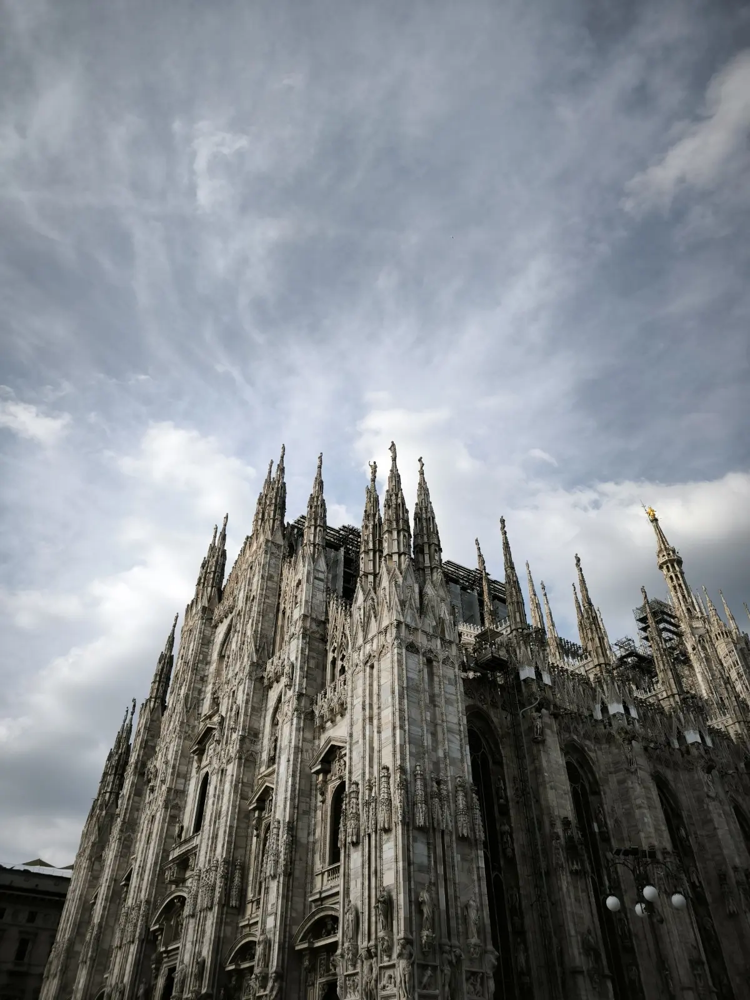
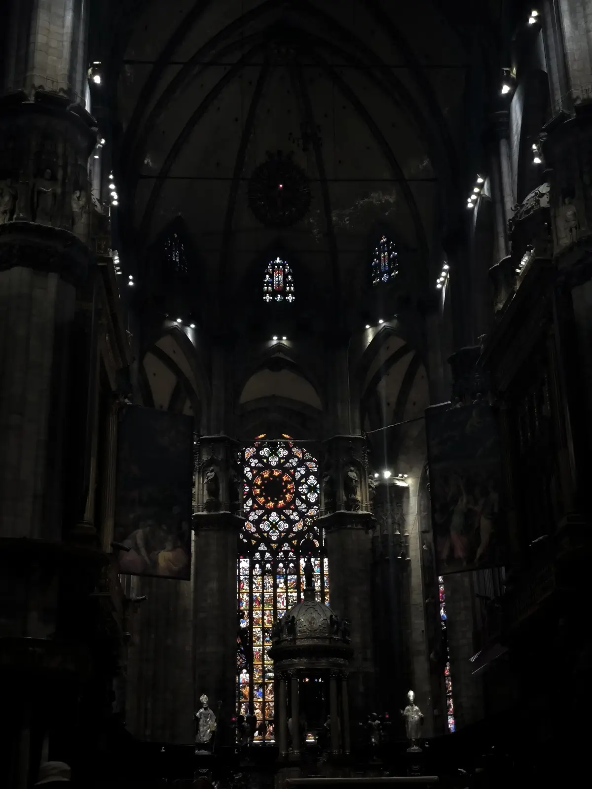
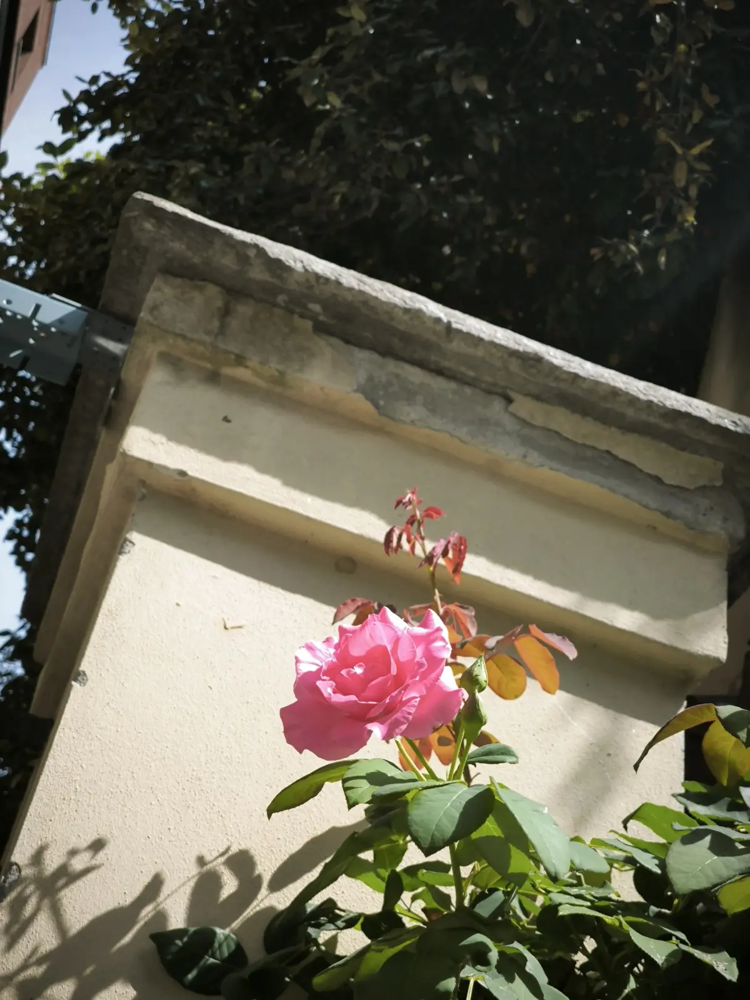
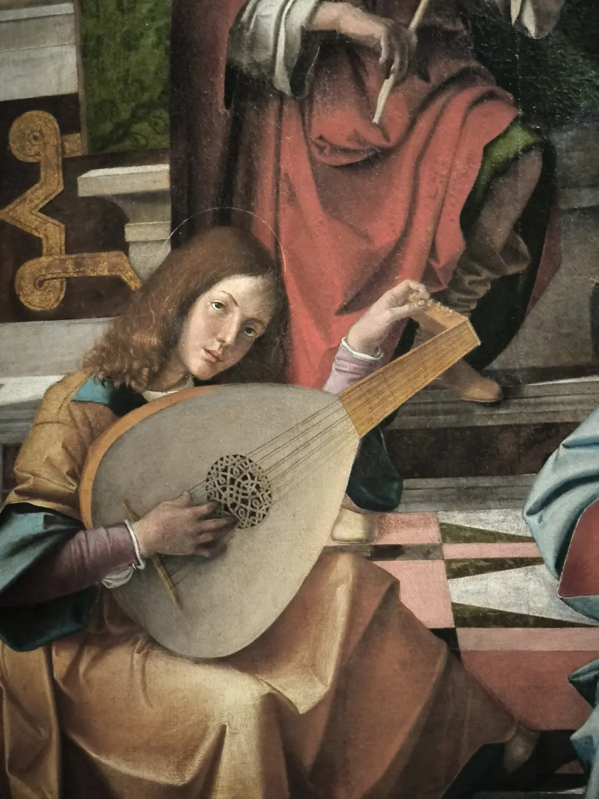
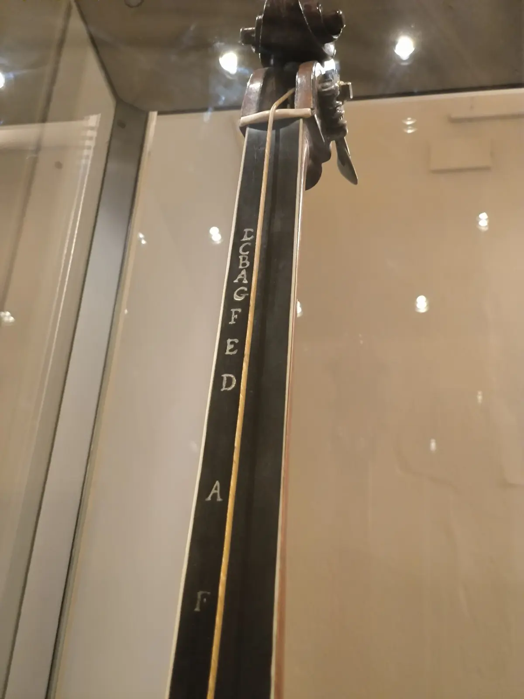
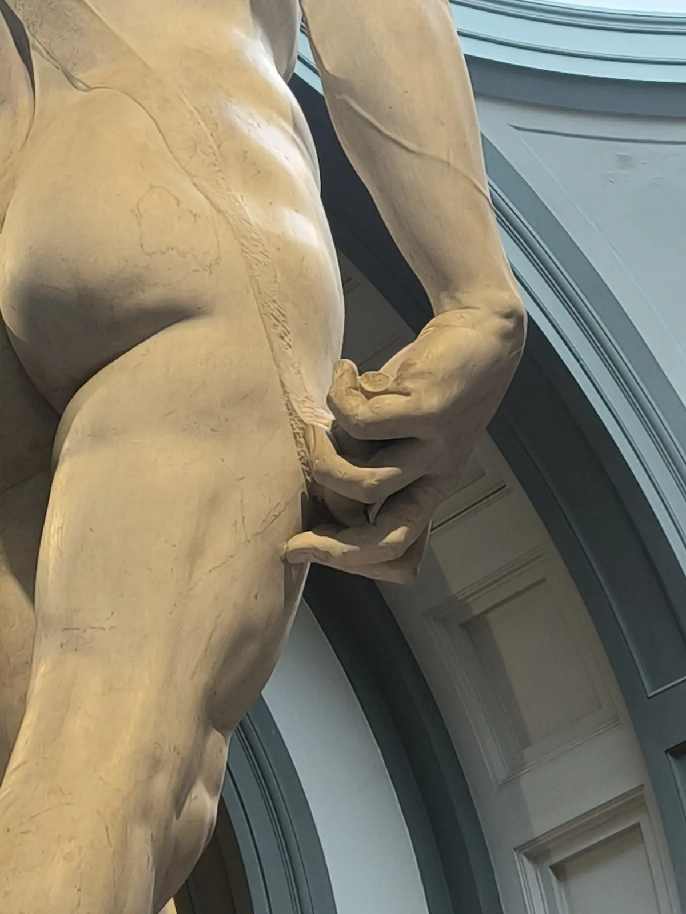
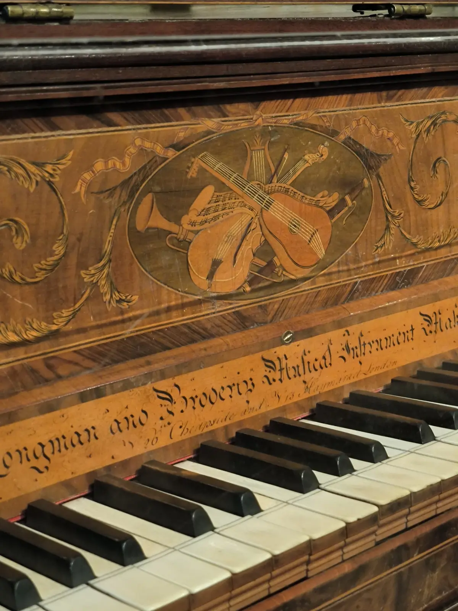

:::gallery
{width="1600" height="1200" data-color="#707170"}

{width="1200" height="1600" data-color="#516674"}

{width="1200" height="1600" data-color="#615341"}

{width="1200" height="1600" data-color="#868a8e"}

{width="1200" height="1600" data-color="#100f0e"}

{width="1200" height="1600" data-color="#6b6353"}

{width="1200" height="1600" data-color="#6d5a49"}

{width="1200" height="1600" data-color="#948068"}

{width="1200" height="1600" data-color="#7e7663"}

{width="1200" height="1600" data-color="#79552f"}
:::

Если кратко,
Я провела насыщенный месяц в Италии, а потом в экстренном порядке сдала сессию за неделю!

Это была последняя большая сессия специалитета Московской консерватории, и она закрыта на отлично, но с рекордно низкой пятёркой по специальности!
🤩🤩🤩
Благодарю всех, кто участвовал в [том голосовании](https://t.me/gattavasis/552), всё благодаря вам😘

Уже хочется начать делиться фотографиями и впечатлениями:
я была в 4 провинциях Италии и в Ватикане, 6 городах, 25 музеях, ≈30–35 церквях и соборах, 2 морях, играла во дворцах (в одном до сих пор живёт семья!), в театре, познакомилась и поиграла нескольким выдающимся скрипачам, в том числе на скрипке Антонио Страдивари золотой эпохи... а занималась я в римской квартире генуэзской семьи, которая ведёт родословную с 12 века. Видела столько всего, что знала с детства из художественных альбомов и, разумеется, благодаря нашему преподу по истории искусств Натальи «300 картин» Вагановой.

Делюсь атмосферой
🫪🫪🫪
