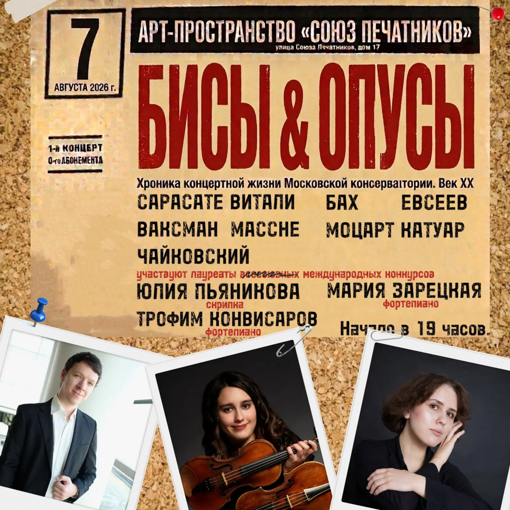

{width="1600" height="1600" data-color="#9f7c60"}

Дорогие петербуржцы и все, кто заглянет к нам как турист!
**7 августа** приглашаю вас на наш концерт в [Арт-пространстве «Союз печатников»](https://t.me/soyz_pechatnikov), где есть рояли, книги, живопись, рисунки, клавесин и кот — всё, что нужно для счастья!

Счастлива сообщить, что ко мне в гости опять приедут мои консерваторские друзья! [Мария Зарецкая](https://t.me/+t-QSTyGI5LQ2MWRi), живое воплощение афоризма «Талантливый человек талантлив во всем», джазовая пианистка, музыковед и полиглот — представит редкую сольную программу, о которой я позже расскажу. С петербургской премьерой!

А за легкомысленную половину концерта, разумеется, отвечаю я!
Я имею в виду, конечно, легкомысленный тяжелоартиллерийский золотой репертуар великих советских скрипачей 20 века! Удачи мне.

В сольной программе меня поддержит замечательный пианист, солист Мариинского театра, **Трофим Конвисаров**!

P.S. Написала этот пост специально, чтобы уже нельзя было провернуть фарш назад, — придётся заниматься...

🎫 [БИЛЕТЫ](https://spb.qtickets.events/247527-bisy-i-opusy-xx-vek)
Промокод для друзей:
`KONSA`
